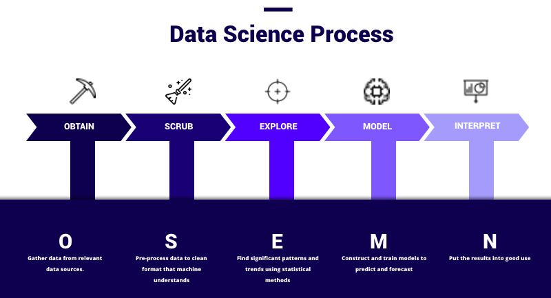

<h1>Table of Contents<span class="tocSkip"></span></h1>
<div class="toc"><ul class="toc-item"><li><ul class="toc-item"><li><span><a href="#Northwind-Co:-Company-Sales-Analysis" data-toc-modified-id="Northwind-Co:-Company-Sales-Analysis-0.1"><span class="toc-item-num">0.1&nbsp;&nbsp;</span>Northwind Co: Company Sales Analysis</a></span></li></ul></li><li><span><a href="#Project-Overview:" data-toc-modified-id="Project-Overview:-1"><span class="toc-item-num">1&nbsp;&nbsp;</span>Project Overview:</a></span><ul class="toc-item"><li><span><a href="#Obtain-Data" data-toc-modified-id="Obtain-Data-1.1"><span class="toc-item-num">1.1&nbsp;&nbsp;</span>Obtain Data</a></span></li><li><span><a href="#Pre-Process/Scrub-Data" data-toc-modified-id="Pre-Process/Scrub-Data-1.2"><span class="toc-item-num">1.2&nbsp;&nbsp;</span>Pre-Process/Scrub Data</a></span></li><li><span><a href="#Explore-Data" data-toc-modified-id="Explore-Data-1.3"><span class="toc-item-num">1.3&nbsp;&nbsp;</span>Explore Data</a></span></li><li><span><a href="#Hypothesis-Testing" data-toc-modified-id="Hypothesis-Testing-1.4"><span class="toc-item-num">1.4&nbsp;&nbsp;</span>Hypothesis Testing</a></span></li><li><span><a href="#Interpret,-Review-Results" data-toc-modified-id="Interpret,-Review-Results-1.5"><span class="toc-item-num">1.5&nbsp;&nbsp;</span>Interpret, Review Results</a></span></li></ul></li><li><span><a href="#Obtain-Data-/-Import-Libraries" data-toc-modified-id="Obtain-Data-/-Import-Libraries-2"><span class="toc-item-num">2&nbsp;&nbsp;</span>Obtain Data / Import Libraries</a></span><ul class="toc-item"><li><span><a href="#Provided-ERD-for-Northwind-Co:" data-toc-modified-id="Provided-ERD-for-Northwind-Co:-2.1"><span class="toc-item-num">2.1&nbsp;&nbsp;</span>Provided ERD for Northwind Co:</a></span></li></ul></li><li><span><a href="#Pre-Process/Scrub-Data" data-toc-modified-id="Pre-Process/Scrub-Data-3"><span class="toc-item-num">3&nbsp;&nbsp;</span>Pre-Process/Scrub Data</a></span><ul class="toc-item"><li><span><a href="#Category-Table-Scrubbing:" data-toc-modified-id="Category-Table-Scrubbing:-3.1"><span class="toc-item-num">3.1&nbsp;&nbsp;</span>Category Table Scrubbing:</a></span><ul class="toc-item"><li><span><a href="#Product-Table-Scrubbing:" data-toc-modified-id="Product-Table-Scrubbing:-3.1.1"><span class="toc-item-num">3.1.1&nbsp;&nbsp;</span>Product Table Scrubbing:</a></span></li><li><span><a href="#Customer-Table-Scrubbing:" data-toc-modified-id="Customer-Table-Scrubbing:-3.1.2"><span class="toc-item-num">3.1.2&nbsp;&nbsp;</span>Customer Table Scrubbing:</a></span></li><li><span><a href="#CustomerCustomerDemo-Table-Scrubbing:" data-toc-modified-id="CustomerCustomerDemo-Table-Scrubbing:-3.1.3"><span class="toc-item-num">3.1.3&nbsp;&nbsp;</span>CustomerCustomerDemo Table Scrubbing:</a></span></li><li><span><a href="#CustomerDemographic-Table-Scrubbing:" data-toc-modified-id="CustomerDemographic-Table-Scrubbing:-3.1.4"><span class="toc-item-num">3.1.4&nbsp;&nbsp;</span>CustomerDemographic Table Scrubbing:</a></span></li><li><span><a href="#Employee-Table-Scrubbing:" data-toc-modified-id="Employee-Table-Scrubbing:-3.1.5"><span class="toc-item-num">3.1.5&nbsp;&nbsp;</span>Employee Table Scrubbing:</a></span></li><li><span><a href="#Territory,-EmployeeTerritory,-and-Region-Table-Scrubbing:" data-toc-modified-id="Territory,-EmployeeTerritory,-and-Region-Table-Scrubbing:-3.1.6"><span class="toc-item-num">3.1.6&nbsp;&nbsp;</span>Territory, EmployeeTerritory, and Region Table Scrubbing:</a></span></li><li><span><a href="#Order,-OrderDetail-Table-Scrubbing:" data-toc-modified-id="Order,-OrderDetail-Table-Scrubbing:-3.1.7"><span class="toc-item-num">3.1.7&nbsp;&nbsp;</span>Order, OrderDetail Table Scrubbing:</a></span></li><li><span><a href="#Shipper,-Supplier-Table-Scrubbing:" data-toc-modified-id="Shipper,-Supplier-Table-Scrubbing:-3.1.8"><span class="toc-item-num">3.1.8&nbsp;&nbsp;</span>Shipper, Supplier Table Scrubbing:</a></span></li></ul></li></ul></li><li><span><a href="#Data-Exploration/Analysis:" data-toc-modified-id="Data-Exploration/Analysis:-4"><span class="toc-item-num">4&nbsp;&nbsp;</span>Data Exploration/Analysis:</a></span><ul class="toc-item"><li><span><a href="#Do-discounts-have-a-statistically-significant-effect-on-the-number-of-products-customers-order?-If-so,-at-what-level(s)-of-discount?" data-toc-modified-id="Do-discounts-have-a-statistically-significant-effect-on-the-number-of-products-customers-order?-If-so,-at-what-level(s)-of-discount?-4.1"><span class="toc-item-num">4.1&nbsp;&nbsp;</span>Do discounts have a statistically significant effect on the number of products customers order? If so, at what level(s) of discount?</a></span><ul class="toc-item"><li><span><a href="#Do-discounts-have-a-statistically-significant-effect-on-the-number-of-products-customers-order?" data-toc-modified-id="Do-discounts-have-a-statistically-significant-effect-on-the-number-of-products-customers-order?-4.1.1"><span class="toc-item-num">4.1.1&nbsp;&nbsp;</span>Do discounts have a statistically significant effect on the number of products customers order?</a></span><ul class="toc-item"><li><span><a href="#Do-discounts-have-a-statistically-significant-effect-on-the-number-of-products-customers-order?" data-toc-modified-id="Do-discounts-have-a-statistically-significant-effect-on-the-number-of-products-customers-order?-4.1.1.1"><span class="toc-item-num">4.1.1.1&nbsp;&nbsp;</span>Do discounts have a statistically significant effect on the number of products customers order?</a></span></li></ul></li><li><span><a href="#If-so,-at-what-level(s)-of-discount?" data-toc-modified-id="If-so,-at-what-level(s)-of-discount?-4.1.2"><span class="toc-item-num">4.1.2&nbsp;&nbsp;</span>If so, at what level(s) of discount?</a></span><ul class="toc-item"><li><span><a href="#If-so,-at-what-level(s)-of-discount?" data-toc-modified-id="If-so,-at-what-level(s)-of-discount?-4.1.2.1"><span class="toc-item-num">4.1.2.1&nbsp;&nbsp;</span>If so, at what level(s) of discount?</a></span></li></ul></li></ul></li><li><span><a href="#Do-discounts-have-a-statistically-significant-effect-on-customer-spend-per-order?-If-so,-at-what-level(s)-of-discount?" data-toc-modified-id="Do-discounts-have-a-statistically-significant-effect-on-customer-spend-per-order?-If-so,-at-what-level(s)-of-discount?-4.2"><span class="toc-item-num">4.2&nbsp;&nbsp;</span>Do discounts have a statistically significant effect on customer spend per order? If so, at what level(s) of discount?</a></span><ul class="toc-item"><li><span><a href="#Do-discounts-have-a-statistically-significant-effect-on-customer-spend?" data-toc-modified-id="Do-discounts-have-a-statistically-significant-effect-on-customer-spend?-4.2.1"><span class="toc-item-num">4.2.1&nbsp;&nbsp;</span>Do discounts have a statistically significant effect on customer spend?</a></span><ul class="toc-item"><li><span><a href="#Do-discounts-have-a-statistically-significant-effect-on-average-customer-spend-(order-price)?" data-toc-modified-id="Do-discounts-have-a-statistically-significant-effect-on-average-customer-spend-(order-price)?-4.2.1.1"><span class="toc-item-num">4.2.1.1&nbsp;&nbsp;</span>Do discounts have a statistically significant effect on average customer spend (order price)?</a></span></li></ul></li><li><span><a href="#At-what-level(s)-of-discount-is-there-a-significant-effect-on-average-customer-spend?" data-toc-modified-id="At-what-level(s)-of-discount-is-there-a-significant-effect-on-average-customer-spend?-4.2.2"><span class="toc-item-num">4.2.2&nbsp;&nbsp;</span>At what level(s) of discount is there a significant effect on average customer spend?</a></span></li></ul></li><li><span><a href="#Do-discounts-have-a-statistically-significant-effect-on-Order-Quantity-by-Category?-If-so,-at-what-level(s)-of-discount?" data-toc-modified-id="Do-discounts-have-a-statistically-significant-effect-on-Order-Quantity-by-Category?-If-so,-at-what-level(s)-of-discount?-4.3"><span class="toc-item-num">4.3&nbsp;&nbsp;</span>Do discounts have a statistically significant effect on Order Quantity by Category? If so, at what level(s) of discount?</a></span><ul class="toc-item"><li><span><a href="#Do-discounts-have-a-statistically-significant-effect-on-the-number-of-products-customers-order-by-category?" data-toc-modified-id="Do-discounts-have-a-statistically-significant-effect-on-the-number-of-products-customers-order-by-category?-4.3.1"><span class="toc-item-num">4.3.1&nbsp;&nbsp;</span>Do discounts have a statistically significant effect on the number of products customers order by category?</a></span></li></ul></li><li><span><a href="#Is-there-a-statistically-significant-difference-in-performance-of-Sales-Employees-at-Northwind?" data-toc-modified-id="Is-there-a-statistically-significant-difference-in-performance-of-Sales-Employees-at-Northwind?-4.4"><span class="toc-item-num">4.4&nbsp;&nbsp;</span>Is there a statistically significant difference in performance of Sales Employees at Northwind?</a></span><ul class="toc-item"><li><span><a href="#Is-total-all-time-revenue-generated-equal-across-all-employees?" data-toc-modified-id="Is-total-all-time-revenue-generated-equal-across-all-employees?-4.4.1"><span class="toc-item-num">4.4.1&nbsp;&nbsp;</span>Is total all-time revenue generated equal across all employees?</a></span></li><li><span><a href="#Is-total-all-time-revenue-generated-equal-across-all-employees?" data-toc-modified-id="Is-total-all-time-revenue-generated-equal-across-all-employees?-4.4.2"><span class="toc-item-num">4.4.2&nbsp;&nbsp;</span>Is total all-time revenue generated equal across all employees?</a></span></li><li><span><a href="#Is-average-Order-Revenue-equal-across-all-employees-in-2014?" data-toc-modified-id="Is-average-Order-Revenue-equal-across-all-employees-in-2014?-4.4.3"><span class="toc-item-num">4.4.3&nbsp;&nbsp;</span>Is average Order Revenue equal across all employees in 2014?</a></span></li></ul></li><li><span><a href="#YoY-Revenue:" data-toc-modified-id="YoY-Revenue:-4.5"><span class="toc-item-num">4.5&nbsp;&nbsp;</span>YoY Revenue:</a></span><ul class="toc-item"><li><span><a href="#Is-Q1-Order-Revenue-for-2014-significantly-greater-than-Q1-Order-Revenue-from-2013?" data-toc-modified-id="Is-Q1-Order-Revenue-for-2014-significantly-greater-than-Q1-Order-Revenue-from-2013?-4.5.1"><span class="toc-item-num">4.5.1&nbsp;&nbsp;</span>Is Q1 Order Revenue for 2014 significantly greater than Q1 Order Revenue from 2013?</a></span><ul class="toc-item"><li><span><a href="#Is-Average-Q1-Order-Revenue-for-2014-significantly-greater-than-Average-Q1-Order-Revenue-from-2013?" data-toc-modified-id="Is-Average-Q1-Order-Revenue-for-2014-significantly-greater-than-Average-Q1-Order-Revenue-from-2013?-4.5.1.1"><span class="toc-item-num">4.5.1.1&nbsp;&nbsp;</span>Is Average Q1 Order Revenue for 2014 significantly greater than Average Q1 Order Revenue from 2013?</a></span></li></ul></li></ul></li></ul></li></ul></div>

## Northwind Co: Company Sales Analysis
Flatiron Module 2 Project: Paul Woody


# Project Overview:
For this project, we'll be exploring the data provided by our client, Northwind, containing companywide sales data for a range of products.  Our goal is to derive the significance of discounts on overall sales as well as to provide the client with additional business recommendations based on the results of EDA. 

To complete our analysis, we will follow the OSEMN Data Science process as outlined [here](http://www.dataists.com/tag/osemn/).


[Credit](https://www.thelead.io/data-science/5-steps-to-a-data-science-project-lifecycle)

## Obtain Data
    - Load dataset provided by client
## Pre-Process/Scrub Data
    - Ensure that missing values are handled appropriately
    - Ensure that all data is cast to the correct dtype, and that any non-sensical datapoints are scrubbed or dropped from our dataset.
## Explore Data
    - Cluster, visualize, and view correlations between features in the dataset 
    - Identify the aims of the project in the form of clearly articulated business questions
## Hypothesis Testing
    - Utilize hypothesis testing to evaluate the results questions posed in the data exploration phase.
    - Utilize various statistical methodologies to evaluate significace of results
## Interpret, Review Results
    - Using the results of hypothesis/significance testing, evaluate the business questions posed in Step 3
    - Articulate business recommendations based on the results of testing at appropriate confidence intervals
    - Identify potential improvements or factors that may skew the obtained results 
    - Identify suggested next steps for client


## Provided ERD for Northwind Co:


# Obtain / Load Data:

```python
# Creating engine and binding to target database:
engine = create_engine("sqlite:///Northwind_small.sqlite", echo=True)
Session = sessionmaker(bind=engine)
session = Session()
```


```python
from sqlalchemy import inspect
inspector = inspect(engine)

# Viewing Table Names to compare with ERD:
print(inspector.get_table_names())
```

    2019-06-24 17:55:07,428 INFO sqlalchemy.engine.base.Engine SELECT name FROM sqlite_master WHERE type='table' ORDER BY name
    2019-06-24 17:55:07,430 INFO sqlalchemy.engine.base.Engine ()
    ['Category', 'Customer', 'CustomerCustomerDemo', 'CustomerDemographic', 'Employee', 'EmployeeTerritory', 'Order', 'OrderDetail', 'Product', 'Region', 'Shipper', 'Supplier', 'Territory']


As demonstrated by the output of table names above, there are many discrepancies between the Table/Column names in the provided ERD and in the actual database. In order to successfully scrub/explore the dataset, we must first verify the table/column names in our database, as well as account for missing values and improperly stored dtypes.


```python
# Using above function to iterate over all tables:
tables = inspector.get_table_names()
for table in tables:
    print(get_column_info(table))
```

    
    ------------------------------------------------------------------------
    Table Name: Category, Primary Key: ['Id']
    ------------------------------------------------------------------------
    
    Column Name: Id, Column Type: INTEGER
    Column Name: CategoryName, Column Type: VARCHAR(8000)
    Column Name: Description, Column Type: VARCHAR(8000)
    None
    
    ------------------------------------------------------------------------
    Table Name: Customer, Primary Key: ['Id']
    ------------------------------------------------------------------------
    
    Column Name: Id, Column Type: VARCHAR(8000)
    Column Name: CompanyName, Column Type: VARCHAR(8000)
    Column Name: ContactName, Column Type: VARCHAR(8000)
    Column Name: ContactTitle, Column Type: VARCHAR(8000)
    Column Name: Address, Column Type: VARCHAR(8000)
    Column Name: City, Column Type: VARCHAR(8000)
    Column Name: Region, Column Type: VARCHAR(8000)
    Column Name: PostalCode, Column Type: VARCHAR(8000)
    Column Name: Country, Column Type: VARCHAR(8000)
    Column Name: Phone, Column Type: VARCHAR(8000)
    Column Name: Fax, Column Type: VARCHAR(8000)
    None
    
    ------------------------------------------------------------------------
    Table Name: CustomerCustomerDemo, Primary Key: ['Id']
    ------------------------------------------------------------------------
    
    Column Name: Id, Column Type: VARCHAR(8000)
    Column Name: CustomerTypeId, Column Type: VARCHAR(8000)
    None
    
    ------------------------------------------------------------------------
    Table Name: CustomerDemographic, Primary Key: ['Id']
    ------------------------------------------------------------------------
    
    Column Name: Id, Column Type: VARCHAR(8000)
    Column Name: CustomerDesc, Column Type: VARCHAR(8000)
    None
    
    ------------------------------------------------------------------------
    Table Name: Employee, Primary Key: ['Id']
    ------------------------------------------------------------------------
    
    Column Name: Id, Column Type: INTEGER
    Column Name: LastName, Column Type: VARCHAR(8000)
    Column Name: FirstName, Column Type: VARCHAR(8000)
    Column Name: Title, Column Type: VARCHAR(8000)
    Column Name: TitleOfCourtesy, Column Type: VARCHAR(8000)
    Column Name: BirthDate, Column Type: VARCHAR(8000)
    Column Name: HireDate, Column Type: VARCHAR(8000)
    Column Name: Address, Column Type: VARCHAR(8000)
    Column Name: City, Column Type: VARCHAR(8000)
    Column Name: Region, Column Type: VARCHAR(8000)
    Column Name: PostalCode, Column Type: VARCHAR(8000)
    Column Name: Country, Column Type: VARCHAR(8000)
    Column Name: HomePhone, Column Type: VARCHAR(8000)
    Column Name: Extension, Column Type: VARCHAR(8000)
    Column Name: Photo, Column Type: BLOB
    Column Name: Notes, Column Type: VARCHAR(8000)
    Column Name: ReportsTo, Column Type: INTEGER
    Column Name: PhotoPath, Column Type: VARCHAR(8000)
    None
    
    ------------------------------------------------------------------------
    Table Name: EmployeeTerritory, Primary Key: ['Id']
    ------------------------------------------------------------------------
    
    Column Name: Id, Column Type: VARCHAR(8000)
    Column Name: EmployeeId, Column Type: INTEGER
    Column Name: TerritoryId, Column Type: VARCHAR(8000)
    None
    
    ------------------------------------------------------------------------
    Table Name: Order, Primary Key: ['Id']
    ------------------------------------------------------------------------
    
    Column Name: Id, Column Type: INTEGER
    Column Name: CustomerId, Column Type: VARCHAR(8000)
    Column Name: EmployeeId, Column Type: INTEGER
    Column Name: OrderDate, Column Type: VARCHAR(8000)
    Column Name: RequiredDate, Column Type: VARCHAR(8000)
    Column Name: ShippedDate, Column Type: VARCHAR(8000)
    Column Name: ShipVia, Column Type: INTEGER
    Column Name: Freight, Column Type: DECIMAL
    Column Name: ShipName, Column Type: VARCHAR(8000)
    Column Name: ShipAddress, Column Type: VARCHAR(8000)
    Column Name: ShipCity, Column Type: VARCHAR(8000)
    Column Name: ShipRegion, Column Type: VARCHAR(8000)
    Column Name: ShipPostalCode, Column Type: VARCHAR(8000)
    Column Name: ShipCountry, Column Type: VARCHAR(8000)
    None
    
    ------------------------------------------------------------------------
    Table Name: OrderDetail, Primary Key: ['Id']
    ------------------------------------------------------------------------
    
    Column Name: Id, Column Type: VARCHAR(8000)
    Column Name: OrderId, Column Type: INTEGER
    Column Name: ProductId, Column Type: INTEGER
    Column Name: UnitPrice, Column Type: DECIMAL
    Column Name: Quantity, Column Type: INTEGER
    Column Name: Discount, Column Type: FLOAT
    None
    
    ------------------------------------------------------------------------
    Table Name: Product, Primary Key: ['Id']
    ------------------------------------------------------------------------
    
    Column Name: Id, Column Type: INTEGER
    Column Name: ProductName, Column Type: VARCHAR(8000)
    Column Name: SupplierId, Column Type: INTEGER
    Column Name: CategoryId, Column Type: INTEGER
    Column Name: QuantityPerUnit, Column Type: VARCHAR(8000)
    Column Name: UnitPrice, Column Type: DECIMAL
    Column Name: UnitsInStock, Column Type: INTEGER
    Column Name: UnitsOnOrder, Column Type: INTEGER
    Column Name: ReorderLevel, Column Type: INTEGER
    Column Name: Discontinued, Column Type: INTEGER
    None
    
    ------------------------------------------------------------------------
    Table Name: Region, Primary Key: ['Id']
    ------------------------------------------------------------------------
    
    Column Name: Id, Column Type: INTEGER
    Column Name: RegionDescription, Column Type: VARCHAR(8000)
    None
    
    ------------------------------------------------------------------------
    Table Name: Shipper, Primary Key: ['Id']
    ------------------------------------------------------------------------
    
    Column Name: Id, Column Type: INTEGER
    Column Name: CompanyName, Column Type: VARCHAR(8000)
    Column Name: Phone, Column Type: VARCHAR(8000)
    None
    
    ------------------------------------------------------------------------
    Table Name: Supplier, Primary Key: ['Id']
    ------------------------------------------------------------------------
    
    Column Name: Id, Column Type: INTEGER
    Column Name: CompanyName, Column Type: VARCHAR(8000)
    Column Name: ContactName, Column Type: VARCHAR(8000)
    Column Name: ContactTitle, Column Type: VARCHAR(8000)
    Column Name: Address, Column Type: VARCHAR(8000)
    Column Name: City, Column Type: VARCHAR(8000)
    Column Name: Region, Column Type: VARCHAR(8000)
    Column Name: PostalCode, Column Type: VARCHAR(8000)
    Column Name: Country, Column Type: VARCHAR(8000)
    Column Name: Phone, Column Type: VARCHAR(8000)
    Column Name: Fax, Column Type: VARCHAR(8000)
    Column Name: HomePage, Column Type: VARCHAR(8000)
    None
    
    ------------------------------------------------------------------------
    Table Name: Territory, Primary Key: ['Id']
    ------------------------------------------------------------------------
    
    Column Name: Id, Column Type: VARCHAR(8000)
    Column Name: TerritoryDescription, Column Type: VARCHAR(8000)
    Column Name: RegionId, Column Type: INTEGER
    None


# Pre-Process/Scrub Data

Now that the dataset has been loaded, we should familiarize ourselves with Northwind and what they do as a company prior to forming specific inquiries and queries. For each table in the Northwind Database, we'll preview the contents, properly account for null values, and ensure that column data is stored in the proper format prior to hypothesis testing.

## Category Table Scrubbing:


```python
# Viewing Category Table:
df_category.head(3)
```


<div>
<style scoped>
    .dataframe tbody tr th:only-of-type {
        vertical-align: middle;
    }

    .dataframe tbody tr th {
        vertical-align: top;
    }

    .dataframe thead th {
        text-align: right;
    }
</style>
<table border="1" class="dataframe">
  <thead>
    <tr style="text-align: right;">
      <th></th>
      <th>Id</th>
      <th>CategoryName</th>
      <th>Description</th>
    </tr>
  </thead>
  <tbody>
    <tr>
      <th>0</th>
      <td>1</td>
      <td>Beverages</td>
      <td>Soft drinks, coffees, teas, beers, and ales</td>
    </tr>
    <tr>
      <th>1</th>
      <td>2</td>
      <td>Condiments</td>
      <td>Sweet and savory sauces, relishes, spreads, an...</td>
    </tr>
    <tr>
      <th>2</th>
      <td>3</td>
      <td>Confections</td>
      <td>Desserts, candies, and sweet breads</td>
    </tr>
  </tbody>
</table>
</div>


```python
print(df_category.info())
```

    <class 'pandas.core.frame.DataFrame'>
    RangeIndex: 8 entries, 0 to 7
    Data columns (total 3 columns):
    Id              8 non-null int64
    CategoryName    8 non-null object
    Description     8 non-null object
    dtypes: int64(1), object(2)
    memory usage: 272.0+ bytes
    None


```python
# Visualizing Category Names:
df_category.groupby(['CategoryName']).head(10)
```


<div>
<style scoped>
    .dataframe tbody tr th:only-of-type {
        vertical-align: middle;
    }

    .dataframe tbody tr th {
        vertical-align: top;
    }

    .dataframe thead th {
        text-align: right;
    }
</style>
<table border="1" class="dataframe">
  <thead>
    <tr style="text-align: right;">
      <th></th>
      <th>Id</th>
      <th>CategoryName</th>
      <th>Description</th>
    </tr>
  </thead>
  <tbody>
    <tr>
      <th>0</th>
      <td>1</td>
      <td>Beverages</td>
      <td>Soft drinks, coffees, teas, beers, and ales</td>
    </tr>
    <tr>
      <th>1</th>
      <td>2</td>
      <td>Condiments</td>
      <td>Sweet and savory sauces, relishes, spreads, an...</td>
    </tr>
    <tr>
      <th>2</th>
      <td>3</td>
      <td>Confections</td>
      <td>Desserts, candies, and sweet breads</td>
    </tr>
    <tr>
      <th>3</th>
      <td>4</td>
      <td>Dairy Products</td>
      <td>Cheeses</td>
    </tr>
    <tr>
      <th>4</th>
      <td>5</td>
      <td>Grains/Cereals</td>
      <td>Breads, crackers, pasta, and cereal</td>
    </tr>
    <tr>
      <th>5</th>
      <td>6</td>
      <td>Meat/Poultry</td>
      <td>Prepared meats</td>
    </tr>
    <tr>
      <th>6</th>
      <td>7</td>
      <td>Produce</td>
      <td>Dried fruit and bean curd</td>
    </tr>
    <tr>
      <th>7</th>
      <td>8</td>
      <td>Seafood</td>
      <td>Seaweed and fish</td>
    </tr>
  </tbody>
</table>
</div>


Based on the contents of the Category Table, we can reasonably conclude that Northwind is a Food & Beverage Distributor. We may choose to explore sales perfomance by Category in our exploratory data analysis, but for now, let's get a better idea of the products sold by Northwind.

### Product Table Scrubbing:

Now that we have a broad idea of what Northwind does, let's peruse the products they sell.


```python
# Reviewing Product DataFrame:
df_product.head(3)
```


<div>
<style scoped>
    .dataframe tbody tr th:only-of-type {
        vertical-align: middle;
    }

    .dataframe tbody tr th {
        vertical-align: top;
    }

    .dataframe thead th {
        text-align: right;
    }
</style>
<table border="1" class="dataframe">
  <thead>
    <tr style="text-align: right;">
      <th></th>
      <th>Id</th>
      <th>ProductName</th>
      <th>SupplierId</th>
      <th>CategoryId</th>
      <th>QuantityPerUnit</th>
      <th>UnitPrice</th>
      <th>UnitsInStock</th>
      <th>UnitsOnOrder</th>
      <th>ReorderLevel</th>
      <th>Discontinued</th>
    </tr>
  </thead>
  <tbody>
    <tr>
      <th>0</th>
      <td>1</td>
      <td>Chai</td>
      <td>1</td>
      <td>1</td>
      <td>10 boxes x 20 bags</td>
      <td>18.0</td>
      <td>39</td>
      <td>0</td>
      <td>10</td>
      <td>0</td>
    </tr>
    <tr>
      <th>1</th>
      <td>2</td>
      <td>Chang</td>
      <td>1</td>
      <td>1</td>
      <td>24 - 12 oz bottles</td>
      <td>19.0</td>
      <td>17</td>
      <td>40</td>
      <td>25</td>
      <td>0</td>
    </tr>
    <tr>
      <th>2</th>
      <td>3</td>
      <td>Aniseed Syrup</td>
      <td>1</td>
      <td>2</td>
      <td>12 - 550 ml bottles</td>
      <td>10.0</td>
      <td>13</td>
      <td>70</td>
      <td>25</td>
      <td>0</td>
    </tr>
  </tbody>
</table>
</div>


```python
# Reviewing the products NorthWind carries:
print(len(df_product.ProductName))
df_product.ProductName.unique()
```

    77


    array(['Chai', 'Chang', 'Aniseed Syrup', "Chef Anton's Cajun Seasoning",
           "Chef Anton's Gumbo Mix", "Grandma's Boysenberry Spread",
           "Uncle Bob's Organic Dried Pears", 'Northwoods Cranberry Sauce',
           'Mishi Kobe Niku', 'Ikura', 'Queso Cabrales',
           'Queso Manchego La Pastora', 'Konbu', 'Tofu', 'Genen Shouyu',
           'Pavlova', 'Alice Mutton', 'Carnarvon Tigers',
           'Teatime Chocolate Biscuits', "Sir Rodney's Marmalade",
           "Sir Rodney's Scones", "Gustaf's Knäckebröd", 'Tunnbröd',
           'Guaraná Fantástica', 'NuNuCa Nuß-Nougat-Creme',
           'Gumbär Gummibärchen', 'Schoggi Schokolade', 'Rössle Sauerkraut',
           'Thüringer Rostbratwurst', 'Nord-Ost Matjeshering',
           'Gorgonzola Telino', 'Mascarpone Fabioli', 'Geitost',
           'Sasquatch Ale', 'Steeleye Stout', 'Inlagd Sill', 'Gravad lax',
           'Côte de Blaye', 'Chartreuse verte', 'Boston Crab Meat',
           "Jack's New England Clam Chowder", 'Singaporean Hokkien Fried Mee',
           'Ipoh Coffee', 'Gula Malacca', 'Rogede sild', 'Spegesild',
           'Zaanse koeken', 'Chocolade', 'Maxilaku', 'Valkoinen suklaa',
           'Manjimup Dried Apples', 'Filo Mix', 'Perth Pasties', 'Tourtière',
           'Pâté chinois', 'Gnocchi di nonna Alice', 'Ravioli Angelo',
           'Escargots de Bourgogne', 'Raclette Courdavault',
           'Camembert Pierrot', "Sirop d'érable", 'Tarte au sucre',
           'Vegie-spread', 'Wimmers gute Semmelknödel',
           'Louisiana Fiery Hot Pepper Sauce', 'Louisiana Hot Spiced Okra',
           'Laughing Lumberjack Lager', 'Scottish Longbreads',
           'Gudbrandsdalsost', 'Outback Lager', 'Flotemysost',
           'Mozzarella di Giovanni', 'Röd Kaviar', 'Longlife Tofu',
           'Rhönbräu Klosterbier', 'Lakkalikööri',
           'Original Frankfurter grüne Soße'], dtype=object)


```python
# Viewing number of "Discontinued" Products:
df_product.Discontinued.value_counts()
```


    0    69
    1     8
    Name: Discontinued, dtype: int64


As seen above, Northwind carries a total of 77 products.

For the purposes of our analysis, we will ignore the presence of Discontinued Products, including them in our analysis. Should we find that specific Discontinued products perform as good as or better than other products in the dataset, we may recommend that Northwind choose to restock these products.

In a future project, Northwind may also consider investigating the sales performance of specific products on a regional or national level to maximize product performance by region, reduce shipping costs, and reduce shrink through supply chain optimization.

### Customer Table Scrubbing:

After defining what it is Northwind does, we should next explore Northwind's customer dataset. Is Northwind a local distributor? Where are Northwind's customers located? Is Northwind's target demographic clear?

Reviewing the data to answer some of the questions above should give us insight into potential pitfalls faced by Northwind as well as to guide the scope of our inquiry. Based on differences in regional sales performance, it may be prudent to prioritize expansion in a particular region, change marketing strategies (such as discounts) in specific regions, or hire additional employees.


```python
# Viewing Customer DataFrame:
df_customer.head(3)
```


<div>
<style scoped>
    .dataframe tbody tr th:only-of-type {
        vertical-align: middle;
    }

    .dataframe tbody tr th {
        vertical-align: top;
    }

    .dataframe thead th {
        text-align: right;
    }
</style>
<table border="1" class="dataframe">
  <thead>
    <tr style="text-align: right;">
      <th></th>
      <th>Id</th>
      <th>CompanyName</th>
      <th>ContactName</th>
      <th>ContactTitle</th>
      <th>Address</th>
      <th>City</th>
      <th>Region</th>
      <th>PostalCode</th>
      <th>Country</th>
      <th>Phone</th>
      <th>Fax</th>
    </tr>
  </thead>
  <tbody>
    <tr>
      <th>0</th>
      <td>ALFKI</td>
      <td>Alfreds Futterkiste</td>
      <td>Maria Anders</td>
      <td>Sales Representative</td>
      <td>Obere Str. 57</td>
      <td>Berlin</td>
      <td>Western Europe</td>
      <td>12209</td>
      <td>Germany</td>
      <td>030-0074321</td>
      <td>030-0076545</td>
    </tr>
    <tr>
      <th>1</th>
      <td>ANATR</td>
      <td>Ana Trujillo Emparedados y helados</td>
      <td>Ana Trujillo</td>
      <td>Owner</td>
      <td>Avda. de la Constitución 2222</td>
      <td>México D.F.</td>
      <td>Central America</td>
      <td>05021</td>
      <td>Mexico</td>
      <td>(5) 555-4729</td>
      <td>(5) 555-3745</td>
    </tr>
    <tr>
      <th>2</th>
      <td>ANTON</td>
      <td>Antonio Moreno Taquería</td>
      <td>Antonio Moreno</td>
      <td>Owner</td>
      <td>Mataderos  2312</td>
      <td>México D.F.</td>
      <td>Central America</td>
      <td>05023</td>
      <td>Mexico</td>
      <td>(5) 555-3932</td>
      <td>None</td>
    </tr>
  </tbody>
</table>
</div>


```python
df_customer.head(3)
```


<div>
<style scoped>
    .dataframe tbody tr th:only-of-type {
        vertical-align: middle;
    }

    .dataframe tbody tr th {
        vertical-align: top;
    }

    .dataframe thead th {
        text-align: right;
    }
</style>
<table border="1" class="dataframe">
  <thead>
    <tr style="text-align: right;">
      <th></th>
      <th>Id</th>
      <th>CompanyName</th>
      <th>ContactName</th>
      <th>ContactTitle</th>
      <th>Address</th>
      <th>City</th>
      <th>Region</th>
      <th>PostalCode</th>
      <th>Country</th>
      <th>Phone</th>
      <th>Fax</th>
    </tr>
  </thead>
  <tbody>
    <tr>
      <th>0</th>
      <td>ALFKI</td>
      <td>Alfreds Futterkiste</td>
      <td>Maria Anders</td>
      <td>Sales Representative</td>
      <td>Obere Str. 57</td>
      <td>Berlin</td>
      <td>Western Europe</td>
      <td>12209</td>
      <td>Germany</td>
      <td>030-0074321</td>
      <td>030-0076545</td>
    </tr>
    <tr>
      <th>1</th>
      <td>ANATR</td>
      <td>Ana Trujillo Emparedados y helados</td>
      <td>Ana Trujillo</td>
      <td>Owner</td>
      <td>Avda. de la Constitución 2222</td>
      <td>México D.F.</td>
      <td>Central America</td>
      <td>05021</td>
      <td>Mexico</td>
      <td>(5) 555-4729</td>
      <td>(5) 555-3745</td>
    </tr>
    <tr>
      <th>2</th>
      <td>ANTON</td>
      <td>Antonio Moreno Taquería</td>
      <td>Antonio Moreno</td>
      <td>Owner</td>
      <td>Mataderos  2312</td>
      <td>México D.F.</td>
      <td>Central America</td>
      <td>05023</td>
      <td>Mexico</td>
      <td>(5) 555-3932</td>
      <td>None</td>
    </tr>
  </tbody>
</table>
</div>


```python
# Reviewing the names of Northwind's customers:
df_customer.CompanyName.unique()
```


    array(['Alfreds Futterkiste', 'Ana Trujillo Emparedados y helados',
           'Antonio Moreno Taquería', 'Around the Horn', 'Berglunds snabbköp',
           'Blauer See Delikatessen', 'Blondesddsl père et fils',
           'Bólido Comidas preparadas', 'Bon app', 'Bottom-Dollar Markets',
           "B's Beverages", 'Cactus Comidas para llevar',
           'Centro comercial Moctezuma', 'Chop-suey Chinese',
           'Comércio Mineiro', 'Consolidated Holdings',
           'Drachenblut Delikatessen', 'Du monde entier',
           'Eastern Connection', 'Ernst Handel', 'Familia Arquibaldo',
           'FISSA Fabrica Inter. Salchichas S.A.', 'Folies gourmandes',
           'Folk och fä HB', 'Frankenversand', 'France restauration',
           'Franchi S.p.A.', 'Furia Bacalhau e Frutos do Mar',
           'Galería del gastrónomo', 'Godos Cocina Típica',
           'Gourmet Lanchonetes', 'Great Lakes Food Market',
           'GROSELLA-Restaurante', 'Hanari Carnes', 'HILARION-Abastos',
           'Hungry Coyote Import Store', 'Hungry Owl All-Night Grocers',
           'Island Trading', 'Königlich Essen', "La corne d'abondance",
           "La maison d'Asie", 'Laughing Bacchus Wine Cellars',
           'Lazy K Kountry Store', 'Lehmanns Marktstand', "Let's Stop N Shop",
           'LILA-Supermercado', 'LINO-Delicateses',
           'Lonesome Pine Restaurant', 'Magazzini Alimentari Riuniti',
           'Maison Dewey', 'Mère Paillarde', 'Morgenstern Gesundkost',
           'North/South', 'Océano Atlántico Ltda.', 'Old World Delicatessen',
           'Ottilies Käseladen', 'Paris spécialités',
           'Pericles Comidas clásicas', 'Piccolo und mehr',
           'Princesa Isabel Vinhos', 'Que Delícia', 'Queen Cozinha',
           'QUICK-Stop', 'Rancho grande', 'Rattlesnake Canyon Grocery',
           'Reggiani Caseifici', 'Ricardo Adocicados', 'Richter Supermarkt',
           'Romero y tomillo', 'Santé Gourmet', 'Save-a-lot Markets',
           'Seven Seas Imports', 'Simons bistro', 'Spécialités du monde',
           'Split Rail Beer & Ale', 'Suprêmes délices', 'The Big Cheese',
           'The Cracker Box', 'Toms Spezialitäten', 'Tortuga Restaurante',
           'Tradição Hipermercados', "Trail's Head Gourmet Provisioners",
           'Vaffeljernet', 'Victuailles en stock',
           'Vins et alcools Chevalier', 'Die Wandernde Kuh', 'Wartian Herkku',
           'Wellington Importadora', 'White Clover Markets', 'Wilman Kala',
           'Wolski  Zajazd'], dtype=object)


```python
df_customer_demo = df_customer.groupby(['Region'])['CompanyName'].count()
df_customer_demo.head()
```


    Region
    British Isles       8
    Central America     5
    Eastern Europe      1
    North America      16
    Northern Europe     4
    Name: CompanyName, dtype: int64


```python
df_customer_demo_country = df_customer.groupby(['Country'])['CompanyName'].count()
print(len(df_customer_demo_country))
df_customer_demo_country
```

    21


    Country
    Argentina       3
    Austria         2
    Belgium         2
    Brazil          9
    Canada          3
    Denmark         2
    Finland         2
    France         11
    Germany        11
    Ireland         1
    Italy           3
    Mexico          5
    Norway          1
    Poland          1
    Portugal        2
    Spain           5
    Sweden          2
    Switzerland     2
    UK              7
    USA            13
    Venezuela       4
    Name: CompanyName, dtype: int64


Based on their customer demographics, it is evident that Northwind operates internationally, with customers in 21 different countries. The USA, France, and Germany contain the highest number of Northwind customers, with 13, 11, and 11 respectively. 

Regionally, North American contains the highest number of Northwind customers with a total of 16. Should we choose to evaluate sales performance at a national level, we should ensure that sample sizes are large enough to provide meaningful analysis. For this reason, it may be prudent to first explore trends at the regional level.

Should we choose to explore regional sales performance in our EDA, we may also consider grouping smaller 'sub-regions' such as Northern/Eastern Europe to increase sample sizes.

Should Northwind continue to expand in some of the "smaller" countries with less customers, Northwind may wish to investigate sales performance at a National level in a future experiment.


```python
# Re-reviewing Customer DataFrame:
df_customer.info()
```

    <class 'pandas.core.frame.DataFrame'>
    RangeIndex: 91 entries, 0 to 90
    Data columns (total 10 columns):
    Id              91 non-null object
    CompanyName     91 non-null object
    ContactName     91 non-null object
    ContactTitle    91 non-null object
    Address         91 non-null object
    City            91 non-null object
    Region          91 non-null object
    PostalCode      91 non-null object
    Country         91 non-null object
    Phone           91 non-null object
    dtypes: object(10)
    memory usage: 7.2+ KB


```python
# Viewing Unique Values for ContactTitle:
df_customer.ContactTitle.unique()
# We can also consider exploring purchasing trends between department or seniority within a company:
```


    array(['Sales Representative', 'Owner', 'Order Administrator',
           'Marketing Manager', 'Accounting Manager', 'Sales Agent',
           'Sales Associate', 'Sales Manager', 'Marketing Assistant',
           'Assistant Sales Agent', 'Assistant Sales Representative',
           'Owner/Marketing Assistant'], dtype=object)


### Employee Table Scrubbing:


```python
# Reviewing Employee DataFrame:
df_employee.head(3)
```


<div>
<style scoped>
    .dataframe tbody tr th:only-of-type {
        vertical-align: middle;
    }

    .dataframe tbody tr th {
        vertical-align: top;
    }

    .dataframe thead th {
        text-align: right;
    }
</style>
<table border="1" class="dataframe">
  <thead>
    <tr style="text-align: right;">
      <th></th>
      <th>Id</th>
      <th>LastName</th>
      <th>FirstName</th>
      <th>Title</th>
      <th>TitleOfCourtesy</th>
      <th>BirthDate</th>
      <th>HireDate</th>
      <th>Address</th>
      <th>City</th>
      <th>Region</th>
      <th>PostalCode</th>
      <th>Country</th>
      <th>HomePhone</th>
      <th>Extension</th>
      <th>Photo</th>
      <th>Notes</th>
      <th>ReportsTo</th>
      <th>PhotoPath</th>
    </tr>
  </thead>
  <tbody>
    <tr>
      <th>0</th>
      <td>1</td>
      <td>Davolio</td>
      <td>Nancy</td>
      <td>Sales Representative</td>
      <td>Ms.</td>
      <td>1980-12-08</td>
      <td>2024-05-01</td>
      <td>507 - 20th Ave. E. Apt. 2A</td>
      <td>Seattle</td>
      <td>North America</td>
      <td>98122</td>
      <td>USA</td>
      <td>(206) 555-9857</td>
      <td>5467</td>
      <td>None</td>
      <td>Education includes a BA in psychology from Col...</td>
      <td>2.0</td>
      <td>http://accweb/emmployees/davolio.bmp</td>
    </tr>
    <tr>
      <th>1</th>
      <td>2</td>
      <td>Fuller</td>
      <td>Andrew</td>
      <td>Vice President, Sales</td>
      <td>Dr.</td>
      <td>1984-02-19</td>
      <td>2024-08-14</td>
      <td>908 W. Capital Way</td>
      <td>Tacoma</td>
      <td>North America</td>
      <td>98401</td>
      <td>USA</td>
      <td>(206) 555-9482</td>
      <td>3457</td>
      <td>None</td>
      <td>Andrew received his BTS commercial in 1974 and...</td>
      <td>NaN</td>
      <td>http://accweb/emmployees/fuller.bmp</td>
    </tr>
    <tr>
      <th>2</th>
      <td>3</td>
      <td>Leverling</td>
      <td>Janet</td>
      <td>Sales Representative</td>
      <td>Ms.</td>
      <td>1995-08-30</td>
      <td>2024-04-01</td>
      <td>722 Moss Bay Blvd.</td>
      <td>Kirkland</td>
      <td>North America</td>
      <td>98033</td>
      <td>USA</td>
      <td>(206) 555-3412</td>
      <td>3355</td>
      <td>None</td>
      <td>Janet has a BS degree in chemistry from Boston...</td>
      <td>2.0</td>
      <td>http://accweb/emmployees/leverling.bmp</td>
    </tr>
  </tbody>
</table>
</div>


```python
df_employee_names = df_employee.groupby(['FirstName', 'LastName'])['FirstName', 'LastName', 'Region', 'Country', 'City', 'HireDate']
df_employee_names.head(10)
```


<div>
<style scoped>
    .dataframe tbody tr th:only-of-type {
        vertical-align: middle;
    }

    .dataframe tbody tr th {
        vertical-align: top;
    }

    .dataframe thead th {
        text-align: right;
    }
</style>
<table border="1" class="dataframe">
  <thead>
    <tr style="text-align: right;">
      <th></th>
      <th>FirstName</th>
      <th>LastName</th>
      <th>Region</th>
      <th>Country</th>
      <th>City</th>
      <th>HireDate</th>
    </tr>
  </thead>
  <tbody>
    <tr>
      <th>0</th>
      <td>Nancy</td>
      <td>Davolio</td>
      <td>North America</td>
      <td>USA</td>
      <td>Seattle</td>
      <td>2024-05-01</td>
    </tr>
    <tr>
      <th>1</th>
      <td>Andrew</td>
      <td>Fuller</td>
      <td>North America</td>
      <td>USA</td>
      <td>Tacoma</td>
      <td>2024-08-14</td>
    </tr>
    <tr>
      <th>2</th>
      <td>Janet</td>
      <td>Leverling</td>
      <td>North America</td>
      <td>USA</td>
      <td>Kirkland</td>
      <td>2024-04-01</td>
    </tr>
    <tr>
      <th>3</th>
      <td>Margaret</td>
      <td>Peacock</td>
      <td>North America</td>
      <td>USA</td>
      <td>Redmond</td>
      <td>2025-05-03</td>
    </tr>
    <tr>
      <th>4</th>
      <td>Steven</td>
      <td>Buchanan</td>
      <td>British Isles</td>
      <td>UK</td>
      <td>London</td>
      <td>2025-10-17</td>
    </tr>
    <tr>
      <th>5</th>
      <td>Michael</td>
      <td>Suyama</td>
      <td>British Isles</td>
      <td>UK</td>
      <td>London</td>
      <td>2025-10-17</td>
    </tr>
    <tr>
      <th>6</th>
      <td>Robert</td>
      <td>King</td>
      <td>British Isles</td>
      <td>UK</td>
      <td>London</td>
      <td>2026-01-02</td>
    </tr>
    <tr>
      <th>7</th>
      <td>Laura</td>
      <td>Callahan</td>
      <td>North America</td>
      <td>USA</td>
      <td>Seattle</td>
      <td>2026-03-05</td>
    </tr>
    <tr>
      <th>8</th>
      <td>Anne</td>
      <td>Dodsworth</td>
      <td>British Isles</td>
      <td>UK</td>
      <td>London</td>
      <td>2026-11-15</td>
    </tr>
  </tbody>
</table>
</div>


As seen above, Northwind has a total of 9 employees and offices in the Seattle area and London. In our EDA, we may choose to compare sales performance between the Seattle and London offices. However, from the data above, we can determine that employees are making international sales and are likely assigned a specific territory.


```python
# Filling in null values with column mode:
df_employee.ReportsTo.fillna(2.0, inplace=True)
```


```python
# Re-reviewing Employee DataFrame
df_employee.head(3)
```


<div>
<style scoped>
    .dataframe tbody tr th:only-of-type {
        vertical-align: middle;
    }

    .dataframe tbody tr th {
        vertical-align: top;
    }

    .dataframe thead th {
        text-align: right;
    }
</style>
<table border="1" class="dataframe">
  <thead>
    <tr style="text-align: right;">
      <th></th>
      <th>Id</th>
      <th>LastName</th>
      <th>FirstName</th>
      <th>Title</th>
      <th>TitleOfCourtesy</th>
      <th>BirthDate</th>
      <th>HireDate</th>
      <th>Address</th>
      <th>City</th>
      <th>Region</th>
      <th>PostalCode</th>
      <th>Country</th>
      <th>HomePhone</th>
      <th>Extension</th>
      <th>Photo</th>
      <th>Notes</th>
      <th>ReportsTo</th>
      <th>PhotoPath</th>
    </tr>
  </thead>
  <tbody>
    <tr>
      <th>0</th>
      <td>1</td>
      <td>Davolio</td>
      <td>Nancy</td>
      <td>Sales Representative</td>
      <td>Ms.</td>
      <td>1980-12-08</td>
      <td>2024-05-01</td>
      <td>507 - 20th Ave. E. Apt. 2A</td>
      <td>Seattle</td>
      <td>North America</td>
      <td>98122</td>
      <td>USA</td>
      <td>(206) 555-9857</td>
      <td>5467</td>
      <td>None</td>
      <td>Education includes a BA in psychology from Col...</td>
      <td>2.0</td>
      <td>http://accweb/emmployees/davolio.bmp</td>
    </tr>
    <tr>
      <th>1</th>
      <td>2</td>
      <td>Fuller</td>
      <td>Andrew</td>
      <td>Vice President, Sales</td>
      <td>Dr.</td>
      <td>1984-02-19</td>
      <td>2024-08-14</td>
      <td>908 W. Capital Way</td>
      <td>Tacoma</td>
      <td>North America</td>
      <td>98401</td>
      <td>USA</td>
      <td>(206) 555-9482</td>
      <td>3457</td>
      <td>None</td>
      <td>Andrew received his BTS commercial in 1974 and...</td>
      <td>2.0</td>
      <td>http://accweb/emmployees/fuller.bmp</td>
    </tr>
    <tr>
      <th>2</th>
      <td>3</td>
      <td>Leverling</td>
      <td>Janet</td>
      <td>Sales Representative</td>
      <td>Ms.</td>
      <td>1995-08-30</td>
      <td>2024-04-01</td>
      <td>722 Moss Bay Blvd.</td>
      <td>Kirkland</td>
      <td>North America</td>
      <td>98033</td>
      <td>USA</td>
      <td>(206) 555-3412</td>
      <td>3355</td>
      <td>None</td>
      <td>Janet has a BS degree in chemistry from Boston...</td>
      <td>2.0</td>
      <td>http://accweb/emmployees/leverling.bmp</td>
    </tr>
  </tbody>
</table>
</div>


### Territory, EmployeeTerritory, and Region Table Scrubbing:


```python
# Reviewing EmployeeTerritory DataFrame:
print(df_employeeterritory.info())
df_employeeterritory.head(3)
```

    <class 'pandas.core.frame.DataFrame'>
    RangeIndex: 49 entries, 0 to 48
    Data columns (total 3 columns):
    Id             49 non-null object
    EmployeeId     49 non-null int64
    TerritoryId    49 non-null object
    dtypes: int64(1), object(2)
    memory usage: 1.2+ KB
    None


<div>
<style scoped>
    .dataframe tbody tr th:only-of-type {
        vertical-align: middle;
    }

    .dataframe tbody tr th {
        vertical-align: top;
    }

    .dataframe thead th {
        text-align: right;
    }
</style>
<table border="1" class="dataframe">
  <thead>
    <tr style="text-align: right;">
      <th></th>
      <th>Id</th>
      <th>EmployeeId</th>
      <th>TerritoryId</th>
    </tr>
  </thead>
  <tbody>
    <tr>
      <th>0</th>
      <td>1/06897</td>
      <td>1</td>
      <td>06897</td>
    </tr>
    <tr>
      <th>1</th>
      <td>1/19713</td>
      <td>1</td>
      <td>19713</td>
    </tr>
    <tr>
      <th>2</th>
      <td>2/01581</td>
      <td>2</td>
      <td>01581</td>
    </tr>
  </tbody>
</table>
</div>


```python
# Reviewing Territory DataFrame:
print(df_territory.info())
df_territory.head(3)
```

    <class 'pandas.core.frame.DataFrame'>
    RangeIndex: 53 entries, 0 to 52
    Data columns (total 3 columns):
    Id                      53 non-null object
    TerritoryDescription    53 non-null object
    RegionId                53 non-null int64
    dtypes: int64(1), object(2)
    memory usage: 1.3+ KB
    None


<div>
<style scoped>
    .dataframe tbody tr th:only-of-type {
        vertical-align: middle;
    }

    .dataframe tbody tr th {
        vertical-align: top;
    }

    .dataframe thead th {
        text-align: right;
    }
</style>
<table border="1" class="dataframe">
  <thead>
    <tr style="text-align: right;">
      <th></th>
      <th>Id</th>
      <th>TerritoryDescription</th>
      <th>RegionId</th>
    </tr>
  </thead>
  <tbody>
    <tr>
      <th>0</th>
      <td>01581</td>
      <td>Westboro</td>
      <td>1</td>
    </tr>
    <tr>
      <th>1</th>
      <td>01730</td>
      <td>Bedford</td>
      <td>1</td>
    </tr>
    <tr>
      <th>2</th>
      <td>01833</td>
      <td>Georgetow</td>
      <td>1</td>
    </tr>
  </tbody>
</table>
</div>


```python
# Reviewing Region DataFrame:
print(df_region.info())
df_region.head(3)
```

    <class 'pandas.core.frame.DataFrame'>
    RangeIndex: 4 entries, 0 to 3
    Data columns (total 2 columns):
    Id                   4 non-null int64
    RegionDescription    4 non-null object
    dtypes: int64(1), object(1)
    memory usage: 144.0+ bytes
    None


<div>
<style scoped>
    .dataframe tbody tr th:only-of-type {
        vertical-align: middle;
    }

    .dataframe tbody tr th {
        vertical-align: top;
    }

    .dataframe thead th {
        text-align: right;
    }
</style>
<table border="1" class="dataframe">
  <thead>
    <tr style="text-align: right;">
      <th></th>
      <th>Id</th>
      <th>RegionDescription</th>
    </tr>
  </thead>
  <tbody>
    <tr>
      <th>0</th>
      <td>1</td>
      <td>Eastern</td>
    </tr>
    <tr>
      <th>1</th>
      <td>2</td>
      <td>Western</td>
    </tr>
    <tr>
      <th>2</th>
      <td>3</td>
      <td>Northern</td>
    </tr>
  </tbody>
</table>
</div>


```python
print(inspector.get_pk_constraint('Territory'))
print(inspector.get_pk_constraint('EmployeeTerritory'))
print(inspector.get_pk_constraint('Region'))
```

    {'constrained_columns': ['Id'], 'name': None}
    {'constrained_columns': ['Id'], 'name': None}
    {'constrained_columns': ['Id'], 'name': None}


```python
# Creating a new query to identify employee:territory/region pairs:
df_employee_terr_pairs = pd.read_sql_query("""SELECT e.LastName, t.TerritoryDescription, r.RegionDescription \
            FROM [Employee] e \
            INNER JOIN [EmployeeTerritory] et on et.EmployeeId = e.Id \
            INNER JOIN [Territory] t on t.Id = et.TerritoryId \
            INNER JOIN [Region] r on r.Id = t.RegionId
            GROUP BY e.LastName
            ORDER BY r.RegionDescription ASC;""", engine)
df_employee_terr_pairs.head(10)
```

    2019-06-24 17:53:41,851 INFO sqlalchemy.engine.base.Engine SELECT e.LastName, t.TerritoryDescription, r.RegionDescription             FROM [Employee] e             INNER JOIN [EmployeeTerritory] et on et.EmployeeId = e.Id             INNER JOIN [Territory] t on t.Id = et.TerritoryId             INNER JOIN [Region] r on r.Id = t.RegionId
                GROUP BY e.LastName
                ORDER BY r.RegionDescription ASC;
    2019-06-24 17:53:41,852 INFO sqlalchemy.engine.base.Engine ()


<div>
<style scoped>
    .dataframe tbody tr th:only-of-type {
        vertical-align: middle;
    }

    .dataframe tbody tr th {
        vertical-align: top;
    }

    .dataframe thead th {
        text-align: right;
    }
</style>
<table border="1" class="dataframe">
  <thead>
    <tr style="text-align: right;">
      <th></th>
      <th>LastName</th>
      <th>TerritoryDescription</th>
      <th>RegionDescription</th>
    </tr>
  </thead>
  <tbody>
    <tr>
      <th>0</th>
      <td>Buchanan</td>
      <td>Fairport</td>
      <td>Eastern</td>
    </tr>
    <tr>
      <th>1</th>
      <td>Davolio</td>
      <td>Neward</td>
      <td>Eastern</td>
    </tr>
    <tr>
      <th>2</th>
      <td>Fuller</td>
      <td>Louisville</td>
      <td>Eastern</td>
    </tr>
    <tr>
      <th>3</th>
      <td>Peacock</td>
      <td>Cary</td>
      <td>Eastern</td>
    </tr>
    <tr>
      <th>4</th>
      <td>Callahan</td>
      <td>Racine</td>
      <td>Northern</td>
    </tr>
    <tr>
      <th>5</th>
      <td>Dodsworth</td>
      <td>Minneapolis</td>
      <td>Northern</td>
    </tr>
    <tr>
      <th>6</th>
      <td>Leverling</td>
      <td>Tampa</td>
      <td>Southern</td>
    </tr>
    <tr>
      <th>7</th>
      <td>King</td>
      <td>Santa Cruz</td>
      <td>Western</td>
    </tr>
    <tr>
      <th>8</th>
      <td>Suyama</td>
      <td>Seattle</td>
      <td>Western</td>
    </tr>
  </tbody>
</table>
</div>


Based on the results of the query above, we can observe that the Eastern region is assigned the most sales team members. In our EDA, we might choose to investigate regional sales performance as a measure of average sales per employee or average monthly sales by region. Through this analysis, we could identify higher-performing regions (even if total revenue is lower) that could be ideal targets for expansion or develop data driven marketing strategies to encourage rapid growth.

However, following this line of inquiry may be more productive in a future experiment, as the territories and regions are not currently clearly defined in the dataset.

### Order, OrderDetail Table Scrubbing:


```python
# Reviewing Order DataFrame:
df_order.head(3)
```


<div>
<style scoped>
    .dataframe tbody tr th:only-of-type {
        vertical-align: middle;
    }

    .dataframe tbody tr th {
        vertical-align: top;
    }

    .dataframe thead th {
        text-align: right;
    }
</style>
<table border="1" class="dataframe">
  <thead>
    <tr style="text-align: right;">
      <th></th>
      <th>Id</th>
      <th>CustomerId</th>
      <th>EmployeeId</th>
      <th>OrderDate</th>
      <th>RequiredDate</th>
      <th>ShippedDate</th>
      <th>ShipVia</th>
      <th>Freight</th>
      <th>ShipName</th>
      <th>ShipAddress</th>
      <th>ShipCity</th>
      <th>ShipRegion</th>
      <th>ShipPostalCode</th>
      <th>ShipCountry</th>
    </tr>
  </thead>
  <tbody>
    <tr>
      <th>0</th>
      <td>10248</td>
      <td>VINET</td>
      <td>5</td>
      <td>2012-07-04</td>
      <td>2012-08-01</td>
      <td>2012-07-16</td>
      <td>3</td>
      <td>32.38</td>
      <td>Vins et alcools Chevalier</td>
      <td>59 rue de l'Abbaye</td>
      <td>Reims</td>
      <td>Western Europe</td>
      <td>51100</td>
      <td>France</td>
    </tr>
    <tr>
      <th>1</th>
      <td>10249</td>
      <td>TOMSP</td>
      <td>6</td>
      <td>2012-07-05</td>
      <td>2012-08-16</td>
      <td>2012-07-10</td>
      <td>1</td>
      <td>11.61</td>
      <td>Toms Spezialitäten</td>
      <td>Luisenstr. 48</td>
      <td>Münster</td>
      <td>Western Europe</td>
      <td>44087</td>
      <td>Germany</td>
    </tr>
    <tr>
      <th>2</th>
      <td>10250</td>
      <td>HANAR</td>
      <td>4</td>
      <td>2012-07-08</td>
      <td>2012-08-05</td>
      <td>2012-07-12</td>
      <td>2</td>
      <td>65.83</td>
      <td>Hanari Carnes</td>
      <td>Rua do Paço, 67</td>
      <td>Rio de Janeiro</td>
      <td>South America</td>
      <td>05454-876</td>
      <td>Brazil</td>
    </tr>
  </tbody>
</table>
</div>


```python
# Investigating Order DataFrame for the presence of null values:
print(df_order.info())
```

    <class 'pandas.core.frame.DataFrame'>
    RangeIndex: 830 entries, 0 to 829
    Data columns (total 14 columns):
    Id                830 non-null int64
    CustomerId        830 non-null object
    EmployeeId        830 non-null int64
    OrderDate         830 non-null object
    RequiredDate      830 non-null object
    ShippedDate       809 non-null object
    ShipVia           830 non-null int64
    Freight           830 non-null float64
    ShipName          830 non-null object
    ShipAddress       830 non-null object
    ShipCity          830 non-null object
    ShipRegion        830 non-null object
    ShipPostalCode    811 non-null object
    ShipCountry       830 non-null object
    dtypes: float64(1), int64(3), object(10)
    memory usage: 90.9+ KB
    None


```python
df_order.ShipRegion.unique()
```


    array(['Western Europe', 'South America', 'Central America',
           'North America', 'Northern Europe', 'Scandinavia',
           'Southern Europe', 'British Isles', 'Eastern Europe'], dtype=object)


By reviewing the unique values for the ShipRegion column, we can determine that ShipRegion maps to the same region descriptions from the Region table, signifying that this data can be used to review regional sales.

Let's briefly review this association:


```python
df_region_preview = pd.read_sql_query("""SELECT o.ShipRegion, \
            SUM(od.Quantity * od.UnitPrice * (1-od.Discount)) TotalRev \
            FROM [OrderDetail] od \
            INNER JOIN [Order] o on o.Id = od.OrderId \
            GROUP BY o.ShipRegion \
            ORDER BY TotalRev DESC""", engine)
df_region_preview.head(10)
```

    2019-06-24 17:53:41,896 INFO sqlalchemy.engine.base.Engine SELECT o.ShipRegion,             SUM(od.Quantity * od.UnitPrice * (1-od.Discount)) TotalRev             FROM [OrderDetail] od             INNER JOIN [Order] o on o.Id = od.OrderId             GROUP BY o.ShipRegion             ORDER BY TotalRev DESC
    2019-06-24 17:53:41,897 INFO sqlalchemy.engine.base.Engine ()


<div>
<style scoped>
    .dataframe tbody tr th:only-of-type {
        vertical-align: middle;
    }

    .dataframe tbody tr th {
        vertical-align: top;
    }

    .dataframe thead th {
        text-align: right;
    }
</style>
<table border="1" class="dataframe">
  <thead>
    <tr style="text-align: right;">
      <th></th>
      <th>ShipRegion</th>
      <th>TotalRev</th>
    </tr>
  </thead>
  <tbody>
    <tr>
      <th>0</th>
      <td>Western Europe</td>
      <td>505164.3085</td>
    </tr>
    <tr>
      <th>1</th>
      <td>North America</td>
      <td>295780.9005</td>
    </tr>
    <tr>
      <th>2</th>
      <td>South America</td>
      <td>171855.5055</td>
    </tr>
    <tr>
      <th>3</th>
      <td>British Isles</td>
      <td>108951.2150</td>
    </tr>
    <tr>
      <th>4</th>
      <td>Northern Europe</td>
      <td>87156.1625</td>
    </tr>
    <tr>
      <th>5</th>
      <td>Southern Europe</td>
      <td>45225.7175</td>
    </tr>
    <tr>
      <th>6</th>
      <td>Scandinavia</td>
      <td>24545.2025</td>
    </tr>
    <tr>
      <th>7</th>
      <td>Central America</td>
      <td>23582.0775</td>
    </tr>
    <tr>
      <th>8</th>
      <td>Eastern Europe</td>
      <td>3531.9500</td>
    </tr>
  </tbody>
</table>
</div>


```python
# Plotting to compare regional sales totals:
sns.set_style('whitegrid')
sns.color_codes=True
fig, ax = plt.subplots()

sns.barplot(x=df_region_preview.ShipRegion, y=df_region_preview.TotalRev)

ax.set_title('Total Revenue ($) by Region', fontsize=13, fontweight='semibold')
ax.set_xlabel('')
plt.xticks(rotation=45, ha='right')

fig.savefig('TotalRevbyRegion.png', bbox_inches='tight')
plt.show()
```


Should we choose to explore revenue by region further in our EDA, we should likely group smaller regions such as Central Europe to a new "Europe" region in order to increase our sample population and receive results that are more likely to be statistically significant.

However, it should be noted that economy and cultural preference are likely factored into the region categorization implemented by Northwind, and may play a role in consumer purchase behavior. In a future experiment (with additional customers/sales in the "smaller" regions' dataset), Northwind could analyze the performance of these smaller regions individually.


```python
# Dropping ShipPostalCode Column, as we have City/Region/Country info:
df_order.drop('ShipPostalCode', axis=1, inplace=True)
```


```python
# Filling null values for ShippedDate:
df_order.ShippedDate.fillna('0', inplace=True)
```

### Shipper, Supplier Table Scrubbing:


```python
# Reviewing Shipper DataFrame:
print(len(df_shipper.CompanyName))
df_shipper.head()
```

    3


<div>
<style scoped>
    .dataframe tbody tr th:only-of-type {
        vertical-align: middle;
    }

    .dataframe tbody tr th {
        vertical-align: top;
    }

    .dataframe thead th {
        text-align: right;
    }
</style>
<table border="1" class="dataframe">
  <thead>
    <tr style="text-align: right;">
      <th></th>
      <th>Id</th>
      <th>CompanyName</th>
      <th>Phone</th>
    </tr>
  </thead>
  <tbody>
    <tr>
      <th>0</th>
      <td>1</td>
      <td>Speedy Express</td>
      <td>(503) 555-9831</td>
    </tr>
    <tr>
      <th>1</th>
      <td>2</td>
      <td>United Package</td>
      <td>(503) 555-3199</td>
    </tr>
    <tr>
      <th>2</th>
      <td>3</td>
      <td>Federal Shipping</td>
      <td>(503) 555-9931</td>
    </tr>
  </tbody>
</table>
</div>


```python
print(df_shipper.info())
```

    <class 'pandas.core.frame.DataFrame'>
    RangeIndex: 3 entries, 0 to 2
    Data columns (total 3 columns):
    Id             3 non-null int64
    CompanyName    3 non-null object
    Phone          3 non-null object
    dtypes: int64(1), object(2)
    memory usage: 152.0+ bytes
    None


```python
# Reviewing Supplier DataFrame
df_supplier.head(3)
```


<div>
<style scoped>
    .dataframe tbody tr th:only-of-type {
        vertical-align: middle;
    }

    .dataframe tbody tr th {
        vertical-align: top;
    }

    .dataframe thead th {
        text-align: right;
    }
</style>
<table border="1" class="dataframe">
  <thead>
    <tr style="text-align: right;">
      <th></th>
      <th>Id</th>
      <th>CompanyName</th>
      <th>ContactName</th>
      <th>ContactTitle</th>
      <th>Address</th>
      <th>City</th>
      <th>Region</th>
      <th>PostalCode</th>
      <th>Country</th>
      <th>Phone</th>
      <th>Fax</th>
      <th>HomePage</th>
    </tr>
  </thead>
  <tbody>
    <tr>
      <th>0</th>
      <td>1</td>
      <td>Exotic Liquids</td>
      <td>Charlotte Cooper</td>
      <td>Purchasing Manager</td>
      <td>49 Gilbert St.</td>
      <td>London</td>
      <td>British Isles</td>
      <td>EC1 4SD</td>
      <td>UK</td>
      <td>(171) 555-2222</td>
      <td>None</td>
      <td>None</td>
    </tr>
    <tr>
      <th>1</th>
      <td>2</td>
      <td>New Orleans Cajun Delights</td>
      <td>Shelley Burke</td>
      <td>Order Administrator</td>
      <td>P.O. Box 78934</td>
      <td>New Orleans</td>
      <td>North America</td>
      <td>70117</td>
      <td>USA</td>
      <td>(100) 555-4822</td>
      <td>None</td>
      <td>#CAJUN.HTM#</td>
    </tr>
    <tr>
      <th>2</th>
      <td>3</td>
      <td>Grandma Kelly's Homestead</td>
      <td>Regina Murphy</td>
      <td>Sales Representative</td>
      <td>707 Oxford Rd.</td>
      <td>Ann Arbor</td>
      <td>North America</td>
      <td>48104</td>
      <td>USA</td>
      <td>(313) 555-5735</td>
      <td>(313) 555-3349</td>
      <td>None</td>
    </tr>
  </tbody>
</table>
</div>


```python
# Investigating Supplier DataFrame for presence of Null Values

# Dropping the 'Fax' and 'HomePage' columns:
df_supplier.drop(['Fax', 'HomePage'], axis=1, inplace=True)
print(df_supplier.info())
```

    <class 'pandas.core.frame.DataFrame'>
    RangeIndex: 29 entries, 0 to 28
    Data columns (total 10 columns):
    Id              29 non-null int64
    CompanyName     29 non-null object
    ContactName     29 non-null object
    ContactTitle    29 non-null object
    Address         29 non-null object
    City            29 non-null object
    Region          29 non-null object
    PostalCode      29 non-null object
    Country         29 non-null object
    Phone           29 non-null object
    dtypes: int64(1), object(9)
    memory usage: 2.3+ KB
    None


While the data above does allow us to examine the links and shape of Northwind's supply chain, there is no data in the dataset related to sales prices/shipping rates.

While we could examine differences in product quantities shipped or purchases made through Northwind's suppliers/shippers, these comparisons lack the context of cost.

In a future experiment, Northwind might consider adding their expenditures with partner companies to the database so that their efficiency can be evaluated with greater confidence.

# Data Exploration/Analysis:

## Do discounts have a statistically significant effect on the number of products customers order? If so, at what level(s) of discount?

### Do discounts have a statistically significant effect on the number of products customers order?
* $H_{0}:$ Discount has no effect on the number of products ordered.
* $H_{a}:$ Discount does have an effect on number of products ordered.
* $\alpha$ = 0.05


```python
# Creating new DataFrame:
df_discount_basic = pd.read_sql_query("""SELECT ProductId, UnitPrice, Quantity, Discount FROM OrderDetail""", engine)
df_discount_basic.head()
```

    2019-06-24 17:53:42,312 INFO sqlalchemy.engine.base.Engine SELECT ProductId, UnitPrice, Quantity, Discount FROM OrderDetail
    2019-06-24 17:53:42,313 INFO sqlalchemy.engine.base.Engine ()


<div>
<style scoped>
    .dataframe tbody tr th:only-of-type {
        vertical-align: middle;
    }

    .dataframe tbody tr th {
        vertical-align: top;
    }

    .dataframe thead th {
        text-align: right;
    }
</style>
<table border="1" class="dataframe">
  <thead>
    <tr style="text-align: right;">
      <th></th>
      <th>ProductId</th>
      <th>UnitPrice</th>
      <th>Quantity</th>
      <th>Discount</th>
    </tr>
  </thead>
  <tbody>
    <tr>
      <th>0</th>
      <td>11</td>
      <td>14.0</td>
      <td>12</td>
      <td>0.0</td>
    </tr>
    <tr>
      <th>1</th>
      <td>42</td>
      <td>9.8</td>
      <td>10</td>
      <td>0.0</td>
    </tr>
    <tr>
      <th>2</th>
      <td>72</td>
      <td>34.8</td>
      <td>5</td>
      <td>0.0</td>
    </tr>
    <tr>
      <th>3</th>
      <td>14</td>
      <td>18.6</td>
      <td>9</td>
      <td>0.0</td>
    </tr>
    <tr>
      <th>4</th>
      <td>51</td>
      <td>42.4</td>
      <td>40</td>
      <td>0.0</td>
    </tr>
  </tbody>
</table>
</div>


```python
# Creating a new column to identify presence of Discount/no Discount:
df_discount_basic['DiscBool'] = df_discount_basic['Discount'].apply(lambda x: 0 if x == 0 else 1)
```


```python
# Since nearly every discount value is a multiple of .05, we will discard other values.
df_discount_basic.Discount.value_counts()
```


    0.00    1317
    0.05     185
    0.10     173
    0.20     161
    0.15     157
    0.25     154
    0.03       3
    0.02       2
    0.01       1
    0.04       1
    0.06       1
    Name: Discount, dtype: int64


```python
# Dropping values where Discount%.05 != 0:
df_discount_basic = df_discount_basic[df_discount_basic.Discount.isin(['0.00', '0.05', '0.10', '0.15', '0.20', '0.25'])]
df_discount_basic.describe()
```


<div>
<style scoped>
    .dataframe tbody tr th:only-of-type {
        vertical-align: middle;
    }

    .dataframe tbody tr th {
        vertical-align: top;
    }

    .dataframe thead th {
        text-align: right;
    }
</style>
<table border="1" class="dataframe">
  <thead>
    <tr style="text-align: right;">
      <th></th>
      <th>ProductId</th>
      <th>UnitPrice</th>
      <th>Quantity</th>
      <th>Discount</th>
      <th>DiscBool</th>
    </tr>
  </thead>
  <tbody>
    <tr>
      <th>count</th>
      <td>2147.000000</td>
      <td>2147.000000</td>
      <td>2147.000000</td>
      <td>2147.000000</td>
      <td>2147.000000</td>
    </tr>
    <tr>
      <th>mean</th>
      <td>40.805776</td>
      <td>26.203987</td>
      <td>23.895203</td>
      <td>0.056265</td>
      <td>0.386586</td>
    </tr>
    <tr>
      <th>std</th>
      <td>22.148297</td>
      <td>29.855453</td>
      <td>19.009580</td>
      <td>0.083586</td>
      <td>0.487081</td>
    </tr>
    <tr>
      <th>min</th>
      <td>1.000000</td>
      <td>2.000000</td>
      <td>1.000000</td>
      <td>0.000000</td>
      <td>0.000000</td>
    </tr>
    <tr>
      <th>25%</th>
      <td>22.000000</td>
      <td>12.000000</td>
      <td>10.000000</td>
      <td>0.000000</td>
      <td>0.000000</td>
    </tr>
    <tr>
      <th>50%</th>
      <td>41.000000</td>
      <td>18.400000</td>
      <td>20.000000</td>
      <td>0.000000</td>
      <td>0.000000</td>
    </tr>
    <tr>
      <th>75%</th>
      <td>60.000000</td>
      <td>32.000000</td>
      <td>30.000000</td>
      <td>0.100000</td>
      <td>1.000000</td>
    </tr>
    <tr>
      <th>max</th>
      <td>77.000000</td>
      <td>263.500000</td>
      <td>130.000000</td>
      <td>0.250000</td>
      <td>1.000000</td>
    </tr>
  </tbody>
</table>
</div>


```python
# Visualizing Number of Orders and Average Order Size by hue DiscBool:
fig, axes = plt.subplots(2, 1, figsize=(12,5))
sns.set_style('whitegrid')

# Grouping DataFrame for visualization:
df_discount_basic.groupby(['DiscBool'])['Quantity'].count().plot(kind='barh', ax=axes[0], color=['#E78AC3', '#A6D854'])
df_discount_basic.groupby(['DiscBool'])['Quantity'].mean().plot(kind='barh', ax=axes[1], color=['#E78AC3', '#A6D854'])

# Subplot 1 Labels:
axes[0].set_title('Number of Orders', fontweight='bold', fontsize=13)
axes[0].set_xlabel('Orders', fontweight='semibold')
axes[0].set_ylabel('')
axes[0].set_yticklabels(['No Discount', 'Discount'], fontweight='semibold')

#Subplot 2 Labels:
axes[1].set_title('Average Order Size', fontweight='bold', fontsize=13)
axes[1].set_xlabel('Orders', fontweight='semibold')
axes[1].set_ylabel('')
axes[1].set_yticklabels(['No Discount', 'Discount'], fontweight='semibold')
fig.subplots_adjust(hspace=.75)

fig.savefig('Order_numbersandsize_discbool.png', bbox_inches='tight')
plt.show()
```


```python
# Difference Between Number of Orders and Avg Size by hue Discount:
print(f"- There were **{df_discount_basic.groupby(['DiscBool'])['Quantity'].count()[0] - df_discount_basic.groupby(['DiscBool'])['Quantity'].count()[1]}** more orders made where there was no discount.")
print(f"- The average order size for discounted items was **{df_discount_basic.groupby(['DiscBool'])['Quantity'].mean()[1] - df_discount_basic.groupby(['DiscBool'])['Quantity'].mean()[0]}** items greater than the order size when there was no discount.")     
```

    - There were **487** more orders made where there was no discount.
    - The average order size for discounted items was **5.638954908472158** items greater than the order size when there was no discount.


As seen above, while there are less orders made for discounted items, the average order size when purchasing discounted items is larger. In order to determine the effect of any discount to sales, we will determine whether the differences illustrated above are stastically significant.

*Note: This initial inquiry does not factor in item price or discount level.*


```python
# Create DataFrame where value for Discount > 0:
query1 = 'DiscBool > 0'
df_discount_bool = df_discount_basic.query(query1)

# Create DataFrame where value for Discount == 0:
query2 = 'DiscBool == 0'
df_nodiscount_bool = df_discount_basic.query(query2)
```


```python
df_discount_bool.describe()
```


<div>
<style scoped>
    .dataframe tbody tr th:only-of-type {
        vertical-align: middle;
    }

    .dataframe tbody tr th {
        vertical-align: top;
    }

    .dataframe thead th {
        text-align: right;
    }
</style>
<table border="1" class="dataframe">
  <thead>
    <tr style="text-align: right;">
      <th></th>
      <th>ProductId</th>
      <th>UnitPrice</th>
      <th>Quantity</th>
      <th>Discount</th>
      <th>DiscBool</th>
    </tr>
  </thead>
  <tbody>
    <tr>
      <th>count</th>
      <td>830.000000</td>
      <td>830.000000</td>
      <td>830.000000</td>
      <td>830.000000</td>
      <td>830.0</td>
    </tr>
    <tr>
      <th>mean</th>
      <td>39.868675</td>
      <td>26.255482</td>
      <td>27.354217</td>
      <td>0.145542</td>
      <td>1.0</td>
    </tr>
    <tr>
      <th>std</th>
      <td>22.019037</td>
      <td>30.091176</td>
      <td>20.720667</td>
      <td>0.071250</td>
      <td>0.0</td>
    </tr>
    <tr>
      <th>min</th>
      <td>1.000000</td>
      <td>2.000000</td>
      <td>1.000000</td>
      <td>0.050000</td>
      <td>1.0</td>
    </tr>
    <tr>
      <th>25%</th>
      <td>21.000000</td>
      <td>12.125000</td>
      <td>12.250000</td>
      <td>0.100000</td>
      <td>1.0</td>
    </tr>
    <tr>
      <th>50%</th>
      <td>40.000000</td>
      <td>18.000000</td>
      <td>20.000000</td>
      <td>0.150000</td>
      <td>1.0</td>
    </tr>
    <tr>
      <th>75%</th>
      <td>59.000000</td>
      <td>31.230000</td>
      <td>36.000000</td>
      <td>0.200000</td>
      <td>1.0</td>
    </tr>
    <tr>
      <th>max</th>
      <td>77.000000</td>
      <td>263.500000</td>
      <td>130.000000</td>
      <td>0.250000</td>
      <td>1.0</td>
    </tr>
  </tbody>
</table>
</div>


```python
df_nodiscount_bool.describe()
```


<div>
<style scoped>
    .dataframe tbody tr th:only-of-type {
        vertical-align: middle;
    }

    .dataframe tbody tr th {
        vertical-align: top;
    }

    .dataframe thead th {
        text-align: right;
    }
</style>
<table border="1" class="dataframe">
  <thead>
    <tr style="text-align: right;">
      <th></th>
      <th>ProductId</th>
      <th>UnitPrice</th>
      <th>Quantity</th>
      <th>Discount</th>
      <th>DiscBool</th>
    </tr>
  </thead>
  <tbody>
    <tr>
      <th>count</th>
      <td>1317.000000</td>
      <td>1317.000000</td>
      <td>1317.000000</td>
      <td>1317.0</td>
      <td>1317.0</td>
    </tr>
    <tr>
      <th>mean</th>
      <td>41.396355</td>
      <td>26.171534</td>
      <td>21.715262</td>
      <td>0.0</td>
      <td>0.0</td>
    </tr>
    <tr>
      <th>std</th>
      <td>22.217410</td>
      <td>29.717354</td>
      <td>17.507493</td>
      <td>0.0</td>
      <td>0.0</td>
    </tr>
    <tr>
      <th>min</th>
      <td>1.000000</td>
      <td>2.000000</td>
      <td>1.000000</td>
      <td>0.0</td>
      <td>0.0</td>
    </tr>
    <tr>
      <th>25%</th>
      <td>23.000000</td>
      <td>12.000000</td>
      <td>10.000000</td>
      <td>0.0</td>
      <td>0.0</td>
    </tr>
    <tr>
      <th>50%</th>
      <td>41.000000</td>
      <td>18.400000</td>
      <td>18.000000</td>
      <td>0.0</td>
      <td>0.0</td>
    </tr>
    <tr>
      <th>75%</th>
      <td>60.000000</td>
      <td>32.800000</td>
      <td>30.000000</td>
      <td>0.0</td>
      <td>0.0</td>
    </tr>
    <tr>
      <th>max</th>
      <td>77.000000</td>
      <td>263.500000</td>
      <td>130.000000</td>
      <td>0.0</td>
      <td>0.0</td>
    </tr>
  </tbody>
</table>
</div>


```python
# Generate values to represent a normal distributions using dataset:
discount_mu, discount_sigma, discount_n = 27.35, 20.72, 830
no_discount_mu, no_discount_sigma, no_discount_n = 21.72, 17.51, 1317

# Generating Normal Distributions using KDE_gen fxn:
discount_KDE = KDE_gen(discount_mu, discount_sigma, discount_n)
no_discount_KDE = KDE_gen(no_discount_mu, no_discount_sigma, no_discount_n)
```


```python
# Visualizing Distribution of orders with/without discounts:
sns.set(rc={'figure.figsize':(10,5)})
sns.set_style('whitegrid')

ax = sns.distplot(df_discount_bool.Quantity, label='Discount', color='#E78AC3')
ax = sns.distplot(df_nodiscount_bool.Quantity, label='No Discount', color='#A6D854')
ax = sns.kdeplot(discount_KDE, label='Discount KDE')
ax = sns.kdeplot(no_discount_KDE, label='No Discount KDE')
ax.set_xlim(-15, 145)
ax.set_title('Distribution of Order Quantity', fontsize=14, fontweight='bold')
ax.legend(loc=1, fontsize='medium');
```


```python
# Investigating Distribution:
stats.probplot(df_discount_bool.Quantity, plot = plt), 
stats.probplot(df_nodiscount_bool.Quantity, plot = plt),
plt.show()
```


```python
variance_ratio(a=df_discount_bool.Quantity, b=df_nodiscount_bool.Quantity)
```


    1.4001218425014454


Based on the results above, we can see that there is some amount of positive skew present in the distribution of order sizes. However, based on the sample population sizes, we can accept the distribution as normal.

Because the variables are independent, distributed normally, but do not show homogeneity in variance, we will use a Welch's two-tailed t-test to test the assertions made by our hypothesis.


```python
a = df_discount_bool.Quantity.mean()
b = df_nodiscount_bool.Quantity.mean()
results_printer(a,b)
```

    Avg with discount: 27.35
    Avg with no discount: 21.72
    Effect Size: 5.64
    Relative effect size: 0.26


```python
# 2 tailed T:
stats.ttest_ind(df_discount_bool.Quantity, df_nodiscount_bool.Quantity, equal_var=False)
```


    Ttest_indResult(statistic=6.511219067380875, pvalue=1.0051255540843165e-10)


#### Do discounts have a statistically significant effect on the number of products customers order?
* $H_{0}:$ Discount has no effect on the number of products ordered.
* $H_{a}:$ Discount does have an effect on number of products ordered.
* $\alpha$ = 0.05

The resulting p-value of our two-tailed Welch's t-test is 1.00e$^{-10}$.

p < 0.05

**Discounts do have a statistically significant effect on the number of products customers order.**

The resulting p-value is less than our alpha value of 0.05. Therefore, we reject the null hypothesis that there is no difference between average order size for orders with and without discounts. Since we've confirmed that discounts do have a statistically significant effect on the number of products customers order, we can explore the difference in effect at each level of discount.

### If so, at what level(s) of discount?
* $H_{0}:$ The average number of products ordered by customers is the same regardless of discount level.
<br>
* $H_{a}:$ The average number of products ordered by customers is not the same as discount level changes.
<br>
* $\alpha$ = 0.05


```python
# Repeating above visualization for each discount value:
fig, axes = plt.subplots(2, 1, figsize=(12,5))
sns.set_style('whitegrid')

# Grouping DataFrame for visualization:
df_discount_basic.groupby(['Discount'])['Quantity'].count().plot(kind='barh', ax=axes[0], \
                                    color=['#E78AC3', '#A6D854', '#FFD92F', '#E5C494', '#B3B3B3', '#66C2A5'])
df_discount_basic.groupby(['Discount'])['Quantity'].mean().plot(kind='barh', ax=axes[1], \
                                    color=['#E78AC3', '#A6D854', '#FFD92F', '#E5C494', '#B3B3B3', '#66C2A5'])

# Subplot 1 Labels:
axes[0].set_title('Number of Orders per Discount Level', fontweight='bold', fontsize=13)
axes[0].set_xlabel('Orders', fontweight='semibold')
axes[0].set_ylabel('')
axes[0].set_yticklabels(['No Discount', '0.05', '0.10', '0.15', '0.20', '0.25'], fontweight='semibold')

# Subplot 2 Labels:
axes[1].set_title('Average Order Size per Discount Level', fontweight='bold', fontsize=13)
axes[1].set_xlabel('Orders', fontweight='semibold')
axes[1].set_ylabel('')
axes[1].set_yticklabels(['No Discount', '0.05', '0.10', '0.15', '0.20', '0.25'], fontweight='semibold')
fig.subplots_adjust(hspace=.75);
```


```python
sns.set(rc={'figure.figsize':(10,6)})
sns.set_style('whitegrid')

ax = sns.boxenplot(data=df_discount_basic, x=df_discount_basic.Discount, y=df_discount_basic.Quantity, \
                   hue=df_discount_basic.Discount, palette='Set2')
ax = sns.swarmplot(data=df_discount_basic, x=df_discount_basic.Discount, y=df_discount_basic.Quantity, \
                   hue=df_discount_basic.Discount, palette='Set2', alpha=.45)

ax.set_title('Discount vs. Order Quantity', fontsize=14, fontweight='bold')
ax.set_ylim(0)
ax.legend(loc=1, fontsize='small', ncol=2);
```


In contrast to our analysis in part 1a., when order quantity is visualized at each discount level we can observe a larger difference in number of orders and a smaller difference in average order size at each individual level of discount.


```python
# Fitting model to prepare to calculate ANOVA:
lm = ols('Quantity ~ C(Discount)', df_discount_bool).fit()
lm.summary()
```


<table class="simpletable">
<caption>OLS Regression Results</caption>
<tr>
  <th>Dep. Variable:</th>        <td>Quantity</td>     <th>  R-squared:         </th> <td>   0.003</td>
</tr>
<tr>
  <th>Model:</th>                   <td>OLS</td>       <th>  Adj. R-squared:    </th> <td>  -0.002</td>
</tr>
<tr>
  <th>Method:</th>             <td>Least Squares</td>  <th>  F-statistic:       </th> <td>  0.6741</td>
</tr>
<tr>
  <th>Date:</th>             <td>Mon, 24 Jun 2019</td> <th>  Prob (F-statistic):</th>  <td> 0.610</td> 
</tr>
<tr>
  <th>Time:</th>                 <td>17:53:48</td>     <th>  Log-Likelihood:    </th> <td> -3691.7</td>
</tr>
<tr>
  <th>No. Observations:</th>      <td>   830</td>      <th>  AIC:               </th> <td>   7393.</td>
</tr>
<tr>
  <th>Df Residuals:</th>          <td>   825</td>      <th>  BIC:               </th> <td>   7417.</td>
</tr>
<tr>
  <th>Df Model:</th>              <td>     4</td>      <th>                     </th>     <td> </td>   
</tr>
<tr>
  <th>Covariance Type:</th>      <td>nonrobust</td>    <th>                     </th>     <td> </td>   
</tr>
</table>
<table class="simpletable">
<tr>
           <td></td>              <th>coef</th>     <th>std err</th>      <th>t</th>      <th>P>|t|</th>  <th>[0.025</th>    <th>0.975]</th>  
</tr>
<tr>
  <th>Intercept</th>           <td>   28.0108</td> <td>    1.525</td> <td>   18.372</td> <td> 0.000</td> <td>   25.018</td> <td>   31.003</td>
</tr>
<tr>
  <th>C(Discount)[T.0.1]</th>  <td>   -2.7738</td> <td>    2.193</td> <td>   -1.265</td> <td> 0.206</td> <td>   -7.079</td> <td>    1.531</td>
</tr>
<tr>
  <th>C(Discount)[T.0.15]</th> <td>    0.3714</td> <td>    2.250</td> <td>    0.165</td> <td> 0.869</td> <td>   -4.045</td> <td>    4.788</td>
</tr>
<tr>
  <th>C(Discount)[T.0.2]</th>  <td>   -0.9860</td> <td>    2.235</td> <td>   -0.441</td> <td> 0.659</td> <td>   -5.373</td> <td>    3.401</td>
</tr>
<tr>
  <th>C(Discount)[T.0.25]</th> <td>    0.2294</td> <td>    2.262</td> <td>    0.101</td> <td> 0.919</td> <td>   -4.211</td> <td>    4.669</td>
</tr>
</table>
<table class="simpletable">
<tr>
  <th>Omnibus:</th>       <td>263.705</td> <th>  Durbin-Watson:     </th> <td>   1.667</td> 
</tr>
<tr>
  <th>Prob(Omnibus):</th> <td> 0.000</td>  <th>  Jarque-Bera (JB):  </th> <td> 751.622</td> 
</tr>
<tr>
  <th>Skew:</th>          <td> 1.598</td>  <th>  Prob(JB):          </th> <td>6.13e-164</td>
</tr>
<tr>
  <th>Kurtosis:</th>      <td> 6.394</td>  <th>  Cond. No.          </th> <td>    5.56</td> 
</tr>
</table><br/><br/>Warnings:<br/>[1] Standard Errors assume that the covariance matrix of the errors is correctly specified.


```python
df_discount_bool# ANOVA analysis to test multiple pairwise comparisons:
sm.stats.anova_lm(lm, typ=2)
```


<div>
<style scoped>
    .dataframe tbody tr th:only-of-type {
        vertical-align: middle;
    }

    .dataframe tbody tr th {
        vertical-align: top;
    }

    .dataframe thead th {
        text-align: right;
    }
</style>
<table border="1" class="dataframe">
  <thead>
    <tr style="text-align: right;">
      <th></th>
      <th>sum_sq</th>
      <th>df</th>
      <th>F</th>
      <th>PR(&gt;F)</th>
    </tr>
  </thead>
  <tbody>
    <tr>
      <th>C(Discount)</th>
      <td>1159.517551</td>
      <td>4.0</td>
      <td>0.674103</td>
      <td>0.610041</td>
    </tr>
    <tr>
      <th>Residual</th>
      <td>354768.342690</td>
      <td>825.0</td>
      <td>NaN</td>
      <td>NaN</td>
    </tr>
  </tbody>
</table>
</div>


```python
df_discount_bool_05 = df_discount_bool[df_discount_bool.Discount.isin([.05])]
df_discount_bool_10 = df_discount_bool[df_discount_bool.Discount.isin([.1])]
df_discount_bool_15 = df_discount_bool[df_discount_bool.Discount.isin([.15])]
df_discount_bool_20 = df_discount_bool[df_discount_bool.Discount.isin([.2])]
df_discount_bool_25 = df_discount_bool[df_discount_bool.Discount.isin([.25])]

df_discount_bool_05.head()
```


<div>
<style scoped>
    .dataframe tbody tr th:only-of-type {
        vertical-align: middle;
    }

    .dataframe tbody tr th {
        vertical-align: top;
    }

    .dataframe thead th {
        text-align: right;
    }
</style>
<table border="1" class="dataframe">
  <thead>
    <tr style="text-align: right;">
      <th></th>
      <th>ProductId</th>
      <th>UnitPrice</th>
      <th>Quantity</th>
      <th>Discount</th>
      <th>DiscBool</th>
    </tr>
  </thead>
  <tbody>
    <tr>
      <th>8</th>
      <td>22</td>
      <td>16.8</td>
      <td>6</td>
      <td>0.05</td>
      <td>1</td>
    </tr>
    <tr>
      <th>9</th>
      <td>57</td>
      <td>15.6</td>
      <td>15</td>
      <td>0.05</td>
      <td>1</td>
    </tr>
    <tr>
      <th>11</th>
      <td>20</td>
      <td>64.8</td>
      <td>40</td>
      <td>0.05</td>
      <td>1</td>
    </tr>
    <tr>
      <th>12</th>
      <td>33</td>
      <td>2.0</td>
      <td>25</td>
      <td>0.05</td>
      <td>1</td>
    </tr>
    <tr>
      <th>51</th>
      <td>12</td>
      <td>30.4</td>
      <td>12</td>
      <td>0.05</td>
      <td>1</td>
    </tr>
  </tbody>
</table>
</div>


```python
# Segmenting by discount level to prepare data for Tukey test:
values = [0.00, 0.05, 0.10, 0.15, 0.20, 0.25]
df_discount_tukey = df_discount_basic[df_discount_basic.Discount.isin(values)]
df_discount_tukey.head()
```


<div>
<style scoped>
    .dataframe tbody tr th:only-of-type {
        vertical-align: middle;
    }

    .dataframe tbody tr th {
        vertical-align: top;
    }

    .dataframe thead th {
        text-align: right;
    }
</style>
<table border="1" class="dataframe">
  <thead>
    <tr style="text-align: right;">
      <th></th>
      <th>ProductId</th>
      <th>UnitPrice</th>
      <th>Quantity</th>
      <th>Discount</th>
      <th>DiscBool</th>
    </tr>
  </thead>
  <tbody>
    <tr>
      <th>0</th>
      <td>11</td>
      <td>14.0</td>
      <td>12</td>
      <td>0.0</td>
      <td>0</td>
    </tr>
    <tr>
      <th>1</th>
      <td>42</td>
      <td>9.8</td>
      <td>10</td>
      <td>0.0</td>
      <td>0</td>
    </tr>
    <tr>
      <th>2</th>
      <td>72</td>
      <td>34.8</td>
      <td>5</td>
      <td>0.0</td>
      <td>0</td>
    </tr>
    <tr>
      <th>3</th>
      <td>14</td>
      <td>18.6</td>
      <td>9</td>
      <td>0.0</td>
      <td>0</td>
    </tr>
    <tr>
      <th>4</th>
      <td>51</td>
      <td>42.4</td>
      <td>40</td>
      <td>0.0</td>
      <td>0</td>
    </tr>
  </tbody>
</table>
</div>


```python
# Performing Tukey Test to Compare Discount Levels:
tk = pairwise_tukeyhsd(df_discount_tukey.Quantity, df_discount_tukey.Discount, .05)
print(tk)
```

    Multiple Comparison of Means - Tukey HSD,FWER=0.05
    =============================================
    group1 group2 meandiff  lower   upper  reject
    ---------------------------------------------
     0.0    0.05   6.2955   2.0814 10.5097  True 
     0.0    0.1    3.5217  -0.8187  7.8622 False 
     0.0    0.15   6.6669   2.1352 11.1986  True 
     0.0    0.2    5.3096   0.8285  9.7907  True 
     0.0    0.25   6.525    1.954   11.096  True 
     0.05   0.1   -2.7738  -8.4504  2.9028 False 
     0.05   0.15   0.3714  -5.4528  6.1955 False 
     0.05   0.2    -0.986  -6.7708  4.7989 False 
     0.05   0.25   0.2294  -5.6253  6.0842 False 
     0.1    0.15   3.1452   -2.771  9.0613 False 
     0.1    0.2    1.7879  -4.0896  7.6653 False 
     0.1    0.25   3.0033   -2.943  8.9496 False 
     0.15   0.2   -1.3573  -7.3775  4.6628 False 
     0.15   0.25  -0.1419  -6.2292  5.9454 False 
     0.2    0.25   1.2154  -4.8343  7.2652 False 
    ---------------------------------------------


#### If so, at what level(s) of discount?
* $H_{0}:$ The number of products ordered by customers is the same regardless of discount level.
<br>
* $H_{a}:$ The number of products ordered by customers is not the same as discount level changes. 
<br>
* $\alpha$ = 0.05

Reviewing the results of the Tukey test, we fail to reject the null hypothesis that there is a significant difference between the control group (no discount) and the experimental group discount level 0.10. 

For discount levels of 0.05, 0.15, 0.20, and 0.25, we reject the null hypothesis, indicating that there **is** a significant difference in the number of products ordered between the control group (no discount) and experimental groups with discount levels of 0.05, 0.15, 0.20, and 0.25

**There is no statistically significant difference in number of products ordered between groups with non-zero discount level.**

While valuable, the results obtained from our first inquiry necessitate consideration of item price to give context. Before definining the parameters of our next inquiry, let's review the results obtained thusfar.

**Summation:**
<br>
There is a statistically significant difference in order quantity based on the presence of a discount at any level, but there is not a statistically significant difference between order quantity and discount level at discount level 0.10.

Great! We can safely advise our client that customers order more products when a discount is offered, but that the delta in customer order volume for each discount level is not statistically significant. However, this data doesn't tell the full story. In order to advise the client on whether (and at what level) to offer discounts, we must determine whether the increase in product orders for discounted items produces a statistically significant difference in every company's #1 metric for success, **revenue**. 

Essentially, we need to determine whether or not customers spend more when discounts are present and whether additional spend exists to offset the loss in potential revenue due to discounts. For example, if there is no statistically significant difference in customer spend regardless of whether a 5% or 25% discount is offered, we would likely advise the client to reduce the discount level of most items to 5%.

## Do discounts have a statistically significant effect on customer spend per order? If so, at what level(s) of discount?

### Do discounts have a statistically significant effect on customer spend?
* $H_{0}:$ Discounts do not have a statistically significant effect customer spend.
<br>
* $H_{a}:$ Discounts do have a statistically significant effect (whether positive or negative) on customer spend.
<br>
* $\alpha$ = 0.05


```python

```


```python
df_discount_spend_t = pd.read_sql_query("""SELECT o.OrderId, o.UnitPrice, o.Discount, o.Quantity, p.QuantityPerUnit \
                    FROM [OrderDetail] o \
                    INNER JOIN Product p on o.ProductId = p.ID
                    GROUP BY o.OrderId;""", engine)
df_discount_spend_t.head(3)
```

    2019-06-24 17:53:48,754 INFO sqlalchemy.engine.base.Engine SELECT o.OrderId, o.UnitPrice, o.Discount, o.Quantity, p.QuantityPerUnit                     FROM [OrderDetail] o                     INNER JOIN Product p on o.ProductId = p.ID
                        GROUP BY o.OrderId;
    2019-06-24 17:53:48,755 INFO sqlalchemy.engine.base.Engine ()


<div>
<style scoped>
    .dataframe tbody tr th:only-of-type {
        vertical-align: middle;
    }

    .dataframe tbody tr th {
        vertical-align: top;
    }

    .dataframe thead th {
        text-align: right;
    }
</style>
<table border="1" class="dataframe">
  <thead>
    <tr style="text-align: right;">
      <th></th>
      <th>OrderId</th>
      <th>UnitPrice</th>
      <th>Discount</th>
      <th>Quantity</th>
      <th>QuantityPerUnit</th>
    </tr>
  </thead>
  <tbody>
    <tr>
      <th>0</th>
      <td>10248</td>
      <td>34.8</td>
      <td>0.00</td>
      <td>5</td>
      <td>24 - 200 g pkgs.</td>
    </tr>
    <tr>
      <th>1</th>
      <td>10249</td>
      <td>42.4</td>
      <td>0.00</td>
      <td>40</td>
      <td>50 - 300 g pkgs.</td>
    </tr>
    <tr>
      <th>2</th>
      <td>10250</td>
      <td>16.8</td>
      <td>0.15</td>
      <td>15</td>
      <td>32 - 8 oz bottles</td>
    </tr>
  </tbody>
</table>
</div>


```python
df_discount_spend = pd.read_sql_query("""SELECT od.OrderId, od.UnitPrice, od.Discount, od.Quantity, \
                    od.Quantity * od.UnitPrice * (1-od.Discount) OrderPrice \
                    FROM [OrderDetail] od \
                    INNER JOIN Product p on od.ProductId = p.ID
                    GROUP BY od.OrderId;""", engine)
print(len(df_discount_spend))
df_discount_spend.head(3)
```

    2019-06-24 17:53:48,778 INFO sqlalchemy.engine.base.Engine SELECT od.OrderId, od.UnitPrice, od.Discount, od.Quantity,                     od.Quantity * od.UnitPrice * (1-od.Discount) OrderPrice                     FROM [OrderDetail] od                     INNER JOIN Product p on od.ProductId = p.ID
                        GROUP BY od.OrderId;
    2019-06-24 17:53:48,778 INFO sqlalchemy.engine.base.Engine ()
    830


<div>
<style scoped>
    .dataframe tbody tr th:only-of-type {
        vertical-align: middle;
    }

    .dataframe tbody tr th {
        vertical-align: top;
    }

    .dataframe thead th {
        text-align: right;
    }
</style>
<table border="1" class="dataframe">
  <thead>
    <tr style="text-align: right;">
      <th></th>
      <th>OrderId</th>
      <th>UnitPrice</th>
      <th>Discount</th>
      <th>Quantity</th>
      <th>OrderPrice</th>
    </tr>
  </thead>
  <tbody>
    <tr>
      <th>0</th>
      <td>10248</td>
      <td>34.8</td>
      <td>0.00</td>
      <td>5</td>
      <td>174.0</td>
    </tr>
    <tr>
      <th>1</th>
      <td>10249</td>
      <td>42.4</td>
      <td>0.00</td>
      <td>40</td>
      <td>1696.0</td>
    </tr>
    <tr>
      <th>2</th>
      <td>10250</td>
      <td>16.8</td>
      <td>0.15</td>
      <td>15</td>
      <td>214.2</td>
    </tr>
  </tbody>
</table>
</div>


```python
df_discount_spend.info()
```

    <class 'pandas.core.frame.DataFrame'>
    RangeIndex: 830 entries, 0 to 829
    Data columns (total 5 columns):
    OrderId       830 non-null int64
    UnitPrice     830 non-null float64
    Discount      830 non-null float64
    Quantity      830 non-null int64
    OrderPrice    830 non-null float64
    dtypes: float64(3), int64(2)
    memory usage: 32.5 KB


```python
# Creating a new column to identify presence of Discount/no Discount:
df_discount_spend['DiscBool'] = df_discount_spend['Discount'].apply(lambda x: 0 if x == 0 else 1)
df_discount_spend.head(3)
```


<div>
<style scoped>
    .dataframe tbody tr th:only-of-type {
        vertical-align: middle;
    }

    .dataframe tbody tr th {
        vertical-align: top;
    }

    .dataframe thead th {
        text-align: right;
    }
</style>
<table border="1" class="dataframe">
  <thead>
    <tr style="text-align: right;">
      <th></th>
      <th>OrderId</th>
      <th>UnitPrice</th>
      <th>Discount</th>
      <th>Quantity</th>
      <th>OrderPrice</th>
      <th>DiscBool</th>
    </tr>
  </thead>
  <tbody>
    <tr>
      <th>0</th>
      <td>10248</td>
      <td>34.8</td>
      <td>0.00</td>
      <td>5</td>
      <td>174.0</td>
      <td>0</td>
    </tr>
    <tr>
      <th>1</th>
      <td>10249</td>
      <td>42.4</td>
      <td>0.00</td>
      <td>40</td>
      <td>1696.0</td>
      <td>0</td>
    </tr>
    <tr>
      <th>2</th>
      <td>10250</td>
      <td>16.8</td>
      <td>0.15</td>
      <td>15</td>
      <td>214.2</td>
      <td>1</td>
    </tr>
  </tbody>
</table>
</div>


```python
# Visualizing Order Price by hue DiscBool:
sns.set_style('whitegrid')
fig, axes = plt.subplots(2, 1, figsize=(12,5))

# Grouping DataFrame for visualization:
df_discount_spend.groupby(['DiscBool'])['OrderPrice'].sum().plot(kind='barh', ax=axes[0], color=['#E78AC3', '#A6D854'])
df_discount_spend.groupby(['DiscBool'])['OrderPrice'].mean().plot(kind='barh', ax=axes[1], color=['#E78AC3', '#A6D854'])

# Subplot 1 Labels:
axes[0].set_title('Total Order Revenue', fontweight='bold', fontsize=13)
axes[0].set_xlabel('Revenue ($)', fontweight='semibold')
axes[0].set_ylabel('')
axes[0].set_yticklabels(['No Discount', 'Discount'])

#Subplot 2 Labels:
axes[1].set_title('Average Order Cost', fontweight='bold', fontsize=13)
axes[1].set_xlabel('Revenue ($)', fontweight='semibold')
axes[1].set_ylabel('')
axes[1].set_yticklabels(['No Discount', 'Discount'])
fig.subplots_adjust(hspace=.75)

fig.savefig('Avg_and_tot_order_rev.png', bbox_inches='tight')
plt.show()
```


Based on the visualization above, we can determine that Northwind generates more total revenue from sales of non-discounted items. However, the average order cost for orders containing discounts is greater than those without discounts. To determine whether this difference is statistically significant, we should first review the distribution of Order Price for orders with and without discount(s).


```python
# Segmenting df_discount_spend based on presence of discount:
# Create DataFrame where value for Discount > 0:
query1 = 'Discount > 0'
df_discount_spend_disc = df_discount_spend.query(query1)

# Create DataFrame where value for Discount == 0:
query2 = 'Discount == 0'
df_discount_spend_nodisc = df_discount_spend.query(query2)
```


```python
# Previewing newly created DataFrame:
print(len(df_discount_spend_disc))
df_discount_spend_disc.head(3)
```

    308


<div>
<style scoped>
    .dataframe tbody tr th:only-of-type {
        vertical-align: middle;
    }

    .dataframe tbody tr th {
        vertical-align: top;
    }

    .dataframe thead th {
        text-align: right;
    }
</style>
<table border="1" class="dataframe">
  <thead>
    <tr style="text-align: right;">
      <th></th>
      <th>OrderId</th>
      <th>UnitPrice</th>
      <th>Discount</th>
      <th>Quantity</th>
      <th>OrderPrice</th>
      <th>DiscBool</th>
    </tr>
  </thead>
  <tbody>
    <tr>
      <th>2</th>
      <td>10250</td>
      <td>16.8</td>
      <td>0.15</td>
      <td>15</td>
      <td>214.20</td>
      <td>1</td>
    </tr>
    <tr>
      <th>10</th>
      <td>10258</td>
      <td>25.6</td>
      <td>0.20</td>
      <td>6</td>
      <td>122.88</td>
      <td>1</td>
    </tr>
    <tr>
      <th>12</th>
      <td>10260</td>
      <td>12.0</td>
      <td>0.25</td>
      <td>21</td>
      <td>189.00</td>
      <td>1</td>
    </tr>
  </tbody>
</table>
</div>


```python
# Previewing newly created DataFrame:
print(len(df_discount_spend_nodisc))
df_discount_spend_nodisc.head(4)
```

    522


<div>
<style scoped>
    .dataframe tbody tr th:only-of-type {
        vertical-align: middle;
    }

    .dataframe tbody tr th {
        vertical-align: top;
    }

    .dataframe thead th {
        text-align: right;
    }
</style>
<table border="1" class="dataframe">
  <thead>
    <tr style="text-align: right;">
      <th></th>
      <th>OrderId</th>
      <th>UnitPrice</th>
      <th>Discount</th>
      <th>Quantity</th>
      <th>OrderPrice</th>
      <th>DiscBool</th>
    </tr>
  </thead>
  <tbody>
    <tr>
      <th>0</th>
      <td>10248</td>
      <td>34.8</td>
      <td>0.0</td>
      <td>5</td>
      <td>174.0</td>
      <td>0</td>
    </tr>
    <tr>
      <th>1</th>
      <td>10249</td>
      <td>42.4</td>
      <td>0.0</td>
      <td>40</td>
      <td>1696.0</td>
      <td>0</td>
    </tr>
    <tr>
      <th>3</th>
      <td>10251</td>
      <td>16.8</td>
      <td>0.0</td>
      <td>20</td>
      <td>336.0</td>
      <td>0</td>
    </tr>
    <tr>
      <th>4</th>
      <td>10252</td>
      <td>27.2</td>
      <td>0.0</td>
      <td>40</td>
      <td>1088.0</td>
      <td>0</td>
    </tr>
  </tbody>
</table>
</div>


```python
# Viewing distributions of newly created DataFrame:
df_discount_spend_disc.describe()
```


<div>
<style scoped>
    .dataframe tbody tr th:only-of-type {
        vertical-align: middle;
    }

    .dataframe tbody tr th {
        vertical-align: top;
    }

    .dataframe thead th {
        text-align: right;
    }
</style>
<table border="1" class="dataframe">
  <thead>
    <tr style="text-align: right;">
      <th></th>
      <th>OrderId</th>
      <th>UnitPrice</th>
      <th>Discount</th>
      <th>Quantity</th>
      <th>OrderPrice</th>
      <th>DiscBool</th>
    </tr>
  </thead>
  <tbody>
    <tr>
      <th>count</th>
      <td>308.000000</td>
      <td>308.000000</td>
      <td>308.000000</td>
      <td>308.000000</td>
      <td>308.000000</td>
      <td>308.0</td>
    </tr>
    <tr>
      <th>mean</th>
      <td>10653.461039</td>
      <td>24.464058</td>
      <td>0.145942</td>
      <td>27.428571</td>
      <td>591.426547</td>
      <td>1.0</td>
    </tr>
    <tr>
      <th>std</th>
      <td>230.064716</td>
      <td>21.738923</td>
      <td>0.070996</td>
      <td>22.444098</td>
      <td>847.375023</td>
      <td>0.0</td>
    </tr>
    <tr>
      <th>min</th>
      <td>10250.000000</td>
      <td>2.500000</td>
      <td>0.050000</td>
      <td>2.000000</td>
      <td>17.000000</td>
      <td>1.0</td>
    </tr>
    <tr>
      <th>25%</th>
      <td>10459.000000</td>
      <td>12.000000</td>
      <td>0.100000</td>
      <td>12.000000</td>
      <td>173.310000</td>
      <td>1.0</td>
    </tr>
    <tr>
      <th>50%</th>
      <td>10642.500000</td>
      <td>18.000000</td>
      <td>0.150000</td>
      <td>20.000000</td>
      <td>334.000000</td>
      <td>1.0</td>
    </tr>
    <tr>
      <th>75%</th>
      <td>10844.000000</td>
      <td>32.912500</td>
      <td>0.200000</td>
      <td>35.000000</td>
      <td>678.250000</td>
      <td>1.0</td>
    </tr>
    <tr>
      <th>max</th>
      <td>11076.000000</td>
      <td>210.800000</td>
      <td>0.250000</td>
      <td>130.000000</td>
      <td>8432.000000</td>
      <td>1.0</td>
    </tr>
  </tbody>
</table>
</div>


```python
# Viewing distributions of newly created DataFrame:
df_discount_spend_nodisc.describe()
```


<div>
<style scoped>
    .dataframe tbody tr th:only-of-type {
        vertical-align: middle;
    }

    .dataframe tbody tr th {
        vertical-align: top;
    }

    .dataframe thead th {
        text-align: right;
    }
</style>
<table border="1" class="dataframe">
  <thead>
    <tr style="text-align: right;">
      <th></th>
      <th>OrderId</th>
      <th>UnitPrice</th>
      <th>Discount</th>
      <th>Quantity</th>
      <th>OrderPrice</th>
      <th>DiscBool</th>
    </tr>
  </thead>
  <tbody>
    <tr>
      <th>count</th>
      <td>522.000000</td>
      <td>522.000000</td>
      <td>522.0</td>
      <td>522.000000</td>
      <td>522.000000</td>
      <td>522.0</td>
    </tr>
    <tr>
      <th>mean</th>
      <td>10667.833333</td>
      <td>25.107261</td>
      <td>0.0</td>
      <td>20.201149</td>
      <td>517.180460</td>
      <td>0.0</td>
    </tr>
    <tr>
      <th>std</th>
      <td>245.338086</td>
      <td>27.939034</td>
      <td>0.0</td>
      <td>15.978385</td>
      <td>971.579167</td>
      <td>0.0</td>
    </tr>
    <tr>
      <th>min</th>
      <td>10248.000000</td>
      <td>2.000000</td>
      <td>0.0</td>
      <td>1.000000</td>
      <td>12.500000</td>
      <td>0.0</td>
    </tr>
    <tr>
      <th>25%</th>
      <td>10450.500000</td>
      <td>12.500000</td>
      <td>0.0</td>
      <td>9.000000</td>
      <td>135.025000</td>
      <td>0.0</td>
    </tr>
    <tr>
      <th>50%</th>
      <td>10680.000000</td>
      <td>18.000000</td>
      <td>0.0</td>
      <td>16.000000</td>
      <td>285.000000</td>
      <td>0.0</td>
    </tr>
    <tr>
      <th>75%</th>
      <td>10887.750000</td>
      <td>33.250000</td>
      <td>0.0</td>
      <td>30.000000</td>
      <td>567.500000</td>
      <td>0.0</td>
    </tr>
    <tr>
      <th>max</th>
      <td>11077.000000</td>
      <td>263.500000</td>
      <td>0.0</td>
      <td>130.000000</td>
      <td>15810.000000</td>
      <td>0.0</td>
    </tr>
  </tbody>
</table>
</div>


```python
# Visualizing order price frequency by hue Discount:
sns.set_style('whitegrid')
fig, ax = plt.subplots(figsize=(7,10.5))

# Plotting boxenplot and swarm plot on the same axis:
ax = sns.boxenplot(data=df_discount_spend, x=df_discount_spend.DiscBool, y=df_discount_spend.OrderPrice, palette='Set2')
ax = sns.swarmplot(data=df_discount_spend, x=df_discount_spend.DiscBool, y=df_discount_spend.OrderPrice, hue=df_discount_spend.Discount, palette='Set2', alpha=.75)

# Labeling:
ax.set_title('Discount vs. Order Revenue', fontsize=14, fontweight='bold')
ax.set_ylabel('Order Price', fontweight='semibold')
ax.set_ylim(0, 5500)
ax.set_xlabel('')
ax.set_xticklabels(['No Discount', 'Discount'], fontweight='semibold')

fig.savefig('DiscountvsOrderRevBoxen.png', bbox_inches='tight')
plt.show()
```


```python
# Visualizing Distribution of Order Price with/without discounts:
sns.set_style('whitegrid')
fig, ax = plt.subplots(figsize=(8,5))

# Plotting the distribution in order price with/without a discount:
ax = sns.distplot(df_discount_spend_disc.OrderPrice, label='Discount', color='#E78AC3', bins=100,
                 hist_kws={"linewidth": 2, "alpha": .6})
ax = sns.distplot(df_discount_spend_nodisc.OrderPrice, label='No Discount', color='#A6D854', bins=100,
                  hist_kws={"linewidth": 2, "alpha": .3})

# Plotting vlines for sample means:
plt.axvline(np.mean(df_discount_spend_nodisc.OrderPrice), color='#E78AC3', label='Discount Mean')
plt.axvline(np.mean(df_discount_spend_disc.OrderPrice), color='#A6D854', label='No Discount Mean')


# Labeling/Formatting:
ax.set_xlim(-2, 4500)
#ax.set_ylim(0, .00005)
ax.set_title('Distribution of Order Revenue', fontsize=14, fontweight='bold')
ax.set_xlabel('Order Revenue', fontweight='semibold')
ax.legend(loc=1, fontsize='medium');
```


The visualization of Distribution of Order Revenue is positively skewed. Before determining the test we'll use to test our hypothesis, let's first visualize and compare the shapes of the distributions above in separate plots.


```python
# Visualizing Distribution of Order Price with/without discounts:
sns.set_style('whitegrid')
fig, axes = plt.subplots(1,2, figsize=(12,5))

# Plotting the same distributions above on separate axes:
sns.distplot(df_discount_spend_disc.OrderPrice, label='Discount', color='#E78AC3', bins=120, ax=axes[0], 
                 hist_kws={"linewidth": 2, "alpha": .6})
sns.distplot(df_discount_spend_nodisc.OrderPrice, label='No Discount', color='#A6D854', bins=200, 
                  hist_kws={"linewidth": 2, "alpha": .3})

# Subplot 1 Labels:
axes[0].set_title('Distribution of Order Revenue (Discount)', fontweight='bold', fontsize=13)
axes[0].set_xlabel('Revenue ($)', fontweight='semibold')
axes[0].set_ylabel('')
axes[0].set_xlim(-2, 3500)

#Subplot 2 Labels:
axes[1].set_title('Distribution of Order Revenue (No Discount)', fontweight='bold', fontsize=13)
axes[1].set_xlabel('Revenue ($)', fontweight='semibold')
axes[1].set_ylabel('')
axes[1].set_xlim(-2, 3500)

fig.subplots_adjust(wspace=.22)

fig.savefig('OrderRev_Distribution_hist_bool.png', bbox_inches='tight')
plt.show()
```


```python
# Visualizing Distribution:
fig, ax = plt.subplots()

stats.probplot(df_discount_spend_disc.OrderPrice, plot = plt), 
stats.probplot(df_discount_spend_nodisc.OrderPrice, plot = plt),

ax.set_title('QQ Plot - Order Revenue Distribution', fontsize=13, fontweight='semibold')

plt.show()
```


A visual examination of the distribution of Order Revenue suggests that we should transform the data to fit a normal distribution before modeling and hypothesis testing.


```python
# Creating/previewing a copy of the df_discount_spend DataFrame:
df_log_discount_spend = df_discount_spend.copy()
df_log_discount_spend.head(3)
```


<div>
<style scoped>
    .dataframe tbody tr th:only-of-type {
        vertical-align: middle;
    }

    .dataframe tbody tr th {
        vertical-align: top;
    }

    .dataframe thead th {
        text-align: right;
    }
</style>
<table border="1" class="dataframe">
  <thead>
    <tr style="text-align: right;">
      <th></th>
      <th>OrderId</th>
      <th>UnitPrice</th>
      <th>Discount</th>
      <th>Quantity</th>
      <th>OrderPrice</th>
      <th>DiscBool</th>
    </tr>
  </thead>
  <tbody>
    <tr>
      <th>0</th>
      <td>10248</td>
      <td>34.8</td>
      <td>0.00</td>
      <td>5</td>
      <td>174.0</td>
      <td>0</td>
    </tr>
    <tr>
      <th>1</th>
      <td>10249</td>
      <td>42.4</td>
      <td>0.00</td>
      <td>40</td>
      <td>1696.0</td>
      <td>0</td>
    </tr>
    <tr>
      <th>2</th>
      <td>10250</td>
      <td>16.8</td>
      <td>0.15</td>
      <td>15</td>
      <td>214.2</td>
      <td>1</td>
    </tr>
  </tbody>
</table>
</div>


```python
# Log-scaling Order Price:
log_order_price = np.log(df_log_discount_spend.OrderPrice)
df_log_discount_spend['LogOrderPrice'] = log_order_price

# Previewing DataFrame:
df_log_discount_spend.head(3)
```


<div>
<style scoped>
    .dataframe tbody tr th:only-of-type {
        vertical-align: middle;
    }

    .dataframe tbody tr th {
        vertical-align: top;
    }

    .dataframe thead th {
        text-align: right;
    }
</style>
<table border="1" class="dataframe">
  <thead>
    <tr style="text-align: right;">
      <th></th>
      <th>OrderId</th>
      <th>UnitPrice</th>
      <th>Discount</th>
      <th>Quantity</th>
      <th>OrderPrice</th>
      <th>DiscBool</th>
      <th>LogOrderPrice</th>
    </tr>
  </thead>
  <tbody>
    <tr>
      <th>0</th>
      <td>10248</td>
      <td>34.8</td>
      <td>0.00</td>
      <td>5</td>
      <td>174.0</td>
      <td>0</td>
      <td>5.159055</td>
    </tr>
    <tr>
      <th>1</th>
      <td>10249</td>
      <td>42.4</td>
      <td>0.00</td>
      <td>40</td>
      <td>1696.0</td>
      <td>0</td>
      <td>7.436028</td>
    </tr>
    <tr>
      <th>2</th>
      <td>10250</td>
      <td>16.8</td>
      <td>0.15</td>
      <td>15</td>
      <td>214.2</td>
      <td>1</td>
      <td>5.366910</td>
    </tr>
  </tbody>
</table>
</div>


```python
# Segmenting df_log_discount_spend based on presence of discount:
# Create DataFrame where value for Discount > 0:
query1 = 'Discount > 0'
df_log_discount_spend_disc = df_log_discount_spend.query(query1)

# Create DataFrame where value for Discount == 0:
query2 = 'Discount == 0'
df_log_discount_spend_nodisc = df_log_discount_spend.query(query2)
```


```python
# Verifying Output:
print(len(df_log_discount_spend_disc))
df_log_discount_spend_disc.head(3)
```

    308


<div>
<style scoped>
    .dataframe tbody tr th:only-of-type {
        vertical-align: middle;
    }

    .dataframe tbody tr th {
        vertical-align: top;
    }

    .dataframe thead th {
        text-align: right;
    }
</style>
<table border="1" class="dataframe">
  <thead>
    <tr style="text-align: right;">
      <th></th>
      <th>OrderId</th>
      <th>UnitPrice</th>
      <th>Discount</th>
      <th>Quantity</th>
      <th>OrderPrice</th>
      <th>DiscBool</th>
      <th>LogOrderPrice</th>
    </tr>
  </thead>
  <tbody>
    <tr>
      <th>2</th>
      <td>10250</td>
      <td>16.8</td>
      <td>0.15</td>
      <td>15</td>
      <td>214.20</td>
      <td>1</td>
      <td>5.366910</td>
    </tr>
    <tr>
      <th>10</th>
      <td>10258</td>
      <td>25.6</td>
      <td>0.20</td>
      <td>6</td>
      <td>122.88</td>
      <td>1</td>
      <td>4.811208</td>
    </tr>
    <tr>
      <th>12</th>
      <td>10260</td>
      <td>12.0</td>
      <td>0.25</td>
      <td>21</td>
      <td>189.00</td>
      <td>1</td>
      <td>5.241747</td>
    </tr>
  </tbody>
</table>
</div>


```python
# Verifying Output:
print(len(df_log_discount_spend_nodisc))
df_log_discount_spend_nodisc.head(3)
```

    522


<div>
<style scoped>
    .dataframe tbody tr th:only-of-type {
        vertical-align: middle;
    }

    .dataframe tbody tr th {
        vertical-align: top;
    }

    .dataframe thead th {
        text-align: right;
    }
</style>
<table border="1" class="dataframe">
  <thead>
    <tr style="text-align: right;">
      <th></th>
      <th>OrderId</th>
      <th>UnitPrice</th>
      <th>Discount</th>
      <th>Quantity</th>
      <th>OrderPrice</th>
      <th>DiscBool</th>
      <th>LogOrderPrice</th>
    </tr>
  </thead>
  <tbody>
    <tr>
      <th>0</th>
      <td>10248</td>
      <td>34.8</td>
      <td>0.0</td>
      <td>5</td>
      <td>174.0</td>
      <td>0</td>
      <td>5.159055</td>
    </tr>
    <tr>
      <th>1</th>
      <td>10249</td>
      <td>42.4</td>
      <td>0.0</td>
      <td>40</td>
      <td>1696.0</td>
      <td>0</td>
      <td>7.436028</td>
    </tr>
    <tr>
      <th>3</th>
      <td>10251</td>
      <td>16.8</td>
      <td>0.0</td>
      <td>20</td>
      <td>336.0</td>
      <td>0</td>
      <td>5.817111</td>
    </tr>
  </tbody>
</table>
</div>


```python
# Repeating the visualizations above using new column 'LogOrderPrice':
sns.set_style('whitegrid')
fig, axes = plt.subplots(1,2, figsize=(12,5), sharey=False)

sns.distplot(df_log_discount_spend_disc.LogOrderPrice, label='Discount', color='#E78AC3', bins=30, ax=axes[0], 
                 hist_kws={"linewidth": 2, "alpha": .6})
sns.distplot(df_log_discount_spend_nodisc.LogOrderPrice, label='No Discount', color='#A6D854', bins=30, ax=axes[1], 
                  hist_kws={"linewidth": 2, "alpha": .3})

# Subplot 1 Labels:
axes[0].set_title('Order Revenue (Discount)', fontweight='bold', fontsize=13)
axes[0].set_xlabel('Log Revenue', fontweight='semibold')
axes[0].set_ylabel('')
#axes[0].set_xlim(-1000, 30000)

#Subplot 2 Labels:
axes[1].set_title('Order Revenue (No Discount)', fontweight='bold', fontsize=13)
axes[1].set_xlabel('Log Revenue', fontweight='semibold')
axes[1].set_ylabel('')
#axes[1].set_xlim(-1000, 30000)
fig.subplots_adjust(wspace=.13)

fig.savefig('Log_OrderRev_Distribution_hist_bool.png', bbox_inches='tight')
plt.show()
```


```python
# Investigating Normality:
fig,ax = plt.subplots()

stats.probplot(df_log_discount_spend_disc.LogOrderPrice, plot = plt), 
stats.probplot(df_log_discount_spend_nodisc.LogOrderPrice, plot = plt),
ax.set_title('QQ Plot - Log-Scaled Order Revenue Distribution', fontsize=13, fontweight='semibold')

fig.savefig('QQ Plot - Log-Scaled Order Revenue Distribution.png', bbox_inches='tight')

plt.show()
```


```python
# Investigating variance homogeneity:
variance_ratio(a=df_log_discount_spend_disc.LogOrderPrice, b=df_log_discount_spend_nodisc.LogOrderPrice)
```


    1.0836127695528326


Great! Log transforming Order Revenue has normalized the data for both distributions. As our variables are independent, distributions of our variables is normal, and the variances are at an acceptable level of homogeneity, we can determine whether the presence of a discount has a statistically significant effect on Order Price using an independent two-tailed t-test.


```python
# Using a two-tailed t-test to compare distributions above:
stats.ttest_ind(df_log_discount_spend_disc.LogOrderPrice, df_log_discount_spend_nodisc.LogOrderPrice)
```


    Ttest_indResult(statistic=1.829039466630245, pvalue=0.06775322267188763)


#### Do discounts have a statistically significant effect on average customer spend (order price)?

* $H_{0}:$ Discounts do not have a statistically significant effect on average customer spend.
<br>
* $H_{a}:$ Discounts do have a statistically significant effect (whether positive or negative) on average customer spend.
<br>
* $\alpha$ = 0.05

The resulting p-value of our two-tailed t-test is 0.07.

Because p > 0.05 we fail to reject the null hypothesis that states that discount (as a boolean) does not have a statistically significant effect on customer spend.

### At what level(s) of discount is there a significant effect on average customer spend?
* $H_{0}:$ Customer order price is the same regardless of discount level.
<br>
* $H_{a}:$ Customer order price is not the same as discount level changes.
<br>
* $\alpha$ = 0.05


```python
df_log_discount_spend.head(3)
```


<div>
<style scoped>
    .dataframe tbody tr th:only-of-type {
        vertical-align: middle;
    }

    .dataframe tbody tr th {
        vertical-align: top;
    }

    .dataframe thead th {
        text-align: right;
    }
</style>
<table border="1" class="dataframe">
  <thead>
    <tr style="text-align: right;">
      <th></th>
      <th>OrderId</th>
      <th>UnitPrice</th>
      <th>Discount</th>
      <th>Quantity</th>
      <th>OrderPrice</th>
      <th>DiscBool</th>
      <th>LogOrderPrice</th>
    </tr>
  </thead>
  <tbody>
    <tr>
      <th>0</th>
      <td>10248</td>
      <td>34.8</td>
      <td>0.00</td>
      <td>5</td>
      <td>174.0</td>
      <td>0</td>
      <td>5.159055</td>
    </tr>
    <tr>
      <th>1</th>
      <td>10249</td>
      <td>42.4</td>
      <td>0.00</td>
      <td>40</td>
      <td>1696.0</td>
      <td>0</td>
      <td>7.436028</td>
    </tr>
    <tr>
      <th>2</th>
      <td>10250</td>
      <td>16.8</td>
      <td>0.15</td>
      <td>15</td>
      <td>214.2</td>
      <td>1</td>
      <td>5.366910</td>
    </tr>
  </tbody>
</table>
</div>


```python
# Visualizing Order Prices by hue Discount Level:
sns.set_style('whitegrid')
fig, ax = plt.subplots(figsize=(10,6))

ax = sns.boxenplot(data=df_log_discount_spend, x=df_discount_spend.Discount, y=df_discount_spend.OrderPrice, palette='Set2')
ax = sns.swarmplot(data=df_log_discount_spend, x=df_discount_spend.Discount, y=df_discount_spend.OrderPrice, hue=df_discount_spend.Discount, palette='Set2', alpha=.75)

ax.set_title('Discount Level vs. Order Revenue', fontsize=14, fontweight='bold')
ax.set_ylabel('Order Price', fontweight='semibold')
ax.set_ylim(0,6250)
ax.set_xlabel('Discount Level')
ax.set_xticklabels(['No Discount', '0.05', '0.10', '0.15', '0.20', '0.25'], fontweight='semibold')
ax.legend(loc=1, fontsize='medium');
```


```python
# Creating New DataFrames for varying discount level:
df_log_ds_nodisc = df_log_discount_spend[df_log_discount_spend.Discount.isin([0])]
df_log_ds_5p = df_log_discount_spend[df_log_discount_spend.Discount.isin([.05])]
df_log_ds_10p = df_log_discount_spend[df_log_discount_spend.Discount.isin([.10])]
df_log_ds_15p = df_log_discount_spend[df_log_discount_spend.Discount.isin([.15])]
df_log_ds_20p = df_log_discount_spend[df_log_discount_spend.Discount.isin([.20])]
df_log_ds_25p = df_log_discount_spend[df_log_discount_spend.Discount.isin([.25])]
```


```python
# Reviewing sample population sizes:
print(f'Num Orders with no discount: {len(df_log_ds_nodisc)}')
print(f'Num Orders with 5% discount: {len(df_log_ds_5p)}')
print(f'Num Orders with 10% discount: {len(df_log_ds_10p)}')
print(f'Num Orders with 15% discount: {len(df_log_ds_15p)}')
print(f'Num Orders with 20% discount: {len(df_log_ds_20p)}')
print(f'Num Orders with 25% discount: {len(df_log_ds_25p)}')
```

    Num Orders with no discount: 522
    Num Orders with 5% discount: 70
    Num Orders with 10% discount: 57
    Num Orders with 15% discount: 65
    Num Orders with 20% discount: 60
    Num Orders with 25% discount: 56


```python
# Visualizing Distribution of Order Price with/without discounts:
sns.set_style('whitegrid')
fig, ax = plt.subplots(figsize=(10,6))

# Plotting Overlapping distplots for each discount level:
ax = sns.distplot(df_log_ds_nodisc.LogOrderPrice, label='No Discount', color='#E78AC3', bins=30,
                 hist_kws={"linewidth": 2, "alpha":.4})
ax = sns.distplot(df_log_ds_5p.LogOrderPrice, label='5% Discount', color='#A6D854', bins=30,
                  hist_kws={"linewidth": 2, "alpha": .4})
ax = sns.distplot(df_log_ds_10p.LogOrderPrice, label='10% Discount', color='#FFD92F', bins=30,
                  hist_kws={"linewidth": 2, "alpha": .4})
ax = sns.distplot(df_log_ds_15p.LogOrderPrice, label='15% Discount', color='#E5C494', bins=30,
                  hist_kws={"linewidth": 2, "alpha": .4})
ax = sns.distplot(df_log_ds_20p.LogOrderPrice, label='20% Discount', color='#B3B3B3', bins=30,
                  hist_kws={"linewidth": 2, "alpha": .4})
ax = sns.distplot(df_log_ds_25p.LogOrderPrice, label='25% Discount', color='#66C2A5', bins=30,
                  hist_kws={"linewidth": 2, "alpha": .4})

# Adding labels/legend:
ax.set_xlabel('Log Order Price', fontweight='semibold')
ax.set_title('Distribution of Order Price by Discount', fontsize=14, fontweight='bold')
fig.subplots_adjust(top=.85, bottom=.15);
ax.legend(loc=1, fontsize='medium');
```


```python
# Investigating Normality:
stats.probplot(df_log_ds_nodisc.LogOrderPrice, plot = plt), 
stats.probplot(df_log_ds_5p.LogOrderPrice, plot = plt),
stats.probplot(df_log_ds_10p.LogOrderPrice, plot = plt),
stats.probplot(df_log_ds_15p.LogOrderPrice, plot = plt),
stats.probplot(df_log_ds_20p.LogOrderPrice, plot = plt),
stats.probplot(df_log_ds_25p.LogOrderPrice, plot = plt)
plt.show()
```


Distribution of Order price appears normal across each discount level. We can now fit the data above to a model and use ANOVA/Tukey tests to measure variance between sample populations.


```python
df_log_discount_spend.head(3)
```


<div>
<style scoped>
    .dataframe tbody tr th:only-of-type {
        vertical-align: middle;
    }

    .dataframe tbody tr th {
        vertical-align: top;
    }

    .dataframe thead th {
        text-align: right;
    }
</style>
<table border="1" class="dataframe">
  <thead>
    <tr style="text-align: right;">
      <th></th>
      <th>OrderId</th>
      <th>UnitPrice</th>
      <th>Discount</th>
      <th>Quantity</th>
      <th>OrderPrice</th>
      <th>DiscBool</th>
      <th>LogOrderPrice</th>
    </tr>
  </thead>
  <tbody>
    <tr>
      <th>0</th>
      <td>10248</td>
      <td>34.8</td>
      <td>0.00</td>
      <td>5</td>
      <td>174.0</td>
      <td>0</td>
      <td>5.159055</td>
    </tr>
    <tr>
      <th>1</th>
      <td>10249</td>
      <td>42.4</td>
      <td>0.00</td>
      <td>40</td>
      <td>1696.0</td>
      <td>0</td>
      <td>7.436028</td>
    </tr>
    <tr>
      <th>2</th>
      <td>10250</td>
      <td>16.8</td>
      <td>0.15</td>
      <td>15</td>
      <td>214.2</td>
      <td>1</td>
      <td>5.366910</td>
    </tr>
  </tbody>
</table>
</div>


```python
# Fitting data to model:
lm = ols('LogOrderPrice ~ C(Discount)', df_log_discount_spend).fit()
```


```python
# Printing OLS Regression Results:
lm.summary()
```


<table class="simpletable">
<caption>OLS Regression Results</caption>
<tr>
  <th>Dep. Variable:</th>      <td>LogOrderPrice</td>  <th>  R-squared:         </th> <td>   0.019</td>
</tr>
<tr>
  <th>Model:</th>                   <td>OLS</td>       <th>  Adj. R-squared:    </th> <td>   0.013</td>
</tr>
<tr>
  <th>Method:</th>             <td>Least Squares</td>  <th>  F-statistic:       </th> <td>   3.147</td>
</tr>
<tr>
  <th>Date:</th>             <td>Mon, 24 Jun 2019</td> <th>  Prob (F-statistic):</th>  <td>0.00804</td>
</tr>
<tr>
  <th>Time:</th>                 <td>17:53:59</td>     <th>  Log-Likelihood:    </th> <td> -1258.4</td>
</tr>
<tr>
  <th>No. Observations:</th>      <td>   830</td>      <th>  AIC:               </th> <td>   2529.</td>
</tr>
<tr>
  <th>Df Residuals:</th>          <td>   824</td>      <th>  BIC:               </th> <td>   2557.</td>
</tr>
<tr>
  <th>Df Model:</th>              <td>     5</td>      <th>                     </th>     <td> </td>   
</tr>
<tr>
  <th>Covariance Type:</th>      <td>nonrobust</td>    <th>                     </th>     <td> </td>   
</tr>
</table>
<table class="simpletable">
<tr>
           <td></td>              <th>coef</th>     <th>std err</th>      <th>t</th>      <th>P>|t|</th>  <th>[0.025</th>    <th>0.975]</th>  
</tr>
<tr>
  <th>Intercept</th>           <td>    5.6285</td> <td>    0.048</td> <td>  116.259</td> <td> 0.000</td> <td>    5.533</td> <td>    5.724</td>
</tr>
<tr>
  <th>C(Discount)[T.0.05]</th> <td>    0.5477</td> <td>    0.141</td> <td>    3.890</td> <td> 0.000</td> <td>    0.271</td> <td>    0.824</td>
</tr>
<tr>
  <th>C(Discount)[T.0.1]</th>  <td>   -0.0004</td> <td>    0.154</td> <td>   -0.003</td> <td> 0.998</td> <td>   -0.303</td> <td>    0.302</td>
</tr>
<tr>
  <th>C(Discount)[T.0.15]</th> <td>    0.0394</td> <td>    0.145</td> <td>    0.271</td> <td> 0.786</td> <td>   -0.246</td> <td>    0.325</td>
</tr>
<tr>
  <th>C(Discount)[T.0.2]</th>  <td>   -0.0243</td> <td>    0.151</td> <td>   -0.161</td> <td> 0.872</td> <td>   -0.320</td> <td>    0.272</td>
</tr>
<tr>
  <th>C(Discount)[T.0.25]</th> <td>    0.0996</td> <td>    0.156</td> <td>    0.640</td> <td> 0.522</td> <td>   -0.206</td> <td>    0.405</td>
</tr>
</table>
<table class="simpletable">
<tr>
  <th>Omnibus:</th>       <td> 0.238</td> <th>  Durbin-Watson:     </th> <td>   2.080</td>
</tr>
<tr>
  <th>Prob(Omnibus):</th> <td> 0.888</td> <th>  Jarque-Bera (JB):  </th> <td>   0.169</td>
</tr>
<tr>
  <th>Skew:</th>          <td>-0.030</td> <th>  Prob(JB):          </th> <td>   0.919</td>
</tr>
<tr>
  <th>Kurtosis:</th>      <td> 3.035</td> <th>  Cond. No.          </th> <td>    4.79</td>
</tr>
</table><br/><br/>Warnings:<br/>[1] Standard Errors assume that the covariance matrix of the errors is correctly specified.


```python
# ANOVA test:
sm.stats.anova_lm(lm, typ=2)
```


<div>
<style scoped>
    .dataframe tbody tr th:only-of-type {
        vertical-align: middle;
    }

    .dataframe tbody tr th {
        vertical-align: top;
    }

    .dataframe thead th {
        text-align: right;
    }
</style>
<table border="1" class="dataframe">
  <thead>
    <tr style="text-align: right;">
      <th></th>
      <th>sum_sq</th>
      <th>df</th>
      <th>F</th>
      <th>PR(&gt;F)</th>
    </tr>
  </thead>
  <tbody>
    <tr>
      <th>C(Discount)</th>
      <td>19.250021</td>
      <td>5.0</td>
      <td>3.146751</td>
      <td>0.008038</td>
    </tr>
    <tr>
      <th>Residual</th>
      <td>1008.152010</td>
      <td>824.0</td>
      <td>NaN</td>
      <td>NaN</td>
    </tr>
  </tbody>
</table>
</div>


```python
# Performing Tukey Test for Revenue by Discount Level:
tk = pairwise_tukeyhsd(df_discount_spend.OrderPrice, df_discount_spend.Discount, .05)
print(tk)
```

    Multiple Comparison of Means - Tukey HSD,FWER=0.05
    =================================================
    group1 group2  meandiff   lower    upper   reject
    -------------------------------------------------
     0.0    0.05   222.8892 -114.5226 560.301  False 
     0.0    0.1    -43.6691  -413.455 326.1167 False 
     0.0    0.15   21.6946  -326.9724 370.3615 False 
     0.0    0.2    49.7709  -311.5843 411.1261 False 
     0.0    0.25   95.6838  -277.0668 468.4344 False 
     0.05   0.1   -266.5584 -739.4908 206.3741 False 
     0.05   0.15  -201.1947 -657.8041 255.4148 False 
     0.05   0.2   -173.1183 -639.4885 293.2518 False 
     0.05   0.25  -127.2054 -602.4596 348.0487 False 
     0.1    0.15   65.3637  -415.6634 546.3908 False 
     0.1    0.2     93.44   -396.8619 583.7419 False 
     0.1    0.25   139.3529 -359.4069 638.1128 False 
     0.15   0.2    28.0763  -446.5004 502.653  False 
     0.15   0.25   73.9892  -409.3207 557.2991 False 
     0.2    0.25   45.9129  -446.6289 538.4547 False 
    -------------------------------------------------


```python
# Performing Tukey Test for Log Revenue by Discount Level:
tk2 = pairwise_tukeyhsd(df_log_discount_spend.LogOrderPrice, df_log_discount_spend.Discount, .05)
print(tk2)
```

    Multiple Comparison of Means - Tukey HSD,FWER=0.05
    =============================================
    group1 group2 meandiff  lower   upper  reject
    ---------------------------------------------
     0.0    0.05   0.5477   0.1455  0.9499  True 
     0.0    0.1   -0.0004  -0.4412  0.4403 False 
     0.0    0.15   0.0394  -0.3761  0.455  False 
     0.0    0.2   -0.0243   -0.455  0.4064 False 
     0.0    0.25   0.0996  -0.3447  0.5438 False 
     0.05   0.1   -0.5481  -1.1118  0.0156 False 
     0.05   0.15  -0.5082  -1.0525  0.036  False 
     0.05   0.2    -0.572  -1.1278 -0.0161  True 
     0.05   0.25  -0.4481  -1.0146  0.1183 False 
     0.1    0.15   0.0399  -0.5335  0.6132 False 
     0.1    0.2   -0.0239  -0.6083  0.5605 False 
     0.1    0.25    0.1    -0.4945  0.6944 False 
     0.15   0.2   -0.0637  -0.6294  0.5019 False 
     0.15   0.25   0.0601  -0.5159  0.6362 False 
     0.2    0.25   0.1239  -0.4632  0.7109 False 
    ---------------------------------------------


```python

```

## Do discounts have a statistically significant effect on Order Quantity by Category? If so, at what level(s) of discount?
*Note:  Product categories include 'Beverages', 'Condiments', 'Confections', 'Dairy Products', 'Grains/Cereals', 'Meat/Poultry', 'Produce', and 'Seafood'. 

### Do discounts have a statistically significant effect on the number of products customers order by category?
* $H_{0}:$ Discounts do not have a statistically significant effect on number of products customers order by category.
<br>
* $H_{a}:$ Discounts either increase or decrease the number of products customers order by category.
<br>
* $\alpha$ = 0.05


```python
df_discount_category_spend = pd.read_sql_query("""SELECT p.Id, c.CategoryName, p.ProductName, od.Discount, od.Quantity, p.QuantityPerUnit \
            FROM [Product] p \
            INNER JOIN [OrderDetail] od on od.ProductId = p.Id
            INNER JOIN [Category] c on c.Id = p.CategoryId""", engine)
df_discount_category_spend.head(3)
```

    2019-06-24 17:53:59,700 INFO sqlalchemy.engine.base.Engine SELECT p.Id, c.CategoryName, p.ProductName, od.Discount, od.Quantity, p.QuantityPerUnit             FROM [Product] p             INNER JOIN [OrderDetail] od on od.ProductId = p.Id
                INNER JOIN [Category] c on c.Id = p.CategoryId
    2019-06-24 17:53:59,701 INFO sqlalchemy.engine.base.Engine ()


<div>
<style scoped>
    .dataframe tbody tr th:only-of-type {
        vertical-align: middle;
    }

    .dataframe tbody tr th {
        vertical-align: top;
    }

    .dataframe thead th {
        text-align: right;
    }
</style>
<table border="1" class="dataframe">
  <thead>
    <tr style="text-align: right;">
      <th></th>
      <th>Id</th>
      <th>CategoryName</th>
      <th>ProductName</th>
      <th>Discount</th>
      <th>Quantity</th>
      <th>QuantityPerUnit</th>
    </tr>
  </thead>
  <tbody>
    <tr>
      <th>0</th>
      <td>11</td>
      <td>Dairy Products</td>
      <td>Queso Cabrales</td>
      <td>0.0</td>
      <td>12</td>
      <td>1 kg pkg.</td>
    </tr>
    <tr>
      <th>1</th>
      <td>42</td>
      <td>Grains/Cereals</td>
      <td>Singaporean Hokkien Fried Mee</td>
      <td>0.0</td>
      <td>10</td>
      <td>32 - 1 kg pkgs.</td>
    </tr>
    <tr>
      <th>2</th>
      <td>72</td>
      <td>Dairy Products</td>
      <td>Mozzarella di Giovanni</td>
      <td>0.0</td>
      <td>5</td>
      <td>24 - 200 g pkgs.</td>
    </tr>
  </tbody>
</table>
</div>


```python
df_discount_category_spend.info()
```

    <class 'pandas.core.frame.DataFrame'>
    RangeIndex: 2155 entries, 0 to 2154
    Data columns (total 6 columns):
    Id                 2155 non-null int64
    CategoryName       2155 non-null object
    ProductName        2155 non-null object
    Discount           2155 non-null float64
    Quantity           2155 non-null int64
    QuantityPerUnit    2155 non-null object
    dtypes: float64(1), int64(2), object(3)
    memory usage: 101.1+ KB


```python
# Printing the value counts for unique CategoryNames in the dataset:
df_discount_category_spend.CategoryName.value_counts()
```


    Beverages         404
    Dairy Products    366
    Confections       334
    Seafood           330
    Condiments        216
    Grains/Cereals    196
    Meat/Poultry      173
    Produce           136
    Name: CategoryName, dtype: int64


```python
# Since nearly every discount value is a multiple of .05, we will discard other values.
print(len(df_discount_category_spend))
df_discount_category_spend.Discount.value_counts()
```

    2155


    0.00    1317
    0.05     185
    0.10     173
    0.20     161
    0.15     157
    0.25     154
    0.03       3
    0.02       2
    0.01       1
    0.04       1
    0.06       1
    Name: Discount, dtype: int64


```python
# Dropping values where Discount%.05 != 0:
df_discount_category_spend = df_discount_category_spend[df_discount_category_spend.Discount.isin(['0.00', '0.05', '0.10', '0.15', '0.20', '0.25'])]
# Verifying that only 1 row was dropped from the DataFrame:
print(len(df_discount_category_spend))
```

    2147


```python
# Creating a new column to identify presence of Discount/no Discount:
df_discount_category_spend['DiscBool'] = df_discount_category_spend['Discount'].apply(lambda x: 0 if x == 0 else 1)
df_discount_category_spend.head(3)
```


<div>
<style scoped>
    .dataframe tbody tr th:only-of-type {
        vertical-align: middle;
    }

    .dataframe tbody tr th {
        vertical-align: top;
    }

    .dataframe thead th {
        text-align: right;
    }
</style>
<table border="1" class="dataframe">
  <thead>
    <tr style="text-align: right;">
      <th></th>
      <th>Id</th>
      <th>CategoryName</th>
      <th>ProductName</th>
      <th>Discount</th>
      <th>Quantity</th>
      <th>QuantityPerUnit</th>
      <th>DiscBool</th>
    </tr>
  </thead>
  <tbody>
    <tr>
      <th>0</th>
      <td>11</td>
      <td>Dairy Products</td>
      <td>Queso Cabrales</td>
      <td>0.0</td>
      <td>12</td>
      <td>1 kg pkg.</td>
      <td>0</td>
    </tr>
    <tr>
      <th>1</th>
      <td>42</td>
      <td>Grains/Cereals</td>
      <td>Singaporean Hokkien Fried Mee</td>
      <td>0.0</td>
      <td>10</td>
      <td>32 - 1 kg pkgs.</td>
      <td>0</td>
    </tr>
    <tr>
      <th>2</th>
      <td>72</td>
      <td>Dairy Products</td>
      <td>Mozzarella di Giovanni</td>
      <td>0.0</td>
      <td>5</td>
      <td>24 - 200 g pkgs.</td>
      <td>0</td>
    </tr>
  </tbody>
</table>
</div>


```python
# Dropping 'QuantityPerUnit' column:
df_discount_category_spend.drop(['QuantityPerUnit'], axis=1, inplace=True)
df_discount_category_spend.head(3)
```


<div>
<style scoped>
    .dataframe tbody tr th:only-of-type {
        vertical-align: middle;
    }

    .dataframe tbody tr th {
        vertical-align: top;
    }

    .dataframe thead th {
        text-align: right;
    }
</style>
<table border="1" class="dataframe">
  <thead>
    <tr style="text-align: right;">
      <th></th>
      <th>Id</th>
      <th>CategoryName</th>
      <th>ProductName</th>
      <th>Discount</th>
      <th>Quantity</th>
      <th>DiscBool</th>
    </tr>
  </thead>
  <tbody>
    <tr>
      <th>0</th>
      <td>11</td>
      <td>Dairy Products</td>
      <td>Queso Cabrales</td>
      <td>0.0</td>
      <td>12</td>
      <td>0</td>
    </tr>
    <tr>
      <th>1</th>
      <td>42</td>
      <td>Grains/Cereals</td>
      <td>Singaporean Hokkien Fried Mee</td>
      <td>0.0</td>
      <td>10</td>
      <td>0</td>
    </tr>
    <tr>
      <th>2</th>
      <td>72</td>
      <td>Dairy Products</td>
      <td>Mozzarella di Giovanni</td>
      <td>0.0</td>
      <td>5</td>
      <td>0</td>
    </tr>
  </tbody>
</table>
</div>


```python
# Segmenting df_discount_spend based on presence of discount:
# Create DataFrame where value for Discount > 0:
query1 = 'Discount > 0'
df_discount_category_spend_disc = df_discount_category_spend.query(query1)

# Create DataFrame where value for Discount == 0:
query2 = 'Discount == 0'
df_discount_category_spend_nodisc = df_discount_category_spend.query(query2)

# Previewing newly created DataFrame:
print(len(df_discount_category_spend_disc))
print(len(df_discount_category_spend_nodisc))
```

    830
    1317


```python
# Visualizing Distribution of Order Quantity for each Category Name:
sns.set_style('whitegrid')
fig, ax = plt.subplots(figsize=(10,7.5))

# Plotting boxenplot and swarm plot on the same axis:
ax = sns.boxenplot(data=df_discount_category_spend, x=df_discount_category_spend.CategoryName, y=df_discount_category_spend.Quantity, palette='Set2')
ax = sns.swarmplot(data=df_discount_category_spend, x=df_discount_category_spend.CategoryName, y=df_discount_category_spend.Quantity, hue=df_discount_category_spend.DiscBool, palette='Set2', alpha=.75)

# Labeling:
ax.set_title('Discount vs. Order Quantity', fontsize=14, fontweight='bold')
ax.set_ylabel('Order Quantity', fontweight='semibold')
ax.set_ylim(0)
ax.set_xlabel('')

fig.savefig('DiscVsOrderQuant.png', bbox_inches='tight')

plt.xticks(rotation=45, ha='right')
plt.show()
```


```python
# Visualizing Distribution of Product Order Size with/without discounts:
sns.set_style('whitegrid')

# Plotting distributions:
ax = sns.distplot(df_discount_category_spend_disc.Quantity, label='Discount', color='#E78AC3')
ax = sns.distplot(df_discount_category_spend_nodisc.Quantity, label='No Discount', color='#A6D854')

# Label/Format:
ax.set_xlim(-2)
ax.set_title('Distribution of Order Quantity', fontsize=14, fontweight='bold')
ax.legend(loc=1, fontsize='medium');
```


```python
stats.probplot(df_discount_category_spend_disc.Quantity, plot = plt),
stats.probplot(df_discount_category_spend_nodisc.Quantity, plot = plt),
plt.show()
```


Because we're seeking to determine whether the means of two independent groups are significantly different, we'd like to conduct an Independent two tailed t-test.  However, we must first ensure that the populations meet the assumptions of normality and homogeneity of variance required. 

As seen above, the distribution for Order Quantities with and without a Discount are positively skewed. In order to conduct a two-tailed t-test, we should first normalize both distributions.


```python
# Creating Copy of DataFrame:
df_log_discount_category_spend = df_discount_category_spend.copy()

# Log-scaling Order Quantity:
log_category_quant = np.log(df_log_discount_category_spend.Quantity)
df_log_discount_category_spend['LogOrderQuantity'] = log_category_quant

# Previewing DataFrame:
df_log_discount_category_spend.head(3)
```


<div>
<style scoped>
    .dataframe tbody tr th:only-of-type {
        vertical-align: middle;
    }

    .dataframe tbody tr th {
        vertical-align: top;
    }

    .dataframe thead th {
        text-align: right;
    }
</style>
<table border="1" class="dataframe">
  <thead>
    <tr style="text-align: right;">
      <th></th>
      <th>Id</th>
      <th>CategoryName</th>
      <th>ProductName</th>
      <th>Discount</th>
      <th>Quantity</th>
      <th>DiscBool</th>
      <th>LogOrderQuantity</th>
    </tr>
  </thead>
  <tbody>
    <tr>
      <th>0</th>
      <td>11</td>
      <td>Dairy Products</td>
      <td>Queso Cabrales</td>
      <td>0.0</td>
      <td>12</td>
      <td>0</td>
      <td>2.484907</td>
    </tr>
    <tr>
      <th>1</th>
      <td>42</td>
      <td>Grains/Cereals</td>
      <td>Singaporean Hokkien Fried Mee</td>
      <td>0.0</td>
      <td>10</td>
      <td>0</td>
      <td>2.302585</td>
    </tr>
    <tr>
      <th>2</th>
      <td>72</td>
      <td>Dairy Products</td>
      <td>Mozzarella di Giovanni</td>
      <td>0.0</td>
      <td>5</td>
      <td>0</td>
      <td>1.609438</td>
    </tr>
  </tbody>
</table>
</div>


```python
# Visualizing Number of Orders and Log Number of Orders by DiscBool:
sns.set_style('whitegrid')
fig, axes = plt.subplots(1, 2, figsize=(12,6))
ax.legend()

# Subplot 1:
df_discount_category_spend.groupby(['CategoryName', 'DiscBool'])['Quantity'].hist(ax=axes[0], alpha=.25)
#df_discount_category_spend_nodisc.groupby(['CategoryName'])['Quantity'].sum().plot(kind='barh', ax=axes[0], alpha=.3, color=['blue'])

# Subplot 2:
df_log_discount_category_spend.groupby(['CategoryName', 'DiscBool'])['LogOrderQuantity'].hist(ax=axes[1], alpha=.25)
#df_discount_category_spend_nodisc.groupby(['CategoryName'])['Quantity'].mean().plot(kind='barh', ax=axes[1], alpha=.3, color=['blue'])

# Subplot 1 Labels:
axes[0].set_title('Order Quantity Distribution', fontweight='bold', fontsize=13)
axes[0].set_xlabel('Order Quantity', fontweight='semibold')
axes[0].set_ylabel('')
#axes[0].set_yticklabels(['No Discount', 'Discount'])

#Subplot 2 Labels:
axes[1].set_title('Log Order Quantity Distribution', fontweight='bold', fontsize=13)
axes[1].set_xlabel('Log Order Quantity', fontweight='semibold')
axes[1].set_ylabel('')
#axes[1].set_yticklabels(['No Discount', 'Discount'])
fig.subplots_adjust(hspace=.35);
```


As seen above, log scaling the values for Order Quantity increased the distributions' normality. Next, we'll compare sample population variances and create a QQ plot of the distribution shape for Order Quantity with and without a discount.  


```python
# Segmenting df_discount_spend based on presence of discount:
# Create DataFrame where value for Discount > 0:
query1 = 'Discount > 0'
df_log_discount_category_spend_disc = df_log_discount_category_spend.query(query1)

# Create DataFrame where value for Discount == 0:
query2 = 'Discount == 0'
df_log_discount_category_spend_nodisc = df_log_discount_category_spend.query(query2)

# Previewing newly created DataFrame:
print(len(df_log_discount_category_spend_disc))
print(len(df_log_discount_category_spend_nodisc))
```

    830
    1317


```python
variance_ratio(a=df_log_discount_category_spend_disc.LogOrderQuantity, b=df_log_discount_category_spend_nodisc.LogOrderQuantity)
```


    0.9030998215987438


```python
stats.probplot(df_log_discount_category_spend_disc.LogOrderQuantity, plot = plt),
stats.probplot(df_log_discount_category_spend_nodisc.LogOrderQuantity, plot = plt),
plt.show()
```


Great! With confirmation of normal distribution and homogeneity of variance in each population, the data meets the assumptions required to conduct an independent t-test.


```python
# Using a two-tailed t-test to compare distributions above:
stats.ttest_ind(df_log_discount_category_spend_disc.LogOrderQuantity, df_log_discount_category_spend_nodisc.LogOrderQuantity)
```


    Ttest_indResult(statistic=6.920700463008245, pvalue=5.91313388186685e-12)


Because p < 0.05, we reject the null hypothesis that there is no significant difference in Order quantity for orders with and without a discount.


```python
# Creating New DataFrames for Category Names:
df_discount_category_spend_dairy = df_discount_category_spend[df_discount_category_spend.CategoryName.isin(['Dairy Products'])]
df_discount_category_spend_grain = df_discount_category_spend[df_discount_category_spend.CategoryName.isin(["Grains/Cereals"])]
df_discount_category_spend_produce = df_discount_category_spend[df_discount_category_spend.CategoryName.isin(["Produce"])]
df_discount_category_spend_seafood = df_discount_category_spend[df_discount_category_spend.CategoryName.isin(["Seafood"])]
df_discount_category_spend_condiments = df_discount_category_spend[df_discount_category_spend.CategoryName.isin(['Condiments'])]
df_discount_category_spend_confections = df_discount_category_spend[df_discount_category_spend.CategoryName.isin(['Confections'])]
df_discount_category_spend_bev = df_discount_category_spend[df_discount_category_spend.CategoryName.isin(["Beverages"])]
df_discount_category_spend_meat = df_discount_category_spend[df_discount_category_spend.CategoryName.isin(['Meat/Poultry'])]
```


```python
# Segmenting newly created DataFrames by bool Discount:
# Dairy:
query1 = 'Discount > 0'
df_discount_category_spend_dairy_disc = df_discount_category_spend_dairy.query(query1)
query2 = 'Discount == 0'
df_discount_category_spend_dairy_nodisc = df_discount_category_spend_dairy.query(query2)

# Grain:
query1 = 'Discount > 0'
df_discount_category_spend_grain_disc = df_discount_category_spend_grain.query(query1)
query2 = 'Discount == 0'
df_discount_category_spend_grain_nodisc = df_discount_category_spend_grain.query(query2)

# Produce:
query1 = 'Discount > 0'
df_discount_category_spend_produce_disc = df_discount_category_spend_produce.query(query1)
query2 = 'Discount == 0'
df_discount_category_spend_produce_nodisc = df_discount_category_spend_produce.query(query2)

# Seafood:
query1 = 'Discount > 0'
df_discount_category_spend_seafood_disc = df_discount_category_spend_seafood.query(query1)
query2 = 'Discount == 0'
df_discount_category_spend_seafood_nodisc = df_discount_category_spend_seafood.query(query2)

# Condiments:
query1 = 'Discount > 0'
df_discount_category_spend_condiments_disc = df_discount_category_spend_condiments.query(query1)
query2 = 'Discount == 0'
df_discount_category_spend_condiments_nodisc = df_discount_category_spend_condiments.query(query2)

# Confections:
query1 = 'Discount > 0'
df_discount_category_spend_confections_disc = df_discount_category_spend_confections.query(query1)
query2 = 'Discount == 0'
df_discount_category_spend_confections_nodisc = df_discount_category_spend_confections.query(query2)

# Beverages:
query1 = 'Discount > 0'
df_discount_category_spend_bev_disc = df_discount_category_spend_bev.query(query1)
query2 = 'Discount == 0'
df_discount_category_spend_bev_nodisc = df_discount_category_spend_bev.query(query2)

# Meat:
query1 = 'Discount > 0'
df_discount_category_spend_meat_disc = df_discount_category_spend_meat.query(query1)
query2 = 'Discount == 0'
df_discount_category_spend_meat_nodisc = df_discount_category_spend_meat.query(query2)
```


```python
# Visualizing Distribution of Product Order Size with/without discounts:
sns.set_style('whitegrid')

# Creating Gridspec:
plt.figure(figsize=(10,10))
ax1 = plt.subplot2grid((4, 2), (0, 0))
ax2 = plt.subplot2grid((4, 2), (1, 0))
ax3 = plt.subplot2grid((4, 2), (2, 0))
ax4 = plt.subplot2grid((4, 2), (3, 0))
ax5 = plt.subplot2grid((4, 2), (0, 1))
ax6 = plt.subplot2grid((4, 2), (1, 1))
ax7 = plt.subplot2grid((4, 2), (2, 1))
ax8 = plt.subplot2grid((4, 2), (3, 1))

        

# Subplot 1:
ax1.hist(df_discount_category_spend_dairy_disc.Quantity, label='Discount', color='#E78AC3', alpha=.5, bins=30, density=True)
ax1.hist(df_discount_category_spend_dairy_nodisc.Quantity, label='No Discount', color='#A6D854', alpha=.5, bins=30, density=True)
ax1.set_title('Distribution of Order Quantity: Dairy', fontweight='bold')
#axes[0,0].legend(loc=1, fontsize='medium');

# Subplot 2:
ax2.hist(df_discount_category_spend_grain_disc.Quantity, label='Discount', color='#E78AC3', alpha=.5, bins=30, density=True)
ax2.hist(df_discount_category_spend_grain_nodisc.Quantity, label='No Discount', color='#A6D854', alpha=.5, bins=30, density=True)
ax2.set_title("Distribution of Order Quantity: Grains", fontsize=12, fontweight='bold')

# Subplot 3:
ax3.hist(df_discount_category_spend_produce_disc.Quantity, label='Discount', color='#E78AC3', alpha=.5, bins=30, density=True)
ax3.hist(df_discount_category_spend_produce_nodisc.Quantity, label='No Discount', color='#A6D854', alpha=.5, bins=30, density=True)
ax3.set_title("Distribution of Order Quantity: Produce", fontsize=12, fontweight='bold')

# Subplot 4:
ax4.hist(df_discount_category_spend_seafood_disc.Quantity, label='Discount', color='#E78AC3', alpha=.5, bins=30, density=True)
ax4.hist(df_discount_category_spend_seafood_nodisc.Quantity, label='No Discount', color='#A6D854', alpha=.5, bins=30, density=True)
ax4.set_title("Distribution of Order Quantity: Seafood", fontsize=12, fontweight='bold')

# Subplot 5:
ax5.hist(df_discount_category_spend_condiments_disc.Quantity, label='Discount', color='#E78AC3', alpha=.5, bins=30, density=True)
ax5.hist(df_discount_category_spend_condiments_nodisc.Quantity, label='No Discount', color='#A6D854', alpha=.5, bins=30, density=True)
ax5.set_title("Distribution of Order Quantity: Condiments", fontsize=12, fontweight='bold')

# Subplot 6:
ax6.hist(df_discount_category_spend_confections_disc.Quantity, label='Discount', color='#E78AC3', alpha=.5, bins=30, density=True)
ax6.hist(df_discount_category_spend_confections_nodisc.Quantity, label='No Discount', color='#A6D854', alpha=.5, bins=30, density=True)
ax6.set_title("Distribution of Order Quantity: Confections", fontsize=12, fontweight='bold')

# Subplot 7:
ax7.hist(df_discount_category_spend_bev_disc.Quantity, label='Discount', color='#E78AC3', alpha=.5, bins=30, density=True)
ax7.hist(df_discount_category_spend_bev_nodisc.Quantity, label='No Discount', color='#A6D854', alpha=.5, bins=30, density=True)
ax7.set_title("Distribution of Order Quantity: Beverages", fontsize=12, fontweight='bold')

# Subplot 8:
ax8.hist(df_discount_category_spend_meat_disc.Quantity, label='Discount', color='#E78AC3', alpha=.5, bins=30, density=True)
ax8.hist(df_discount_category_spend_meat_nodisc.Quantity, label='No Discount', color='#A6D854', alpha=.5, bins=30, density=True)
ax8.set_title("Distribution of Order Quantity: Meat/Poultry", fontsize=12, fontweight='bold')
plt.tight_layout()
```


```python
# Visualizing Distribution of Order Quantity with/without discounts:
sns.set_style('whitegrid')
fig, ax = plt.subplots(figsize=(10,5))

# Plotting the distribution in order quantity with/without a discount:
ax = sns.distplot(df_discount_category_spend_dairy_disc.Quantity, label='Dairy Discount', color='#E78AC3', bins=150,
                 hist_kws={"linewidth": 2, "alpha": .6})
ax = sns.distplot(df_discount_category_spend_dairy_nodisc.Quantity, label='Dairy No Discount', color='#A6D854', bins=150,
                  hist_kws={"linewidth": 2, "alpha": .3})

ax = sns.distplot(df_discount_category_spend_grain_disc.Quantity, label='Grains Discount', color='#E78AC3', bins=150,
                 hist_kws={"linewidth": 2, "alpha": .6})
ax = sns.distplot(df_discount_category_spend_grain_nodisc.Quantity, label='Grains No Discount', color='#A6D854', bins=150,
                  hist_kws={"linewidth": 2, "alpha": .3})

ax = sns.distplot(df_discount_category_spend_produce_disc.Quantity, label='Produce Discount', color='#E78AC3', bins=150,
                 hist_kws={"linewidth": 2, "alpha": .6})
ax = sns.distplot(df_discount_category_spend_produce_nodisc.Quantity, label='Produce No Discount', color='#A6D854', bins=150,
                  hist_kws={"linewidth": 2, "alpha": .3})

ax = sns.distplot(df_discount_category_spend_seafood_disc.Quantity, label='Seafood Discount', color='#E78AC3', bins=150,
                 hist_kws={"linewidth": 2, "alpha": .6})
ax = sns.distplot(df_discount_category_spend_seafood_nodisc.Quantity, label='Seafood No Discount', color='#A6D854', bins=150,
                  hist_kws={"linewidth": 2, "alpha": .3})

ax = sns.distplot(df_discount_category_spend_condiments_disc.Quantity, label='Condiments Discount', color='#E78AC3', bins=150,
                 hist_kws={"linewidth": 2, "alpha": .6})
ax = sns.distplot(df_discount_category_spend_condiments_nodisc.Quantity, label='Condiments No Discount', color='#A6D854', bins=150,
                  hist_kws={"linewidth": 2, "alpha": .3})

ax = sns.distplot(df_discount_category_spend_confections_disc.Quantity, label='Confections Discount', color='#E78AC3', bins=150,
                 hist_kws={"linewidth": 2, "alpha": .6})
ax = sns.distplot(df_discount_category_spend_confections_nodisc.Quantity, label='Confections No Discount', color='#A6D854', bins=150,
                  hist_kws={"linewidth": 2, "alpha": .3})

ax = sns.distplot(df_discount_category_spend_bev_disc.Quantity, label='Beverages Discount', color='#E78AC3', bins=150,
                 hist_kws={"linewidth": 2, "alpha": .6})
ax = sns.distplot(df_discount_category_spend_bev_nodisc.Quantity, label='Beverages No Discount', color='#A6D854', bins=150,
                  hist_kws={"linewidth": 2, "alpha": .3})

ax = sns.distplot(df_discount_category_spend_meat_disc.Quantity, label='Meat/Poultry Discount', color='#E78AC3', bins=150,
                 hist_kws={"linewidth": 2, "alpha": .6})
ax = sns.distplot(df_discount_category_spend_meat_nodisc.Quantity, label='Meat/Poultry No Discount', color='#A6D854', bins=150,
                  hist_kws={"linewidth": 2, "alpha": .3})

# Labeling/Formatting:
ax.set_xlim(-10, 65)
ax.set_ylim(0, .26)
ax.set_title('Distribution of Order Quantity by Category', fontsize=14, fontweight='bold')
ax.set_xlabel('Order Quantity')
ax.legend(loc=(1.05,.5), fontsize='medium', ncol=2);
```


```python
# Creating New DataFrames for varying Product Names:
df_log_discount_category_spend_dairy = df_log_discount_category_spend[df_discount_category_spend.CategoryName.isin(['Dairy Products'])]
df_log_discount_category_spend_grains = df_log_discount_category_spend[df_discount_category_spend.CategoryName.isin(['Grains/Cereals'])]
df_log_discount_category_spend_produce = df_log_discount_category_spend[df_discount_category_spend.CategoryName.isin(['Produce'])]
df_log_discount_category_spend_seafood = df_log_discount_category_spend[df_discount_category_spend.CategoryName.isin(['Seafood'])]
df_log_discount_category_spend_condiments = df_log_discount_category_spend[df_discount_category_spend.CategoryName.isin(['Condiments'])]
df_log_discount_category_spend_confections = df_log_discount_category_spend[df_discount_category_spend.CategoryName.isin(['Confections'])]
df_log_discount_category_spend_bev = df_log_discount_category_spend[df_discount_category_spend.CategoryName.isin(["Beverages"])]
df_log_discount_category_spend_meat = df_log_discount_category_spend[df_discount_category_spend.CategoryName.isin(['Meat/Poultry'])]
```


```python
# Segmenting newly created DataFrames by bool Discount:
# Dairy:
query1 = 'Discount > 0'
df_log_discount_category_spend_dairy_disc = df_log_discount_category_spend_dairy.query(query1)
query2 = 'Discount == 0'
df_log_discount_category_spend_dairy_nodisc = df_log_discount_category_spend_dairy.query(query2)

# Grain:
query1 = 'Discount > 0'
df_log_discount_category_spend_grains_disc = df_log_discount_category_spend_grains.query(query1)
query2 = 'Discount == 0'
df_log_discount_category_spend_grains_nodisc = df_log_discount_category_spend_grains.query(query2)

# Produce:
query1 = 'Discount > 0'
df_log_discount_category_spend_produce_disc = df_log_discount_category_spend_produce.query(query1)
query2 = 'Discount == 0'
df_log_discount_category_spend_produce_nodisc = df_log_discount_category_spend_produce.query(query2)

# Seafood:
query1 = 'Discount > 0'
df_log_discount_category_spend_seafood_disc = df_log_discount_category_spend_seafood.query(query1)
query2 = 'Discount == 0'
df_log_discount_category_spend_seafood_nodisc = df_log_discount_category_spend_seafood.query(query2)

# Condiments:
query1 = 'Discount > 0'
df_log_discount_category_spend_condiments_disc = df_log_discount_category_spend_condiments.query(query1)
query2 = 'Discount == 0'
df_log_discount_category_spend_condiments_nodisc = df_log_discount_category_spend_condiments.query(query2)

# Confections:
query1 = 'Discount > 0'
df_log_discount_category_spend_confections_disc = df_log_discount_category_spend_confections.query(query1)
query2 = 'Discount == 0'
df_log_discount_category_spend_confections_nodisc = df_log_discount_category_spend_confections.query(query2)

# Beverages:
query1 = 'Discount > 0'
df_log_discount_category_spend_bev_disc = df_log_discount_category_spend_bev.query(query1)
query2 = 'Discount == 0'
df_log_discount_category_spend_bev_nodisc = df_log_discount_category_spend_bev.query(query2)

# Meat:
query1 = 'Discount > 0'
df_log_discount_category_spend_meat_disc = df_log_discount_category_spend_meat.query(query1)
query2 = 'Discount == 0'
df_log_discount_category_spend_meat_nodisc = df_log_discount_category_spend_meat.query(query2)
```


```python
# Visualizing Distribution of Log Order Quantity with/without discounts:
sns.set_style('whitegrid')
fig, ax = plt.subplots(figsize=(10,5))

# Plotting the distribution in order quantity with/without a discount:
ax = sns.distplot(df_log_discount_category_spend_dairy_disc.Quantity, label='Dairy Discount', color='#E78AC3', bins=150,
                 hist_kws={"linewidth": 2, "alpha": .6})
ax = sns.distplot(df_log_discount_category_spend_dairy_nodisc.Quantity, label='Dairy No Discount', color='#A6D854', bins=150,
                  hist_kws={"linewidth": 2, "alpha": .3})

ax = sns.distplot(df_log_discount_category_spend_grains_disc.Quantity, label='Grains Discount', color='#E78AC3', bins=150,
                 hist_kws={"linewidth": 2, "alpha": .6})
ax = sns.distplot(df_log_discount_category_spend_grains_nodisc.Quantity, label='Grains No Discount', color='#A6D854', bins=150,
                  hist_kws={"linewidth": 2, "alpha": .3})

ax = sns.distplot(df_log_discount_category_spend_produce_disc.Quantity, label='Produce Discount', color='#E78AC3', bins=150,
                 hist_kws={"linewidth": 2, "alpha": .6})
ax = sns.distplot(df_log_discount_category_spend_produce_nodisc.Quantity, label='Produce No Discount', color='#A6D854', bins=150,
                  hist_kws={"linewidth": 2, "alpha": .3})

ax = sns.distplot(df_log_discount_category_spend_seafood_disc.Quantity, label='Seafood Discount', color='#E78AC3', bins=150,
                 hist_kws={"linewidth": 2, "alpha": .6})
ax = sns.distplot(df_log_discount_category_spend_seafood_nodisc.Quantity, label='Seafood No Discount', color='#A6D854', bins=150,
                  hist_kws={"linewidth": 2, "alpha": .3})

ax = sns.distplot(df_log_discount_category_spend_condiments_disc.Quantity, label='Condiments Discount', color='#E78AC3', bins=150,
                 hist_kws={"linewidth": 2, "alpha": .6})
ax = sns.distplot(df_log_discount_category_spend_condiments_nodisc.Quantity, label='Condiments No Discount', color='#A6D854', bins=150,
                  hist_kws={"linewidth": 2, "alpha": .3})

ax = sns.distplot(df_log_discount_category_spend_confections_disc.Quantity, label='Confections Discount', color='#E78AC3', bins=150,
                 hist_kws={"linewidth": 2, "alpha": .6})
ax = sns.distplot(df_log_discount_category_spend_confections_nodisc.Quantity, label='Confections No Discount', color='#A6D854', bins=150,
                  hist_kws={"linewidth": 2, "alpha": .3})

ax = sns.distplot(df_log_discount_category_spend_bev_disc.Quantity, label='Beverages Discount', color='#E78AC3', bins=150,
                 hist_kws={"linewidth": 2, "alpha": .6})
ax = sns.distplot(df_log_discount_category_spend_bev_nodisc.Quantity, label='Beverages No Discount', color='#A6D854', bins=150,
                  hist_kws={"linewidth": 2, "alpha": .3})

ax = sns.distplot(df_log_discount_category_spend_meat_disc.Quantity, label='Meat/Poultry Discount', color='#E78AC3', bins=150,
                 hist_kws={"linewidth": 2, "alpha": .6})
ax = sns.distplot(df_log_discount_category_spend_meat_nodisc.Quantity, label='Meat/Poultry No Discount', color='#A6D854', bins=150,
                  hist_kws={"linewidth": 2, "alpha": .3})

# Labeling/Formatting:
ax.set_xlim(-2, 55)
ax.set_ylim(0, .26)
ax.set_title('Distribution of Order Quantity by Category', fontsize=14, fontweight='bold')
ax.set_xlabel('Order Quantity')
ax.legend(loc=(1.05,.5), fontsize='medium', ncol=2);
```


```python
tk3 = pairwise_tukeyhsd(df_log_discount_category_spend.Quantity, df_log_discount_category_spend.CategoryName, .05)
print(tk3)
```

         Multiple Comparison of Means - Tukey HSD,FWER=0.05     
    ============================================================
        group1         group2     meandiff  lower  upper  reject
    ------------------------------------------------------------
      Beverages      Condiments    1.0431  -3.8296 5.9159 False 
      Beverages     Confections    0.2102  -4.0656 4.4859 False 
      Beverages    Dairy Products  1.4662  -2.7021 5.6346 False 
      Beverages    Grains/Cereals -0.2094  -5.2426 4.8237 False 
      Beverages     Meat/Poultry   0.6776   -4.567 5.9222 False 
      Beverages       Produce     -1.4533  -7.1915 4.2849 False 
      Beverages       Seafood     -0.1916  -4.4817 4.0985 False 
      Condiments    Confections    -0.833  -5.8859 4.2199 False 
      Condiments   Dairy Products  0.4231  -4.5393 5.3854 False 
      Condiments   Grains/Cereals -1.2526  -6.9607 4.4555 False 
      Condiments    Meat/Poultry  -0.3655  -6.2609 5.5298 False 
      Condiments      Produce     -2.4965  -8.8349 3.842  False 
      Condiments      Seafood     -1.2348  -6.2998 3.8302 False 
     Confections   Dairy Products  1.2561  -3.1216 5.6337 False 
     Confections   Grains/Cereals -0.4196  -5.6274 4.7882 False 
     Confections    Meat/Poultry   0.4675  -4.9449 5.8799 False 
     Confections      Produce     -1.6635  -7.5554 4.2285 False 
     Confections      Seafood     -0.4018  -4.8955 4.0919 False 
    Dairy Products Grains/Cereals -1.6757  -6.7956 3.4443 False 
    Dairy Products  Meat/Poultry  -0.7886  -6.1165 4.5393 False 
    Dairy Products    Produce     -2.9195   -8.734 2.8949 False 
    Dairy Products    Seafood     -1.6578  -6.0494 2.7337 False 
    Grains/Cereals  Meat/Poultry   0.8871  -5.1416 6.9157 False 
    Grains/Cereals    Produce     -1.2439  -7.7065 5.2188 False 
    Grains/Cereals    Seafood      0.0178  -5.2017 5.2374 False 
     Meat/Poultry     Produce     -2.1309  -8.7595 4.4977 False 
     Meat/Poultry     Seafood     -0.8692  -6.2929 4.5545 False 
       Produce        Seafood      1.2617  -4.6406 7.164  False 
    ------------------------------------------------------------


## Is there a statistically significant difference in performance of Sales Employees at Northwind?

### Is total all-time revenue generated equal across all employees?
* $H_{0}:$ There is no difference between all-time revenue generated across all employees.
<br>
* $H_{a}:$ There is a difference between all-time revenue generated across all employees.
<br>
* $\alpha$ = 0.05


```python
df_employee.columns
```


    Index(['Id', 'LastName', 'FirstName', 'Title', 'TitleOfCourtesy', 'BirthDate',
           'HireDate', 'Address', 'City', 'Region', 'PostalCode', 'Country',
           'HomePhone', 'Extension', 'Photo', 'Notes', 'ReportsTo', 'PhotoPath'],
          dtype='object')


```python
df_employee_sales_overview = pd.read_sql_query("""SELECT e.Id, e.LastName, e.Title, e.HireDate, \
            SUM(od.Quantity * od.UnitPrice * (1-od.Discount)) TotalRev\
            FROM [OrderDetail] od \
            INNER JOIN [Order] o on o.Id = od.OrderId \
            INNER JOIN [Employee] e on e.Id = o.EmployeeId \
            GROUP BY e.LastName \
            ORDER BY e.LastName DESC""", engine)
print(len(df_employee_sales_overview))
df_employee_sales_overview.head(50)
```

    2019-06-24 17:54:16,702 INFO sqlalchemy.engine.base.Engine SELECT e.Id, e.LastName, e.Title, e.HireDate,             SUM(od.Quantity * od.UnitPrice * (1-od.Discount)) TotalRev            FROM [OrderDetail] od             INNER JOIN [Order] o on o.Id = od.OrderId             INNER JOIN [Employee] e on e.Id = o.EmployeeId             GROUP BY e.LastName             ORDER BY e.LastName DESC
    2019-06-24 17:54:16,703 INFO sqlalchemy.engine.base.Engine ()
    9


<div>
<style scoped>
    .dataframe tbody tr th:only-of-type {
        vertical-align: middle;
    }

    .dataframe tbody tr th {
        vertical-align: top;
    }

    .dataframe thead th {
        text-align: right;
    }
</style>
<table border="1" class="dataframe">
  <thead>
    <tr style="text-align: right;">
      <th></th>
      <th>Id</th>
      <th>LastName</th>
      <th>Title</th>
      <th>HireDate</th>
      <th>TotalRev</th>
    </tr>
  </thead>
  <tbody>
    <tr>
      <th>0</th>
      <td>6</td>
      <td>Suyama</td>
      <td>Sales Representative</td>
      <td>2025-10-17</td>
      <td>73913.1295</td>
    </tr>
    <tr>
      <th>1</th>
      <td>4</td>
      <td>Peacock</td>
      <td>Sales Representative</td>
      <td>2025-05-03</td>
      <td>232890.8460</td>
    </tr>
    <tr>
      <th>2</th>
      <td>3</td>
      <td>Leverling</td>
      <td>Sales Representative</td>
      <td>2024-04-01</td>
      <td>202812.8430</td>
    </tr>
    <tr>
      <th>3</th>
      <td>7</td>
      <td>King</td>
      <td>Sales Representative</td>
      <td>2026-01-02</td>
      <td>124568.2350</td>
    </tr>
    <tr>
      <th>4</th>
      <td>2</td>
      <td>Fuller</td>
      <td>Vice President, Sales</td>
      <td>2024-08-14</td>
      <td>166537.7550</td>
    </tr>
    <tr>
      <th>5</th>
      <td>9</td>
      <td>Dodsworth</td>
      <td>Sales Representative</td>
      <td>2026-11-15</td>
      <td>77308.0665</td>
    </tr>
    <tr>
      <th>6</th>
      <td>1</td>
      <td>Davolio</td>
      <td>Sales Representative</td>
      <td>2024-05-01</td>
      <td>192107.6045</td>
    </tr>
    <tr>
      <th>7</th>
      <td>8</td>
      <td>Callahan</td>
      <td>Inside Sales Coordinator</td>
      <td>2026-03-05</td>
      <td>126862.2775</td>
    </tr>
    <tr>
      <th>8</th>
      <td>5</td>
      <td>Buchanan</td>
      <td>Sales Manager</td>
      <td>2025-10-17</td>
      <td>68792.2825</td>
    </tr>
  </tbody>
</table>
</div>


```python
# Plotting to compare sales totals by Employee:
sns.set_style('whitegrid')
sns.set_color_codes='Set2'

fig, ax = plt.subplots()

sns.barplot(x=df_employee_sales_overview.LastName, y=df_employee_sales_overview.TotalRev)

ax.set_title('Total Revenue by Employee - All Time', fontsize=13, fontweight='semibold')
ax.set_xlabel('')
ax.set_ylabel('Total Revenue ($)', fontweight='semibold')
plt.xticks(rotation=45, ha='right', fontweight='semibold')

fig.savefig('TotalRevenueByEmp.png', bbox_inches='tight')
plt.show()
```


Ranking the employees in the Sales Team by revenue generated (TotalRev) is only a sigificant measure given the context of how long each employee has worked for Northwind. However, as seen above, the hire date for all employees does not match the period from 2012-2014 in which this data was recorded.

For this reason, it's likely more productive to view differences in 2014 YTD revenue generated for each employee and YoY revenue generated by Northwind as a whole. Also worth mentioning is that there are 3 basic "levels" of employee seniority (Sales Rep, Manager, VP) included. Because we do not have information regarding employee salary as well as other KPIs these employees may be accountable for, a direct comparison of revenue generated is likely not fully representitive of employee performance. 


```python
df_employee_sales = pd.read_sql_query("""SELECT e.Id, e.LastName, e.Title, o.OrderDate, \
            (od.Quantity * od.UnitPrice * (1-od.Discount)) TotalRev\
            FROM [OrderDetail] od \
            INNER JOIN [Order] o on o.Id = od.OrderId \
            INNER JOIN [Employee] e on e.Id = o.EmployeeId;""", engine)
print(len(df_employee_sales))
df_employee_sales.head()
```

    2019-06-24 17:54:17,048 INFO sqlalchemy.engine.base.Engine SELECT e.Id, e.LastName, e.Title, o.OrderDate,             (od.Quantity * od.UnitPrice * (1-od.Discount)) TotalRev            FROM [OrderDetail] od             INNER JOIN [Order] o on o.Id = od.OrderId             INNER JOIN [Employee] e on e.Id = o.EmployeeId;
    2019-06-24 17:54:17,050 INFO sqlalchemy.engine.base.Engine ()
    2155


<div>
<style scoped>
    .dataframe tbody tr th:only-of-type {
        vertical-align: middle;
    }

    .dataframe tbody tr th {
        vertical-align: top;
    }

    .dataframe thead th {
        text-align: right;
    }
</style>
<table border="1" class="dataframe">
  <thead>
    <tr style="text-align: right;">
      <th></th>
      <th>Id</th>
      <th>LastName</th>
      <th>Title</th>
      <th>OrderDate</th>
      <th>TotalRev</th>
    </tr>
  </thead>
  <tbody>
    <tr>
      <th>0</th>
      <td>5</td>
      <td>Buchanan</td>
      <td>Sales Manager</td>
      <td>2012-07-04</td>
      <td>168.0</td>
    </tr>
    <tr>
      <th>1</th>
      <td>5</td>
      <td>Buchanan</td>
      <td>Sales Manager</td>
      <td>2012-07-04</td>
      <td>98.0</td>
    </tr>
    <tr>
      <th>2</th>
      <td>5</td>
      <td>Buchanan</td>
      <td>Sales Manager</td>
      <td>2012-07-04</td>
      <td>174.0</td>
    </tr>
    <tr>
      <th>3</th>
      <td>6</td>
      <td>Suyama</td>
      <td>Sales Representative</td>
      <td>2012-07-05</td>
      <td>167.4</td>
    </tr>
    <tr>
      <th>4</th>
      <td>6</td>
      <td>Suyama</td>
      <td>Sales Representative</td>
      <td>2012-07-05</td>
      <td>1696.0</td>
    </tr>
  </tbody>
</table>
</div>


```python
fig, ax = plt.subplots(figsize=(6.5,10))
sns.set_style('whitegrid')
sns.set_palette('Set2')

df_employee_sales.groupby('LastName')['TotalRev'].plot(kind='hist', alpha=.25, bins=30, ax=ax, density=True)

ax.set_title('Distribution in Order Revenue by Employee')
ax.set_xlabel('Order Revenue')
ax.set_xlim(-2, 4000)
ax.legend(ncol=1, fontsize='small');
```


```python
# Visualizing Distribution:
stats.probplot(df_employee_sales.TotalRev, plot = plt),
plt.show()
```


```python
# Log Scaling OrderPrice:
df_log_employee_sales = df_employee_sales.copy()
#LogDiscountPrice = np.log(df_employee_sales.OrderPrice)
df_log_employee_sales['LogTotalRev'] = np.log(df_employee_sales.TotalRev)
df_log_employee_sales.head()
```


<div>
<style scoped>
    .dataframe tbody tr th:only-of-type {
        vertical-align: middle;
    }

    .dataframe tbody tr th {
        vertical-align: top;
    }

    .dataframe thead th {
        text-align: right;
    }
</style>
<table border="1" class="dataframe">
  <thead>
    <tr style="text-align: right;">
      <th></th>
      <th>Id</th>
      <th>LastName</th>
      <th>Title</th>
      <th>OrderDate</th>
      <th>TotalRev</th>
      <th>LogTotalRev</th>
    </tr>
  </thead>
  <tbody>
    <tr>
      <th>0</th>
      <td>5</td>
      <td>Buchanan</td>
      <td>Sales Manager</td>
      <td>2012-07-04</td>
      <td>168.0</td>
      <td>5.123964</td>
    </tr>
    <tr>
      <th>1</th>
      <td>5</td>
      <td>Buchanan</td>
      <td>Sales Manager</td>
      <td>2012-07-04</td>
      <td>98.0</td>
      <td>4.584967</td>
    </tr>
    <tr>
      <th>2</th>
      <td>5</td>
      <td>Buchanan</td>
      <td>Sales Manager</td>
      <td>2012-07-04</td>
      <td>174.0</td>
      <td>5.159055</td>
    </tr>
    <tr>
      <th>3</th>
      <td>6</td>
      <td>Suyama</td>
      <td>Sales Representative</td>
      <td>2012-07-05</td>
      <td>167.4</td>
      <td>5.120386</td>
    </tr>
    <tr>
      <th>4</th>
      <td>6</td>
      <td>Suyama</td>
      <td>Sales Representative</td>
      <td>2012-07-05</td>
      <td>1696.0</td>
      <td>7.436028</td>
    </tr>
  </tbody>
</table>
</div>


```python
df_employee_sales.groupby('LastName')['TotalRev'].describe()
```


<div>
<style scoped>
    .dataframe tbody tr th:only-of-type {
        vertical-align: middle;
    }

    .dataframe tbody tr th {
        vertical-align: top;
    }

    .dataframe thead th {
        text-align: right;
    }
</style>
<table border="1" class="dataframe">
  <thead>
    <tr style="text-align: right;">
      <th></th>
      <th>count</th>
      <th>mean</th>
      <th>std</th>
      <th>min</th>
      <th>25%</th>
      <th>50%</th>
      <th>75%</th>
      <th>max</th>
    </tr>
    <tr>
      <th>LastName</th>
      <th></th>
      <th></th>
      <th></th>
      <th></th>
      <th></th>
      <th></th>
      <th></th>
      <th></th>
    </tr>
  </thead>
  <tbody>
    <tr>
      <th>Buchanan</th>
      <td>117.0</td>
      <td>587.968226</td>
      <td>845.989352</td>
      <td>20.25</td>
      <td>180.000000</td>
      <td>336.000</td>
      <td>660.00</td>
      <td>6324.00</td>
    </tr>
    <tr>
      <th>Callahan</th>
      <td>260.0</td>
      <td>487.931837</td>
      <td>481.205577</td>
      <td>13.50</td>
      <td>147.150000</td>
      <td>311.340</td>
      <td>635.00</td>
      <td>2700.00</td>
    </tr>
    <tr>
      <th>Davolio</th>
      <td>345.0</td>
      <td>556.833636</td>
      <td>1046.678504</td>
      <td>8.50</td>
      <td>120.000000</td>
      <td>306.375</td>
      <td>640.00</td>
      <td>15810.00</td>
    </tr>
    <tr>
      <th>Dodsworth</th>
      <td>107.0</td>
      <td>722.505294</td>
      <td>1317.878865</td>
      <td>12.50</td>
      <td>167.500000</td>
      <td>323.000</td>
      <td>703.80</td>
      <td>10540.00</td>
    </tr>
    <tr>
      <th>Fuller</th>
      <td>241.0</td>
      <td>691.028029</td>
      <td>1268.353358</td>
      <td>4.80</td>
      <td>145.600000</td>
      <td>399.000</td>
      <td>709.65</td>
      <td>15019.50</td>
    </tr>
    <tr>
      <th>King</th>
      <td>176.0</td>
      <td>707.774063</td>
      <td>1190.981650</td>
      <td>16.00</td>
      <td>163.640625</td>
      <td>366.400</td>
      <td>685.80</td>
      <td>8432.00</td>
    </tr>
    <tr>
      <th>Leverling</th>
      <td>321.0</td>
      <td>631.815710</td>
      <td>1015.899688</td>
      <td>8.64</td>
      <td>144.000000</td>
      <td>347.200</td>
      <td>776.70</td>
      <td>9903.20</td>
    </tr>
    <tr>
      <th>Peacock</th>
      <td>420.0</td>
      <td>554.502014</td>
      <td>835.402851</td>
      <td>7.30</td>
      <td>157.190000</td>
      <td>349.375</td>
      <td>621.00</td>
      <td>10540.00</td>
    </tr>
    <tr>
      <th>Suyama</th>
      <td>168.0</td>
      <td>439.959104</td>
      <td>534.870300</td>
      <td>16.00</td>
      <td>120.000000</td>
      <td>285.750</td>
      <td>525.75</td>
      <td>4456.44</td>
    </tr>
  </tbody>
</table>
</div>


```python
df_log_employee_sales.groupby('LastName')['LogTotalRev'].describe()
```


<div>
<style scoped>
    .dataframe tbody tr th:only-of-type {
        vertical-align: middle;
    }

    .dataframe tbody tr th {
        vertical-align: top;
    }

    .dataframe thead th {
        text-align: right;
    }
</style>
<table border="1" class="dataframe">
  <thead>
    <tr style="text-align: right;">
      <th></th>
      <th>count</th>
      <th>mean</th>
      <th>std</th>
      <th>min</th>
      <th>25%</th>
      <th>50%</th>
      <th>75%</th>
      <th>max</th>
    </tr>
    <tr>
      <th>LastName</th>
      <th></th>
      <th></th>
      <th></th>
      <th></th>
      <th></th>
      <th></th>
      <th></th>
      <th></th>
    </tr>
  </thead>
  <tbody>
    <tr>
      <th>Buchanan</th>
      <td>117.0</td>
      <td>5.807539</td>
      <td>1.063321</td>
      <td>3.008155</td>
      <td>5.192957</td>
      <td>5.817111</td>
      <td>6.492240</td>
      <td>8.752107</td>
    </tr>
    <tr>
      <th>Callahan</th>
      <td>260.0</td>
      <td>5.707344</td>
      <td>1.059273</td>
      <td>2.602690</td>
      <td>4.991452</td>
      <td>5.740883</td>
      <td>6.453533</td>
      <td>7.901007</td>
    </tr>
    <tr>
      <th>Davolio</th>
      <td>345.0</td>
      <td>5.604662</td>
      <td>1.249448</td>
      <td>2.140066</td>
      <td>4.787492</td>
      <td>5.724810</td>
      <td>6.461468</td>
      <td>9.668398</td>
    </tr>
    <tr>
      <th>Dodsworth</th>
      <td>107.0</td>
      <td>5.815776</td>
      <td>1.221841</td>
      <td>2.525729</td>
      <td>5.118191</td>
      <td>5.777652</td>
      <td>6.556389</td>
      <td>9.262933</td>
    </tr>
    <tr>
      <th>Fuller</th>
      <td>241.0</td>
      <td>5.813449</td>
      <td>1.235418</td>
      <td>1.568616</td>
      <td>4.980863</td>
      <td>5.988961</td>
      <td>6.564772</td>
      <td>9.617105</td>
    </tr>
    <tr>
      <th>King</th>
      <td>176.0</td>
      <td>5.838798</td>
      <td>1.179683</td>
      <td>2.772589</td>
      <td>5.097665</td>
      <td>5.903716</td>
      <td>6.530576</td>
      <td>9.039789</td>
    </tr>
    <tr>
      <th>Leverling</th>
      <td>321.0</td>
      <td>5.804188</td>
      <td>1.133329</td>
      <td>2.156403</td>
      <td>4.969813</td>
      <td>5.849901</td>
      <td>6.655054</td>
      <td>9.200613</td>
    </tr>
    <tr>
      <th>Peacock</th>
      <td>420.0</td>
      <td>5.719198</td>
      <td>1.145703</td>
      <td>1.987874</td>
      <td>5.057454</td>
      <td>5.856144</td>
      <td>6.431327</td>
      <td>9.262933</td>
    </tr>
    <tr>
      <th>Suyama</th>
      <td>168.0</td>
      <td>5.556535</td>
      <td>1.068055</td>
      <td>2.772589</td>
      <td>4.787492</td>
      <td>5.655086</td>
      <td>6.264823</td>
      <td>8.402106</td>
    </tr>
  </tbody>
</table>
</div>


```python
fig, ax = plt.subplots(figsize=(6.5,10))
sns.set_style('whitegrid')
sns.set_palette('Set2')

df_log_employee_sales.groupby('LastName')['LogTotalRev'].plot(kind='hist', alpha=.25, bins=30, ax=ax, density=True)

#ax.set_xticklabels(df_log_employee_sales.LastName)
ax.set_xlabel('Log Order Price')
ax.legend(ncol=1, fontsize='small');
#plt.xticks(rotation=90);
```


```python
# Visualizing Distribution:
stats.probplot(df_log_employee_sales.LogTotalRev, plot = plt),
plt.show()
```


```python
tk4 = pairwise_tukeyhsd(df_log_employee_sales.LogTotalRev, df_log_employee_sales.LastName, .05)
print(tk4)
```

    Multiple Comparison of Means - Tukey HSD,FWER=0.05
    ==================================================
      group1    group2  meandiff  lower  upper  reject
    --------------------------------------------------
     Buchanan  Callahan -0.1002  -0.5005 0.3001 False 
     Buchanan  Davolio  -0.2029  -0.5876 0.1818 False 
     Buchanan Dodsworth  0.0082  -0.4728 0.4892 False 
     Buchanan   Fuller   0.0059  -0.3993 0.4111 False 
     Buchanan    King    0.0313  -0.3977 0.4602 False 
     Buchanan Leverling -0.0034  -0.3917 0.385  False 
     Buchanan  Peacock  -0.0883  -0.4642 0.2876 False 
     Buchanan   Suyama   -0.251   -0.684 0.182  False 
     Callahan  Davolio  -0.1027   -0.398 0.1926 False 
     Callahan Dodsworth  0.1084  -0.3046 0.5214 False 
     Callahan   Fuller   0.1061  -0.2154 0.4276 False 
     Callahan    King    0.1315  -0.2195 0.4825 False 
     Callahan Leverling  0.0968  -0.2032 0.3969 False 
     Callahan  Peacock   0.0119  -0.2719 0.2956 False 
     Callahan   Suyama  -0.1508  -0.5068 0.2051 False 
     Davolio  Dodsworth  0.2111  -0.1868 0.609  False 
     Davolio    Fuller   0.2088  -0.0931 0.5107 False 
     Davolio     King    0.2341   -0.099 0.5672 False 
     Davolio  Leverling  0.1995  -0.0793 0.4784 False 
     Davolio   Peacock   0.1145  -0.1467 0.3758 False 
     Davolio    Suyama  -0.0481  -0.3864 0.2902 False 
    Dodsworth   Fuller  -0.0023  -0.4201 0.4154 False 
    Dodsworth    King    0.023   -0.4178 0.4638 False 
    Dodsworth Leverling -0.0116   -0.413 0.3898 False 
    Dodsworth  Peacock  -0.0966   -0.486 0.2928 False 
    Dodsworth   Suyama  -0.2592   -0.704 0.1855 False 
      Fuller     King    0.0253  -0.3312 0.3819 False 
      Fuller  Leverling -0.0093  -0.3158 0.2972 False 
      Fuller   Peacock  -0.0943  -0.3848 0.1963 False 
      Fuller    Suyama  -0.2569  -0.6183 0.1045 False 
       King   Leverling -0.0346  -0.3719 0.3027 False 
       King    Peacock  -0.1196  -0.4425 0.2033 False 
       King     Suyama  -0.2823  -0.6701 0.1056 False 
    Leverling  Peacock   -0.085  -0.3516 0.1816 False 
    Leverling   Suyama  -0.2477  -0.5901 0.0948 False 
     Peacock    Suyama  -0.1627  -0.4909 0.1656 False 
    --------------------------------------------------


### Is total all-time revenue generated equal across all employees?
* $H_{0}:$ There is no difference between all-time revenue generated across all employees.
<br>
* $H_{a}:$ There is a difference between all-time revenue generated across all employees.
<br>
* $\alpha$ = 0.05

Based on the results of the Tukey Test above, we fail to reject the null hypothesis that there is a statistically significant difference between total all-time revenue generated for any 2 employees.

However, we still don't have details on how long each employee has worked at Northwind. Let's repeat a similar test to determine investigate relationships between average sales per employee in 2014.

### Is average Order Revenue equal across all employees in 2014?
* $H_{0}:$ There is no difference in average Order Revenue generated across all employees in 2014.
<br>
* $H_{a}:$ There is a difference in average Order Revenue generated across all employees in 2014.
<br>
* $\alpha$ = 0.05


```python
df_employee_sales_2013 = pd.read_sql_query("""SELECT e.LastName, \
            SUM((od.Quantity * od.UnitPrice * (1-od.Discount))) OrderTotal, 
            COUNT(od.Id) OrderCount
            FROM [OrderDetail] od \
            INNER JOIN [Order] o on o.Id = od.OrderId \
            INNER JOIN [Employee] e on e.Id = o.EmployeeId
            WHERE o.OrderDate LIKE "2013%"
            GROUP BY e.LastName \
            ORDER BY OrderTotal DESC;""", engine)

df_employee_sales_2013.head(10)
```

    2019-06-24 17:54:19,828 INFO sqlalchemy.engine.base.Engine SELECT e.LastName,             SUM((od.Quantity * od.UnitPrice * (1-od.Discount))) OrderTotal, 
                COUNT(od.Id) OrderCount
                FROM [OrderDetail] od             INNER JOIN [Order] o on o.Id = od.OrderId             INNER JOIN [Employee] e on e.Id = o.EmployeeId
                WHERE o.OrderDate LIKE "2013%"
                GROUP BY e.LastName             ORDER BY OrderTotal DESC;
    2019-06-24 17:54:19,829 INFO sqlalchemy.engine.base.Engine ()


<div>
<style scoped>
    .dataframe tbody tr th:only-of-type {
        vertical-align: middle;
    }

    .dataframe tbody tr th {
        vertical-align: top;
    }

    .dataframe thead th {
        text-align: right;
    }
</style>
<table border="1" class="dataframe">
  <thead>
    <tr style="text-align: right;">
      <th></th>
      <th>LastName</th>
      <th>OrderTotal</th>
      <th>OrderCount</th>
    </tr>
  </thead>
  <tbody>
    <tr>
      <th>0</th>
      <td>Peacock</td>
      <td>128809.7910</td>
      <td>218</td>
    </tr>
    <tr>
      <th>1</th>
      <td>Leverling</td>
      <td>108026.1555</td>
      <td>184</td>
    </tr>
    <tr>
      <th>2</th>
      <td>Davolio</td>
      <td>93148.0775</td>
      <td>156</td>
    </tr>
    <tr>
      <th>3</th>
      <td>Fuller</td>
      <td>70444.1400</td>
      <td>102</td>
    </tr>
    <tr>
      <th>4</th>
      <td>King</td>
      <td>60471.1950</td>
      <td>91</td>
    </tr>
    <tr>
      <th>5</th>
      <td>Callahan</td>
      <td>56032.6150</td>
      <td>124</td>
    </tr>
    <tr>
      <th>6</th>
      <td>Suyama</td>
      <td>43126.3695</td>
      <td>86</td>
    </tr>
    <tr>
      <th>7</th>
      <td>Buchanan</td>
      <td>30716.4675</td>
      <td>53</td>
    </tr>
    <tr>
      <th>8</th>
      <td>Dodsworth</td>
      <td>26310.3925</td>
      <td>45</td>
    </tr>
  </tbody>
</table>
</div>


```python
df_employee_sales_2013['OrderAvg'] = df_employee_sales_2013.OrderTotal/df_employee_sales_2013.OrderCount
df_employee_sales_2013.head()
```


<div>
<style scoped>
    .dataframe tbody tr th:only-of-type {
        vertical-align: middle;
    }

    .dataframe tbody tr th {
        vertical-align: top;
    }

    .dataframe thead th {
        text-align: right;
    }
</style>
<table border="1" class="dataframe">
  <thead>
    <tr style="text-align: right;">
      <th></th>
      <th>LastName</th>
      <th>OrderTotal</th>
      <th>OrderCount</th>
      <th>OrderAvg</th>
    </tr>
  </thead>
  <tbody>
    <tr>
      <th>0</th>
      <td>Peacock</td>
      <td>128809.7910</td>
      <td>218</td>
      <td>590.870601</td>
    </tr>
    <tr>
      <th>1</th>
      <td>Leverling</td>
      <td>108026.1555</td>
      <td>184</td>
      <td>587.098671</td>
    </tr>
    <tr>
      <th>2</th>
      <td>Davolio</td>
      <td>93148.0775</td>
      <td>156</td>
      <td>597.103061</td>
    </tr>
    <tr>
      <th>3</th>
      <td>Fuller</td>
      <td>70444.1400</td>
      <td>102</td>
      <td>690.628824</td>
    </tr>
    <tr>
      <th>4</th>
      <td>King</td>
      <td>60471.1950</td>
      <td>91</td>
      <td>664.518626</td>
    </tr>
  </tbody>
</table>
</div>


```python
df_employee_sales_2014 = pd.read_sql_query("""SELECT e.LastName, \
            (od.Quantity * od.UnitPrice * (1-od.Discount)) OrderTotal 
            FROM [OrderDetail] od \
            INNER JOIN [Order] o on o.Id = od.OrderId \
            INNER JOIN [Employee] e on e.Id = o.EmployeeId
            WHERE o.OrderDate LIKE "2014%";""", engine)

df_employee_sales_2014.head(10)
```

    2019-06-24 17:54:19,857 INFO sqlalchemy.engine.base.Engine SELECT e.LastName,             (od.Quantity * od.UnitPrice * (1-od.Discount)) OrderTotal 
                FROM [OrderDetail] od             INNER JOIN [Order] o on o.Id = od.OrderId             INNER JOIN [Employee] e on e.Id = o.EmployeeId
                WHERE o.OrderDate LIKE "2014%";
    2019-06-24 17:54:19,858 INFO sqlalchemy.engine.base.Engine ()


<div>
<style scoped>
    .dataframe tbody tr th:only-of-type {
        vertical-align: middle;
    }

    .dataframe tbody tr th {
        vertical-align: top;
    }

    .dataframe thead th {
        text-align: right;
    }
</style>
<table border="1" class="dataframe">
  <thead>
    <tr style="text-align: right;">
      <th></th>
      <th>LastName</th>
      <th>OrderTotal</th>
    </tr>
  </thead>
  <tbody>
    <tr>
      <th>0</th>
      <td>Fuller</td>
      <td>646.0</td>
    </tr>
    <tr>
      <th>1</th>
      <td>Fuller</td>
      <td>765.0</td>
    </tr>
    <tr>
      <th>2</th>
      <td>King</td>
      <td>140.0</td>
    </tr>
    <tr>
      <th>3</th>
      <td>Fuller</td>
      <td>42.0</td>
    </tr>
    <tr>
      <th>4</th>
      <td>Fuller</td>
      <td>70.0</td>
    </tr>
    <tr>
      <th>5</th>
      <td>Fuller</td>
      <td>75.0</td>
    </tr>
    <tr>
      <th>6</th>
      <td>Callahan</td>
      <td>138.0</td>
    </tr>
    <tr>
      <th>7</th>
      <td>Callahan</td>
      <td>162.0</td>
    </tr>
    <tr>
      <th>8</th>
      <td>Callahan</td>
      <td>552.0</td>
    </tr>
    <tr>
      <th>9</th>
      <td>Buchanan</td>
      <td>180.0</td>
    </tr>
  </tbody>
</table>
</div>


```python
df_employee_sales_2014_overview = pd.read_sql_query("""SELECT e.LastName, \
            SUM(od.Quantity * od.UnitPrice * (1-od.Discount)) OrderTotal 
            FROM [OrderDetail] od \
            INNER JOIN [Order] o on o.Id = od.OrderId \
            INNER JOIN [Employee] e on e.Id = o.EmployeeId
            WHERE o.OrderDate LIKE "2014%" \
            GROUP BY e.LastName \
            ORDER BY e.LastName DESC;""", engine)

df_employee_sales_2014_overview.head(10)
```

    2019-06-24 17:54:19,874 INFO sqlalchemy.engine.base.Engine SELECT e.LastName,             SUM(od.Quantity * od.UnitPrice * (1-od.Discount)) OrderTotal 
                FROM [OrderDetail] od             INNER JOIN [Order] o on o.Id = od.OrderId             INNER JOIN [Employee] e on e.Id = o.EmployeeId
                WHERE o.OrderDate LIKE "2014%"             GROUP BY e.LastName             ORDER BY e.LastName DESC;
    2019-06-24 17:54:19,874 INFO sqlalchemy.engine.base.Engine ()


<div>
<style scoped>
    .dataframe tbody tr th:only-of-type {
        vertical-align: middle;
    }

    .dataframe tbody tr th {
        vertical-align: top;
    }

    .dataframe thead th {
        text-align: right;
    }
</style>
<table border="1" class="dataframe">
  <thead>
    <tr style="text-align: right;">
      <th></th>
      <th>LastName</th>
      <th>OrderTotal</th>
    </tr>
  </thead>
  <tbody>
    <tr>
      <th>0</th>
      <td>Suyama</td>
      <td>14144.1550</td>
    </tr>
    <tr>
      <th>1</th>
      <td>Peacock</td>
      <td>54135.9400</td>
    </tr>
    <tr>
      <th>2</th>
      <td>Leverling</td>
      <td>76562.7275</td>
    </tr>
    <tr>
      <th>3</th>
      <td>King</td>
      <td>48864.8800</td>
    </tr>
    <tr>
      <th>4</th>
      <td>Fuller</td>
      <td>74336.5550</td>
    </tr>
    <tr>
      <th>5</th>
      <td>Dodsworth</td>
      <td>41103.1590</td>
    </tr>
    <tr>
      <th>6</th>
      <td>Davolio</td>
      <td>63195.0120</td>
    </tr>
    <tr>
      <th>7</th>
      <td>Callahan</td>
      <td>48589.5425</td>
    </tr>
    <tr>
      <th>8</th>
      <td>Buchanan</td>
      <td>19691.8950</td>
    </tr>
  </tbody>
</table>
</div>


```python
#df_employee_sales_2014['OrderAvg'] = df_employee_sales_2014.OrderTotal/df_employee_sales_2014.OrderCount
#df_employee_sales_2014.head()
```


```python
#df_employee_sales_2014.OrderAvg
```


```python
df_employee_sales_2014.OrderTotal.describe()
```


    count      691.000000
    mean       637.661166
    std       1250.455796
    min          8.500000
    25%        144.000000
    50%        348.000000
    75%        672.500000
    max      15810.000000
    Name: OrderTotal, dtype: float64


```python

```


```python
# Plotting to compare 2014 sales totals by Employee:
sns.set_style('whitegrid')
sns.set_color_codes='Set2'

fig, ax = plt.subplots()

sns.barplot(x=df_employee_sales_2014_overview.LastName, y=df_employee_sales_2014_overview.OrderTotal)

ax.set_title('Total Revenue by Employee - 2014', fontsize=13, fontweight='semibold')
ax.set_xlabel('')
ax.set_ylabel('Total Revenue ($)', fontweight='semibold')
plt.xticks(rotation=45, ha='right', fontweight='semibold')

fig.savefig('TotalRevenueByEmp2014.png', bbox_inches='tight')
plt.show()
```


```python
tk5 = pairwise_tukeyhsd(df_employee_sales_2014.OrderTotal, df_employee_sales_2014.LastName, 0.05)
print(tk5)


#pairwise_tukeyhsd(df_log_discount_category_spend.Quantity, df_log_discount_category_spend.CategoryName, .05)
```

        Multiple Comparison of Means - Tukey HSD,FWER=0.05   
    =========================================================
      group1    group2   meandiff   lower      upper   reject
    ---------------------------------------------------------
     Buchanan  Callahan  26.2871   -735.675   788.2492 False 
     Buchanan  Davolio   -1.1629  -731.9164   729.5907 False 
     Buchanan Dodsworth  361.3336 -495.9851  1218.6522 False 
     Buchanan   Fuller   218.6609 -529.3949   966.7167 False 
     Buchanan    King    282.2013 -529.3059  1093.7085 False 
     Buchanan Leverling  282.2837 -471.1653  1035.7327 False 
     Buchanan  Peacock   -16.633  -758.8513   725.5853 False 
     Buchanan   Suyama  -210.7553 -1076.7163  655.2056 False 
     Callahan  Davolio    -27.45  -575.0753   520.1753 False 
     Callahan Dodsworth  335.0464 -372.6879  1042.7808 False 
     Callahan   Fuller   192.3738 -378.1349   762.8825 False 
     Callahan    King    255.9142 -395.5738   907.4022 False 
     Callahan Leverling  255.9966 -321.5656   833.5588 False 
     Callahan  Peacock   -42.9201 -605.7528   519.9126 False 
     Callahan   Suyama  -237.0424 -955.2214   481.1365 False 
     Davolio  Dodsworth  362.4964 -311.5233  1036.5161 False 
     Davolio    Fuller   219.8238 -308.2811   747.9286 False 
     Davolio     King    283.3641 -331.3319   898.0602 False 
     Davolio  Leverling  283.4466 -252.2704   819.1635 False 
     Davolio   Peacock   -15.4701 -535.2733   504.333  False 
     Davolio    Suyama  -209.5925  -894.571   475.3861 False 
    Dodsworth   Fuller  -142.6726  -835.413   550.0677 False 
    Dodsworth    King    -79.1323 -839.9513   681.6868 False 
    Dodsworth Leverling  -79.0498 -777.6106   619.5109 False 
    Dodsworth  Peacock  -377.9666 -1064.3992  308.4661 False 
    Dodsworth   Suyama  -572.0889 -1390.7403  246.5625 False 
      Fuller     King    63.5404  -571.6272   698.708  False 
      Fuller  Leverling  63.6228  -495.4651   622.7108 False 
      Fuller   Peacock  -235.2939 -779.1523   308.5645 False 
      Fuller    Suyama  -429.4162 -1132.8239  273.9914 False 
       King   Leverling   0.0824  -641.4281   641.593  False 
       King    Peacock  -298.8343 -927.1164   329.4478 False 
       King     Suyama  -492.9566 -1263.5011  277.5879 False 
    Leverling  Peacock  -298.9167 -850.1697   252.3363 False 
    Leverling   Suyama   -493.039 -1202.1795  216.1014 False 
     Peacock    Suyama  -194.1223 -891.3187   503.0741 False 
    ---------------------------------------------------------


## YoY Revenue:

### Is Q1 Order Revenue for 2014 significantly greater than Q1 Order Revenue from 2013?
* $H_{0}:$ Average Order Revenue for Q1 2014 is not greater than that of 2013.
<br>
* $H_{a}:$ Average Order Revenue for Q1 2014 is greater than that of 2013.
<br>
* $\alpha$ = 0.05

*Note: As we're seeking to determine whether one value is greater than the other, we'll use a one-tailed test.*


```python
df_ttm = pd.read_sql_query("""SELECT o.ID, o.OrderDate, od.UnitPrice, od.Quantity, od.Discount \
            FROM [Order] o \
            INNER JOIN [OrderDetail] od on od.OrderId = o.ID;""", engine)
df_ttm.head(8)
```

    2019-06-24 17:54:20,298 INFO sqlalchemy.engine.base.Engine SELECT o.ID, o.OrderDate, od.UnitPrice, od.Quantity, od.Discount             FROM [Order] o             INNER JOIN [OrderDetail] od on od.OrderId = o.ID;
    2019-06-24 17:54:20,299 INFO sqlalchemy.engine.base.Engine ()


<div>
<style scoped>
    .dataframe tbody tr th:only-of-type {
        vertical-align: middle;
    }

    .dataframe tbody tr th {
        vertical-align: top;
    }

    .dataframe thead th {
        text-align: right;
    }
</style>
<table border="1" class="dataframe">
  <thead>
    <tr style="text-align: right;">
      <th></th>
      <th>Id</th>
      <th>OrderDate</th>
      <th>UnitPrice</th>
      <th>Quantity</th>
      <th>Discount</th>
    </tr>
  </thead>
  <tbody>
    <tr>
      <th>0</th>
      <td>10248</td>
      <td>2012-07-04</td>
      <td>14.0</td>
      <td>12</td>
      <td>0.00</td>
    </tr>
    <tr>
      <th>1</th>
      <td>10248</td>
      <td>2012-07-04</td>
      <td>9.8</td>
      <td>10</td>
      <td>0.00</td>
    </tr>
    <tr>
      <th>2</th>
      <td>10248</td>
      <td>2012-07-04</td>
      <td>34.8</td>
      <td>5</td>
      <td>0.00</td>
    </tr>
    <tr>
      <th>3</th>
      <td>10249</td>
      <td>2012-07-05</td>
      <td>18.6</td>
      <td>9</td>
      <td>0.00</td>
    </tr>
    <tr>
      <th>4</th>
      <td>10249</td>
      <td>2012-07-05</td>
      <td>42.4</td>
      <td>40</td>
      <td>0.00</td>
    </tr>
    <tr>
      <th>5</th>
      <td>10250</td>
      <td>2012-07-08</td>
      <td>7.7</td>
      <td>10</td>
      <td>0.00</td>
    </tr>
    <tr>
      <th>6</th>
      <td>10250</td>
      <td>2012-07-08</td>
      <td>42.4</td>
      <td>35</td>
      <td>0.15</td>
    </tr>
    <tr>
      <th>7</th>
      <td>10250</td>
      <td>2012-07-08</td>
      <td>16.8</td>
      <td>15</td>
      <td>0.15</td>
    </tr>
  </tbody>
</table>
</div>


```python
# Multiplying UnitPrice by Discount and Quantity to obtain total order price:
#df_discount_spend['OrderPrice'] = 
discount_list3 = df_ttm.Discount
unitprice_list3 = df_ttm.UnitPrice
quantity_list3 = df_ttm.Quantity
#quantity_per_unit_list = df_discount_spend.QuantityPerUnitEdit

# Making sure discounts are applied where applicable:
OrderPrice3 = order_cost_calc(discount_list3, unitprice_list3, quantity_list3, new_list=[])
print(OrderPrice3[:8]) # Value of OrderPrice[7] confirms correct application of discount.
print(len(OrderPrice3))
```

    [168.0, 98.0, 174.0, 167.4, 1696.0, 77.0, 1261.3999999999999, 214.2]
    2155


```python
# Inserting new column 'OrderPrice' into DataFrame:
df_ttm['OrderPrice'] = np.array(OrderPrice3)
df_ttm.head()
```


<div>
<style scoped>
    .dataframe tbody tr th:only-of-type {
        vertical-align: middle;
    }

    .dataframe tbody tr th {
        vertical-align: top;
    }

    .dataframe thead th {
        text-align: right;
    }
</style>
<table border="1" class="dataframe">
  <thead>
    <tr style="text-align: right;">
      <th></th>
      <th>Id</th>
      <th>OrderDate</th>
      <th>UnitPrice</th>
      <th>Quantity</th>
      <th>Discount</th>
      <th>OrderPrice</th>
    </tr>
  </thead>
  <tbody>
    <tr>
      <th>0</th>
      <td>10248</td>
      <td>2012-07-04</td>
      <td>14.0</td>
      <td>12</td>
      <td>0.0</td>
      <td>168.0</td>
    </tr>
    <tr>
      <th>1</th>
      <td>10248</td>
      <td>2012-07-04</td>
      <td>9.8</td>
      <td>10</td>
      <td>0.0</td>
      <td>98.0</td>
    </tr>
    <tr>
      <th>2</th>
      <td>10248</td>
      <td>2012-07-04</td>
      <td>34.8</td>
      <td>5</td>
      <td>0.0</td>
      <td>174.0</td>
    </tr>
    <tr>
      <th>3</th>
      <td>10249</td>
      <td>2012-07-05</td>
      <td>18.6</td>
      <td>9</td>
      <td>0.0</td>
      <td>167.4</td>
    </tr>
    <tr>
      <th>4</th>
      <td>10249</td>
      <td>2012-07-05</td>
      <td>42.4</td>
      <td>40</td>
      <td>0.0</td>
      <td>1696.0</td>
    </tr>
  </tbody>
</table>
</div>


```python
df_ttm.OrderDate.iloc[0]
```


    '2012-07-04'


```python
df_ttm['DateList'] = df_ttm['OrderDate'].apply(lambda x: (x.split('-')))
df_ttm[['Year', 'Month', 'Day']] = pd.DataFrame(df_ttm.DateList.values.tolist(), index=df_ttm.index)
df_ttm.drop(['DateList'], axis=1, inplace=True)
df_ttm.head()
```


<div>
<style scoped>
    .dataframe tbody tr th:only-of-type {
        vertical-align: middle;
    }

    .dataframe tbody tr th {
        vertical-align: top;
    }

    .dataframe thead th {
        text-align: right;
    }
</style>
<table border="1" class="dataframe">
  <thead>
    <tr style="text-align: right;">
      <th></th>
      <th>Id</th>
      <th>OrderDate</th>
      <th>UnitPrice</th>
      <th>Quantity</th>
      <th>Discount</th>
      <th>OrderPrice</th>
      <th>Year</th>
      <th>Month</th>
      <th>Day</th>
    </tr>
  </thead>
  <tbody>
    <tr>
      <th>0</th>
      <td>10248</td>
      <td>2012-07-04</td>
      <td>14.0</td>
      <td>12</td>
      <td>0.0</td>
      <td>168.0</td>
      <td>2012</td>
      <td>07</td>
      <td>04</td>
    </tr>
    <tr>
      <th>1</th>
      <td>10248</td>
      <td>2012-07-04</td>
      <td>9.8</td>
      <td>10</td>
      <td>0.0</td>
      <td>98.0</td>
      <td>2012</td>
      <td>07</td>
      <td>04</td>
    </tr>
    <tr>
      <th>2</th>
      <td>10248</td>
      <td>2012-07-04</td>
      <td>34.8</td>
      <td>5</td>
      <td>0.0</td>
      <td>174.0</td>
      <td>2012</td>
      <td>07</td>
      <td>04</td>
    </tr>
    <tr>
      <th>3</th>
      <td>10249</td>
      <td>2012-07-05</td>
      <td>18.6</td>
      <td>9</td>
      <td>0.0</td>
      <td>167.4</td>
      <td>2012</td>
      <td>07</td>
      <td>05</td>
    </tr>
    <tr>
      <th>4</th>
      <td>10249</td>
      <td>2012-07-05</td>
      <td>42.4</td>
      <td>40</td>
      <td>0.0</td>
      <td>1696.0</td>
      <td>2012</td>
      <td>07</td>
      <td>05</td>
    </tr>
  </tbody>
</table>
</div>


```python
import datetime
import matplotlib.dates as mdates
import matplotlib.cbook as cbook
import matplotlib.ticker as ticker
```


```python
df_revenue_2012 = df_ttm[df_ttm.Year.isin(['2012'])]
df_revenue_2013 = df_ttm[df_ttm.Year.isin(['2013'])]
df_revenue_2014 = df_ttm[df_ttm.Year.isin(['2014'])]
```


```python
df_revenue_2012.head()
```


<div>
<style scoped>
    .dataframe tbody tr th:only-of-type {
        vertical-align: middle;
    }

    .dataframe tbody tr th {
        vertical-align: top;
    }

    .dataframe thead th {
        text-align: right;
    }
</style>
<table border="1" class="dataframe">
  <thead>
    <tr style="text-align: right;">
      <th></th>
      <th>Id</th>
      <th>OrderDate</th>
      <th>UnitPrice</th>
      <th>Quantity</th>
      <th>Discount</th>
      <th>OrderPrice</th>
      <th>Year</th>
      <th>Month</th>
      <th>Day</th>
    </tr>
  </thead>
  <tbody>
    <tr>
      <th>0</th>
      <td>10248</td>
      <td>2012-07-04</td>
      <td>14.0</td>
      <td>12</td>
      <td>0.0</td>
      <td>168.0</td>
      <td>2012</td>
      <td>07</td>
      <td>04</td>
    </tr>
    <tr>
      <th>1</th>
      <td>10248</td>
      <td>2012-07-04</td>
      <td>9.8</td>
      <td>10</td>
      <td>0.0</td>
      <td>98.0</td>
      <td>2012</td>
      <td>07</td>
      <td>04</td>
    </tr>
    <tr>
      <th>2</th>
      <td>10248</td>
      <td>2012-07-04</td>
      <td>34.8</td>
      <td>5</td>
      <td>0.0</td>
      <td>174.0</td>
      <td>2012</td>
      <td>07</td>
      <td>04</td>
    </tr>
    <tr>
      <th>3</th>
      <td>10249</td>
      <td>2012-07-05</td>
      <td>18.6</td>
      <td>9</td>
      <td>0.0</td>
      <td>167.4</td>
      <td>2012</td>
      <td>07</td>
      <td>05</td>
    </tr>
    <tr>
      <th>4</th>
      <td>10249</td>
      <td>2012-07-05</td>
      <td>42.4</td>
      <td>40</td>
      <td>0.0</td>
      <td>1696.0</td>
      <td>2012</td>
      <td>07</td>
      <td>05</td>
    </tr>
  </tbody>
</table>
</div>


```python
df_revenue_2012.Month.unique()
```


    array(['07', '08', '09', '10', '11', '12'], dtype=object)


```python
df_revenue_2013.Month.unique()
```


    array(['01', '02', '03', '04', '05', '06', '07', '08', '09', '10', '11',
           '12'], dtype=object)


```python
df_revenue_2013.describe()
```


<div>
<style scoped>
    .dataframe tbody tr th:only-of-type {
        vertical-align: middle;
    }

    .dataframe tbody tr th {
        vertical-align: top;
    }

    .dataframe thead th {
        text-align: right;
    }
</style>
<table border="1" class="dataframe">
  <thead>
    <tr style="text-align: right;">
      <th></th>
      <th>Id</th>
      <th>UnitPrice</th>
      <th>Quantity</th>
      <th>Discount</th>
      <th>OrderPrice</th>
    </tr>
  </thead>
  <tbody>
    <tr>
      <th>count</th>
      <td>1059.000000</td>
      <td>1059.000000</td>
      <td>1059.000000</td>
      <td>1059.000000</td>
      <td>1059.000000</td>
    </tr>
    <tr>
      <th>mean</th>
      <td>10601.432483</td>
      <td>26.076563</td>
      <td>24.068933</td>
      <td>0.059301</td>
      <td>582.705575</td>
    </tr>
    <tr>
      <th>std</th>
      <td>117.268768</td>
      <td>28.580862</td>
      <td>19.040946</td>
      <td>0.084116</td>
      <td>824.299864</td>
    </tr>
    <tr>
      <th>min</th>
      <td>10400.000000</td>
      <td>2.000000</td>
      <td>1.000000</td>
      <td>0.000000</td>
      <td>4.800000</td>
    </tr>
    <tr>
      <th>25%</th>
      <td>10502.500000</td>
      <td>12.500000</td>
      <td>10.000000</td>
      <td>0.000000</td>
      <td>155.000000</td>
    </tr>
    <tr>
      <th>50%</th>
      <td>10601.000000</td>
      <td>18.600000</td>
      <td>20.000000</td>
      <td>0.000000</td>
      <td>340.000000</td>
    </tr>
    <tr>
      <th>75%</th>
      <td>10703.000000</td>
      <td>32.800000</td>
      <td>30.000000</td>
      <td>0.100000</td>
      <td>696.250000</td>
    </tr>
    <tr>
      <th>max</th>
      <td>10807.000000</td>
      <td>263.500000</td>
      <td>130.000000</td>
      <td>0.250000</td>
      <td>10540.000000</td>
    </tr>
  </tbody>
</table>
</div>


```python
df_revenue_2014.Month.unique()
```


    array(['01', '02', '03', '04', '05'], dtype=object)


```python
df_revenue_2014.describe()
```


<div>
<style scoped>
    .dataframe tbody tr th:only-of-type {
        vertical-align: middle;
    }

    .dataframe tbody tr th {
        vertical-align: top;
    }

    .dataframe thead th {
        text-align: right;
    }
</style>
<table border="1" class="dataframe">
  <thead>
    <tr style="text-align: right;">
      <th></th>
      <th>Id</th>
      <th>UnitPrice</th>
      <th>Quantity</th>
      <th>Discount</th>
      <th>OrderPrice</th>
    </tr>
  </thead>
  <tbody>
    <tr>
      <th>count</th>
      <td>691.000000</td>
      <td>691.000000</td>
      <td>691.000000</td>
      <td>691.000000</td>
      <td>691.000000</td>
    </tr>
    <tr>
      <th>mean</th>
      <td>10945.027496</td>
      <td>28.184703</td>
      <td>23.512301</td>
      <td>0.053169</td>
      <td>637.661166</td>
    </tr>
    <tr>
      <th>std</th>
      <td>81.089005</td>
      <td>33.284722</td>
      <td>19.605258</td>
      <td>0.083972</td>
      <td>1250.455796</td>
    </tr>
    <tr>
      <th>min</th>
      <td>10808.000000</td>
      <td>2.500000</td>
      <td>1.000000</td>
      <td>0.000000</td>
      <td>8.500000</td>
    </tr>
    <tr>
      <th>25%</th>
      <td>10871.000000</td>
      <td>12.500000</td>
      <td>10.000000</td>
      <td>0.000000</td>
      <td>144.000000</td>
    </tr>
    <tr>
      <th>50%</th>
      <td>10945.000000</td>
      <td>19.000000</td>
      <td>20.000000</td>
      <td>0.000000</td>
      <td>348.000000</td>
    </tr>
    <tr>
      <th>75%</th>
      <td>11015.000000</td>
      <td>33.625000</td>
      <td>30.000000</td>
      <td>0.100000</td>
      <td>672.500000</td>
    </tr>
    <tr>
      <th>max</th>
      <td>11077.000000</td>
      <td>263.500000</td>
      <td>130.000000</td>
      <td>0.250000</td>
      <td>15810.000000</td>
    </tr>
  </tbody>
</table>
</div>


```python
# Reviewing Monthly Sales in 2014
print(max(df_revenue_2014.OrderDate)) # Checking date of last order placed
df_revenue_2014.groupby(['Month'])['OrderPrice'].sum()
```

    2014-05-06


    Month
    01     94222.1105
    02     99415.2875
    03    104854.1550
    04    123798.6825
    05     18333.6305
    Name: OrderPrice, dtype: float64


As shown above, the last recorded sale in the dataset ocurred on 2014-05-06. Because this range represents less than than 25% of the days in the Month of May, a direct comparison of revenue between May of 2013/2014 is not possible.

Instead, we'll compare the revenue from Q1 2014 with Q1 2013.


```python
df_revenue_2014_q1 = df_revenue_2014.copy()
df_revenue_2014_q1 = df_revenue_2014[df_revenue_2014.Month != '05']
print(len(df_revenue_2014))
print(len(df_revenue_2014_q1))
df_revenue_2014_q1.describe()
```

    691
    632


<div>
<style scoped>
    .dataframe tbody tr th:only-of-type {
        vertical-align: middle;
    }

    .dataframe tbody tr th {
        vertical-align: top;
    }

    .dataframe thead th {
        text-align: right;
    }
</style>
<table border="1" class="dataframe">
  <thead>
    <tr style="text-align: right;">
      <th></th>
      <th>Id</th>
      <th>UnitPrice</th>
      <th>Quantity</th>
      <th>Discount</th>
      <th>OrderPrice</th>
    </tr>
  </thead>
  <tbody>
    <tr>
      <th>count</th>
      <td>632.000000</td>
      <td>632.000000</td>
      <td>632.000000</td>
      <td>632.000000</td>
      <td>632.000000</td>
    </tr>
    <tr>
      <th>mean</th>
      <td>10933.098101</td>
      <td>28.871187</td>
      <td>24.250000</td>
      <td>0.052215</td>
      <td>668.180752</td>
    </tr>
    <tr>
      <th>std</th>
      <td>74.288852</td>
      <td>34.500475</td>
      <td>19.249653</td>
      <td>0.084231</td>
      <td>1287.556400</td>
    </tr>
    <tr>
      <th>min</th>
      <td>10808.000000</td>
      <td>2.500000</td>
      <td>1.000000</td>
      <td>0.000000</td>
      <td>8.500000</td>
    </tr>
    <tr>
      <th>25%</th>
      <td>10865.750000</td>
      <td>12.687500</td>
      <td>10.000000</td>
      <td>0.000000</td>
      <td>168.750000</td>
    </tr>
    <tr>
      <th>50%</th>
      <td>10932.500000</td>
      <td>19.450000</td>
      <td>20.000000</td>
      <td>0.000000</td>
      <td>368.528750</td>
    </tr>
    <tr>
      <th>75%</th>
      <td>10999.000000</td>
      <td>34.000000</td>
      <td>30.000000</td>
      <td>0.100000</td>
      <td>716.625000</td>
    </tr>
    <tr>
      <th>max</th>
      <td>11063.000000</td>
      <td>263.500000</td>
      <td>120.000000</td>
      <td>0.250000</td>
      <td>15810.000000</td>
    </tr>
  </tbody>
</table>
</div>


```python
df_revenue_2013_q1 = df_revenue_2013.copy()
df_revenue_2013_q1 = df_revenue_2013[df_revenue_2013.Month < '05']
print(len(df_revenue_2013_q1))
df_revenue_2013_q1.Month.unique()
```

    322


    array(['01', '02', '03', '04'], dtype=object)


```python
fig, ax = plt.subplots(figsize=(8,4), sharex=False)
sns.set_style('whitegrid')
sns.set_palette('Set2')

a = df_revenue_2013.groupby(['Month'])['OrderPrice'].sum().plot(kind='line', ax=ax, label='2013', marker='o')
b = df_revenue_2014_q1.groupby(['Month'])['OrderPrice'].sum().plot(kind='line', ax=ax, label='2014', marker='o')

ax.set_title('YoY Revenue - 2013 vs. 2014 YTD', fontsize=13, fontweight='semibold')
ticklabels = [datetime.date(1900, month, 12).strftime('%b') for month in range(1,13)]
ax.set_xticks(np.arange(0,12))
ax.set_xlim(0,11)
ax.set_xticklabels(ticklabels) #add monthlabels to the xaxis
ax.set_xlabel('')
ax.set_ylabel('Revenue', fontweight='semibold')

ax.legend(['2013', '2014'], loc=1) #add the column names as legend.

fig.savefig('YoY_Rev_2013v2014.png', bbox_inches='tight')

plt.tight_layout(rect=[0, 0, 0.85, 1])
```


As shown above, Northwind's 2014 Q1 monthly revenue is much greater than that of 2013. However, it's also important to note that there were 632 orders placed in Q1 of 2014 while there were only 322 orders placed in Q1 of 2014.

For this reason, we'll compare the average Order Revenue from each sample.


```python
# Visualizing Q1 Sales Data:
sns.set_style('whitegrid')
fig, axes = plt.subplots(2, 1, figsize=(12,5), sharex=True, sharey=False)

# Grouping DataFrame for visualization:
df_revenue_2013_q1.groupby(['Year'])['OrderPrice'].sum().plot(kind='barh', ax=axes[0], color='#E78AC3')
df_revenue_2014_q1.groupby(['Year'])['OrderPrice'].sum().plot(kind='barh', ax=axes[1], color='#A6D854')

# Subplot 1 Labels:
axes[0].set_title('Total Order Revenue - Q1', fontweight='bold', fontsize=13)
axes[0].set_xlabel('Revenue ($)', fontweight='semibold')
axes[0].set_ylabel('')
axes[0].set_yticklabels(['2013'], fontweight='semibold')

#Subplot 2 Labels:
axes[1].set_xlabel('Revenue ($)', fontweight='semibold')
axes[1].set_ylabel('')
axes[1].set_yticklabels(['2014'], fontweight='semibold')
fig.subplots_adjust(hspace=0)

fig.savefig('tot_order_rev_Q1.png', bbox_inches='tight')
plt.show()
```


```python
# Visualizing Q1 Sales Data:
sns.set_style('whitegrid')
fig, axes = plt.subplots(2, 1, figsize=(12,5), sharex=True, sharey=False)

# Grouping DataFrame for visualization:
df_revenue_2013_q1.groupby(['Year'])['OrderPrice'].mean().plot(kind='barh', ax=axes[0], color='#E78AC3')
df_revenue_2014_q1.groupby(['Year'])['OrderPrice'].mean().plot(kind='barh', ax=axes[1], color='#A6D854')

# Subplot 1 Labels:
axes[0].set_title('Mean Order Revenue - Q1', fontweight='bold', fontsize=13)
axes[0].set_xlabel('Revenue ($)', fontweight='semibold')
axes[0].set_ylabel('')
axes[0].set_yticklabels(['2013'], fontweight='semibold')

#Subplot 2 Labels:
axes[1].set_xlabel('Revenue ($)', fontweight='semibold')
axes[1].set_ylabel('')
axes[1].set_yticklabels(['2014'], fontweight='semibold')
fig.subplots_adjust(hspace=0)

fig.savefig('Avg_order_rev_q1.png', bbox_inches='tight')
plt.show()
```


```python
# Visualizing Distribution of Mean Q1 Order Revenue:
sns.set_style('whitegrid')

# Plotting distributions:
ax = sns.distplot(df_revenue_2013_q1.OrderPrice, label='2013', color='#E78AC3')
ax = sns.distplot(df_revenue_2014_q1.OrderPrice, label='2014', color='#A6D854')

# Label/Format:
ax.set_xlim(0, 4000)
ax.set_xlabel('Order Revenue ($)', fontweight='semibold')
ax.set_title('Distribution of Q1 Revenue Generated per Order', fontsize=14, fontweight='bold')
ax.legend(loc=1, fontsize='medium');
```


```python
# Log Scaling OrderPrice:
df_log_revenue_2013_q1 = df_revenue_2013_q1.copy()
df_log_revenue_2014_q1 = df_revenue_2014_q1.copy()

LogOrderPrice13 = np.log(df_log_revenue_2013_q1.OrderPrice)
LogOrderPrice14 = np.log(df_log_revenue_2014_q1.OrderPrice)

df_log_revenue_2013_q1['LogTotalRev'] = np.log(df_log_revenue_2013_q1.OrderPrice)
df_log_revenue_2014_q1['LogTotalRev'] = np.log(df_log_revenue_2014_q1.OrderPrice)
```


```python
df_log_revenue_2013_q1.head()
```


<div>
<style scoped>
    .dataframe tbody tr th:only-of-type {
        vertical-align: middle;
    }

    .dataframe tbody tr th {
        vertical-align: top;
    }

    .dataframe thead th {
        text-align: right;
    }
</style>
<table border="1" class="dataframe">
  <thead>
    <tr style="text-align: right;">
      <th></th>
      <th>Id</th>
      <th>OrderDate</th>
      <th>UnitPrice</th>
      <th>Quantity</th>
      <th>Discount</th>
      <th>OrderPrice</th>
      <th>Year</th>
      <th>Month</th>
      <th>Day</th>
      <th>LogTotalRev</th>
    </tr>
  </thead>
  <tbody>
    <tr>
      <th>405</th>
      <td>10400</td>
      <td>2013-01-01</td>
      <td>99.0</td>
      <td>21</td>
      <td>0.0</td>
      <td>2079.0</td>
      <td>2013</td>
      <td>01</td>
      <td>01</td>
      <td>7.639642</td>
    </tr>
    <tr>
      <th>406</th>
      <td>10400</td>
      <td>2013-01-01</td>
      <td>14.4</td>
      <td>35</td>
      <td>0.0</td>
      <td>504.0</td>
      <td>2013</td>
      <td>01</td>
      <td>01</td>
      <td>6.222576</td>
    </tr>
    <tr>
      <th>407</th>
      <td>10400</td>
      <td>2013-01-01</td>
      <td>16.0</td>
      <td>30</td>
      <td>0.0</td>
      <td>480.0</td>
      <td>2013</td>
      <td>01</td>
      <td>01</td>
      <td>6.173786</td>
    </tr>
    <tr>
      <th>408</th>
      <td>10401</td>
      <td>2013-01-01</td>
      <td>20.7</td>
      <td>18</td>
      <td>0.0</td>
      <td>372.6</td>
      <td>2013</td>
      <td>01</td>
      <td>01</td>
      <td>5.920505</td>
    </tr>
    <tr>
      <th>409</th>
      <td>10401</td>
      <td>2013-01-01</td>
      <td>30.4</td>
      <td>70</td>
      <td>0.0</td>
      <td>2128.0</td>
      <td>2013</td>
      <td>01</td>
      <td>01</td>
      <td>7.662938</td>
    </tr>
  </tbody>
</table>
</div>


```python
df_log_revenue_2014_q1.head()
```


<div>
<style scoped>
    .dataframe tbody tr th:only-of-type {
        vertical-align: middle;
    }

    .dataframe tbody tr th {
        vertical-align: top;
    }

    .dataframe thead th {
        text-align: right;
    }
</style>
<table border="1" class="dataframe">
  <thead>
    <tr style="text-align: right;">
      <th></th>
      <th>Id</th>
      <th>OrderDate</th>
      <th>UnitPrice</th>
      <th>Quantity</th>
      <th>Discount</th>
      <th>OrderPrice</th>
      <th>Year</th>
      <th>Month</th>
      <th>Day</th>
      <th>LogTotalRev</th>
    </tr>
  </thead>
  <tbody>
    <tr>
      <th>1464</th>
      <td>10808</td>
      <td>2014-01-01</td>
      <td>38.0</td>
      <td>20</td>
      <td>0.15</td>
      <td>646.0</td>
      <td>2014</td>
      <td>01</td>
      <td>01</td>
      <td>6.470800</td>
    </tr>
    <tr>
      <th>1465</th>
      <td>10808</td>
      <td>2014-01-01</td>
      <td>18.0</td>
      <td>50</td>
      <td>0.15</td>
      <td>765.0</td>
      <td>2014</td>
      <td>01</td>
      <td>01</td>
      <td>6.639876</td>
    </tr>
    <tr>
      <th>1466</th>
      <td>10809</td>
      <td>2014-01-01</td>
      <td>7.0</td>
      <td>20</td>
      <td>0.00</td>
      <td>140.0</td>
      <td>2014</td>
      <td>01</td>
      <td>01</td>
      <td>4.941642</td>
    </tr>
    <tr>
      <th>1467</th>
      <td>10810</td>
      <td>2014-01-01</td>
      <td>6.0</td>
      <td>7</td>
      <td>0.00</td>
      <td>42.0</td>
      <td>2014</td>
      <td>01</td>
      <td>01</td>
      <td>3.737670</td>
    </tr>
    <tr>
      <th>1468</th>
      <td>10810</td>
      <td>2014-01-01</td>
      <td>14.0</td>
      <td>5</td>
      <td>0.00</td>
      <td>70.0</td>
      <td>2014</td>
      <td>01</td>
      <td>01</td>
      <td>4.248495</td>
    </tr>
  </tbody>
</table>
</div>


```python
# Visualizing Distribution of Mean Q1 Order Revenue:
sns.set_style('whitegrid')

# Plotting distributions:
ax = sns.distplot(df_log_revenue_2013_q1.LogTotalRev, label='2013', color='#E78AC3')
ax = sns.distplot(df_log_revenue_2014_q1.LogTotalRev, label='2014', color='#A6D854')

# Label/Format:
ax.set_xlabel('Log Order Revenue ($)', fontweight='semibold')
ax.set_title('Distribution of Log Q1 Order Revenue', fontsize=14, fontweight='bold')
ax.legend(loc=1, fontsize='medium');
```


```python
# Visualizing Distribution:
stats.probplot(df_log_revenue_2013_q1.LogTotalRev, plot = plt),
stats.probplot(df_log_revenue_2014_q1.LogTotalRev, plot = plt),

plt.show()
```


```python
# Performing a one-tailed t-test by diving pval by 2:
stats.ttest_ind(df_log_revenue_2014_q1.LogTotalRev, df_log_revenue_2013_q1.LogTotalRev)
```


    Ttest_indResult(statistic=1.7014366592724246, pvalue=0.0891875503870743)


```python
pvalue= 0.0891875503870743/2
print(pvalue)
pvalue < .05
```

    0.04459377519353715


    True


#### Is Average Q1 Order Revenue for 2014 significantly greater than Average Q1 Order Revenue from 2013?
* $H_{0}:$ Average Order Revenue for Q1 2014 is not greater than that of 2013.
<br>
* $H_{a}:$ Average Order Revenue for Q1 2014 is greater than that of 2013.
<br>
* $\alpha$ = 0.05

The p-value = 0.04. Because our p-value < 0.05, we reject the null hypothesis that Average Order Revenue for Q1 2014 is not greater than that of 2013.

With this data, we're able to share the good news with confidence, not only have Northwind's number of Orders doubled in a YoY comparison between 2013 and 2014, but the average Order Revenue has also increased by a stastically significant amount.
